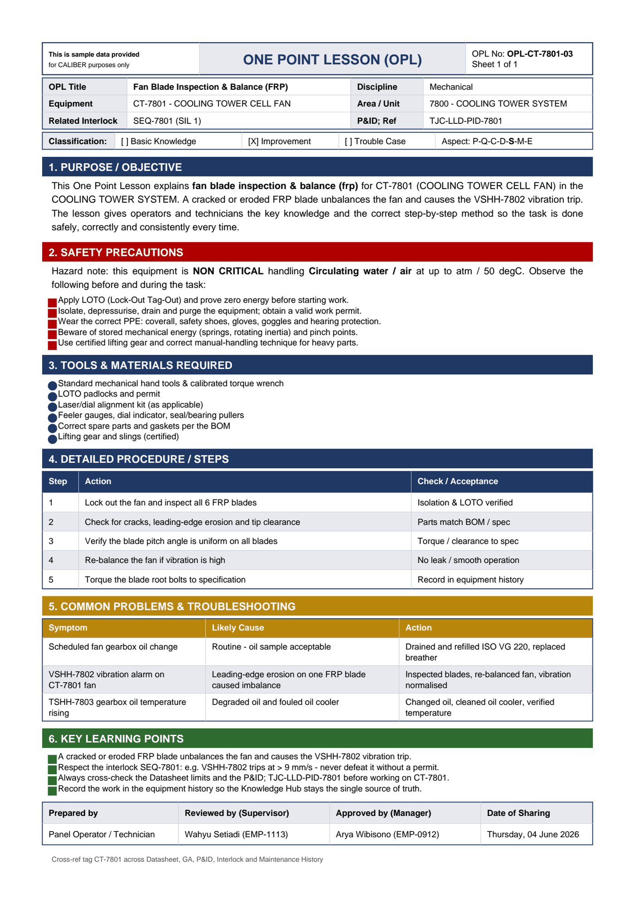

# OPL-CT-7801-03 - Fan Blade Inspection & Balance (FRP)

| Field | Value |
|---|---|
| Equipment | CT-7801 - COOLING TOWER CELL FAN |
| Area / unit | 7800 - COOLING TOWER SYSTEM |
| Discipline | Mechanical |
| Classification | Improvement |
| Related interlock | SEQ-7801 (SIL 1) |
| P&ID ref | TJC-LLD-PID-7801 |

## 1. Purpose

This One Point Lesson explains fan blade inspection & balance (frp) for CT-7801 (COOLING TOWER CELL FAN) in the COOLING TOWER SYSTEM. A cracked or eroded FRP blade unbalances the fan and causes the VSHH-7802 vibration trip. The lesson gives operators and technicians the key knowledge and the correct step-by-step method so the task is done safely, correctly and consistently every time.

## 2. Safety precautions

Hazard note: this equipment is NON CRITICAL handling Circulating water / air at up to atm / 50 degC.

- Apply LOTO (Lock-Out Tag-Out) and prove zero energy before starting work.
- Isolate, depressurise, drain and purge the equipment; obtain a valid work permit.
- Wear the correct PPE: coverall, safety shoes, gloves, goggles and hearing protection.
- Beware of stored mechanical energy (springs, rotating inertia) and pinch points.
- Use certified lifting gear and correct manual-handling technique for heavy parts.

## 3. Tools & materials

- Standard mechanical hand tools & calibrated torque wrench
- LOTO padlocks and permit
- Laser/dial alignment kit (as applicable)
- Feeler gauges, dial indicator, seal/bearing pullers
- Correct spare parts and gaskets per the BOM
- Lifting gear and slings (certified)

## 4. Procedure

| Step | Action | Check / acceptance (as printed) |
|---|---|---|
| 1 | Lock out the fan and inspect all 6 FRP blades | Isolation & LOTO verified |
| 2 | Check for cracks, leading-edge erosion and tip clearance | Parts match BOM / spec |
| 3 | Verify the blade pitch angle is uniform on all blades | Torque / clearance to spec |
| 4 | Re-balance the fan if vibration is high | No leak / smooth operation |
| 5 | Torque the blade root bolts to specification | Record in equipment history |

## 5. Common problems & troubleshooting

Full text restored from the linked work order where the OPL cell was cut off.

| Symptom | Likely cause | Action | Work order |
|---|---|---|---|
| Scheduled fan gearbox oil change | Routine - oil sample acceptable | Drained and refilled ISO VG 220, replaced breather | WO-240162 |
| VSHH-7802 vibration alarm on CT-7801 fan | Leading-edge erosion on one FRP blade caused imbalance | Inspected blades, re-balanced fan, vibration normalised | WO-240163 |
| TSHH-7803 gearbox oil temperature rising | Degraded oil and fouled oil cooler | Changed oil, cleaned oil cooler, verified temperature | WO-240164 |

## 6. Key learning points

- A cracked or eroded FRP blade unbalances the fan and causes the VSHH-7802 vibration trip.
- Respect the interlock SEQ-7801: e.g. VSHH-7802 trips at > 9 mm/s - never defeat it without a permit.
- Always cross-check the Datasheet limits and the P&ID TJC-LLD-PID-7801 before working on CT-7801.
- Record the work in the equipment history so the Knowledge Hub stays the single source of truth.

## Sign-off

| Role | Name |
|---|---|
| Prepared by | Panel Operator / Technician |
| Reviewed by (Supervisor) | Wahyu Setiadi (EMP-1113) |
| Approved by (Manager) | Arya Wibisono (EMP-0912) |
| Date of Sharing | Thursday, 04 June 2026 |

---
Source: `Set_07_CT-7801_COOLING_TOWER_CELL_FAN/One Point Lesson (OPL)/OPL-CT-7801-03 - Fan_Blade_Inspection_Balance_FRP.pdf`

## Image

