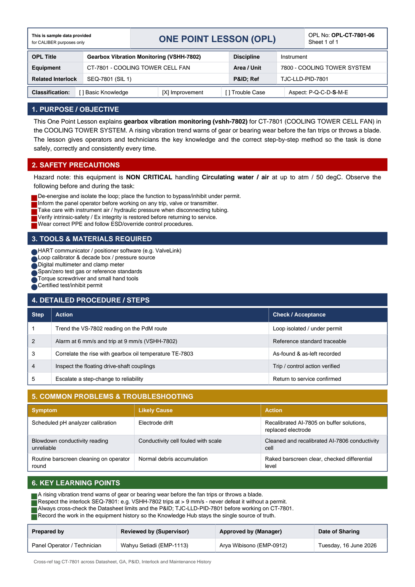

# OPL-CT-7801-06 - Gearbox Vibration Monitoring (VSHH-7802)

| Field | Value |
|---|---|
| Equipment | CT-7801 - COOLING TOWER CELL FAN |
| Area / unit | 7800 - COOLING TOWER SYSTEM |
| Discipline | Instrument |
| Classification | Improvement |
| Related interlock | SEQ-7801 (SIL 1) |
| P&ID ref | TJC-LLD-PID-7801 |

## 1. Purpose

This One Point Lesson explains gearbox vibration monitoring (vshh-7802) for CT-7801 (COOLING TOWER CELL FAN) in the COOLING TOWER SYSTEM. A rising vibration trend warns of gear or bearing wear before the fan trips or throws a blade. The lesson gives operators and technicians the key knowledge and the correct step-by-step method so the task is done safely, correctly and consistently every time.

## 2. Safety precautions

Hazard note: this equipment is NON CRITICAL handling Circulating water / air at up to atm / 50 degC.

- De-energise and isolate the loop; place the function to bypass/inhibit under permit.
- Inform the panel operator before working on any trip, valve or transmitter.
- Take care with instrument air / hydraulic pressure when disconnecting tubing.
- Verify intrinsic-safety / Ex integrity is restored before returning to service.
- Wear correct PPE and follow ESD/override control procedures.

## 3. Tools & materials

- HART communicator / positioner software (e.g. ValveLink)
- Loop calibrator & decade box / pressure source
- Digital multimeter and clamp meter
- Span/zero test gas or reference standards
- Torque screwdriver and small hand tools
- Certified test/inhibit permit

## 4. Procedure

| Step | Action | Check / acceptance (as printed) |
|---|---|---|
| 1 | Trend the VS-7802 reading on the PdM route | Loop isolated / under permit |
| 2 | Alarm at 6 mm/s and trip at 9 mm/s (VSHH-7802) | Reference standard traceable |
| 3 | Correlate the rise with gearbox oil temperature TE-7803 | As-found & as-left recorded |
| 4 | Inspect the floating drive-shaft couplings | Trip / control action verified |
| 5 | Escalate a step-change to reliability | Return to service confirmed |

## 5. Common problems & troubleshooting

Full text restored from the linked work order where the OPL cell was cut off.

| Symptom | Likely cause | Action | Work order |
|---|---|---|---|
| Scheduled pH analyzer calibration | Electrode drift | Recalibrated AI-7805 on buffer solutions, replaced electrode | WO-240165 |
| Blowdown conductivity reading unreliable | Conductivity cell fouled with scale | Cleaned and recalibrated AI-7806 conductivity cell | WO-240168 |
| Routine barscreen cleaning on operator round | Normal debris accumulation | Raked barscreen clear, checked differential level | WO-240161 |

## 6. Key learning points

- A rising vibration trend warns of gear or bearing wear before the fan trips or throws a blade.
- Respect the interlock SEQ-7801: e.g. VSHH-7802 trips at > 9 mm/s - never defeat it without a permit.
- Always cross-check the Datasheet limits and the P&ID TJC-LLD-PID-7801 before working on CT-7801.
- Record the work in the equipment history so the Knowledge Hub stays the single source of truth.

## Sign-off

| Role | Name |
|---|---|
| Prepared by | Panel Operator / Technician |
| Reviewed by (Supervisor) | Wahyu Setiadi (EMP-1113) |
| Approved by (Manager) | Arya Wibisono (EMP-0912) |
| Date of Sharing | Tuesday, 16 June 2026 |

---
Source: `Set_07_CT-7801_COOLING_TOWER_CELL_FAN/One Point Lesson (OPL)/OPL-CT-7801-06 - Gearbox_Vibration_Monitoring_VSHH_7802.pdf`

## Image

