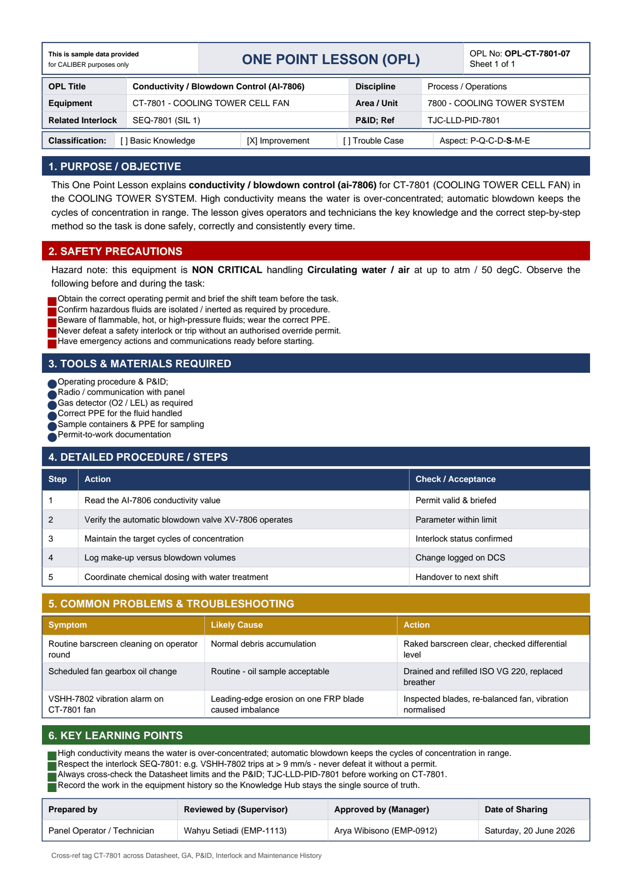

# OPL-CT-7801-07 - Conductivity / Blowdown Control (AI-7806)

| Field | Value |
|---|---|
| Equipment | CT-7801 - COOLING TOWER CELL FAN |
| Area / unit | 7800 - COOLING TOWER SYSTEM |
| Discipline | Process / Operations |
| Classification | Improvement |
| Related interlock | SEQ-7801 (SIL 1) |
| P&ID ref | TJC-LLD-PID-7801 |

## 1. Purpose

This One Point Lesson explains conductivity / blowdown control (ai-7806) for CT-7801 (COOLING TOWER CELL FAN) in the COOLING TOWER SYSTEM. High conductivity means the water is over-concentrated; automatic blowdown keeps the cycles of concentration in range. The lesson gives operators and technicians the key knowledge and the correct step-by-step method so the task is done safely, correctly and consistently every time.

## 2. Safety precautions

Hazard note: this equipment is NON CRITICAL handling Circulating water / air at up to atm / 50 degC.

- Obtain the correct operating permit and brief the shift team before the task.
- Confirm hazardous fluids are isolated / inerted as required by procedure.
- Beware of flammable, hot, or high-pressure fluids; wear the correct PPE.
- Never defeat a safety interlock or trip without an authorised override permit.
- Have emergency actions and communications ready before starting.

## 3. Tools & materials

- Operating procedure & P&ID
- Radio / communication with panel
- Gas detector (O2 / LEL) as required
- Correct PPE for the fluid handled
- Sample containers & PPE for sampling
- Permit-to-work documentation

## 4. Procedure

| Step | Action | Check / acceptance (as printed) |
|---|---|---|
| 1 | Read the AI-7806 conductivity value | Permit valid & briefed |
| 2 | Verify the automatic blowdown valve XV-7806 operates | Parameter within limit |
| 3 | Maintain the target cycles of concentration | Interlock status confirmed |
| 4 | Log make-up versus blowdown volumes | Change logged on DCS |
| 5 | Coordinate chemical dosing with water treatment | Handover to next shift |

## 5. Common problems & troubleshooting

Full text restored from the linked work order where the OPL cell was cut off.

| Symptom | Likely cause | Action | Work order |
|---|---|---|---|
| Routine barscreen cleaning on operator round | Normal debris accumulation | Raked barscreen clear, checked differential level | WO-240161 |
| Scheduled fan gearbox oil change | Routine - oil sample acceptable | Drained and refilled ISO VG 220, replaced breather | WO-240162 |
| VSHH-7802 vibration alarm on CT-7801 fan | Leading-edge erosion on one FRP blade caused imbalance | Inspected blades, re-balanced fan, vibration normalised | WO-240163 |

## 6. Key learning points

- High conductivity means the water is over-concentrated; automatic blowdown keeps the cycles of concentration in range.
- Respect the interlock SEQ-7801: e.g. VSHH-7802 trips at > 9 mm/s - never defeat it without a permit.
- Always cross-check the Datasheet limits and the P&ID TJC-LLD-PID-7801 before working on CT-7801.
- Record the work in the equipment history so the Knowledge Hub stays the single source of truth.

## Sign-off

| Role | Name |
|---|---|
| Prepared by | Panel Operator / Technician |
| Reviewed by (Supervisor) | Wahyu Setiadi (EMP-1113) |
| Approved by (Manager) | Arya Wibisono (EMP-0912) |
| Date of Sharing | Saturday, 20 June 2026 |

---
Source: `Set_07_CT-7801_COOLING_TOWER_CELL_FAN/One Point Lesson (OPL)/OPL-CT-7801-07 - Conductivity_Blowdown_Control_AI_7806.pdf`

## Image

