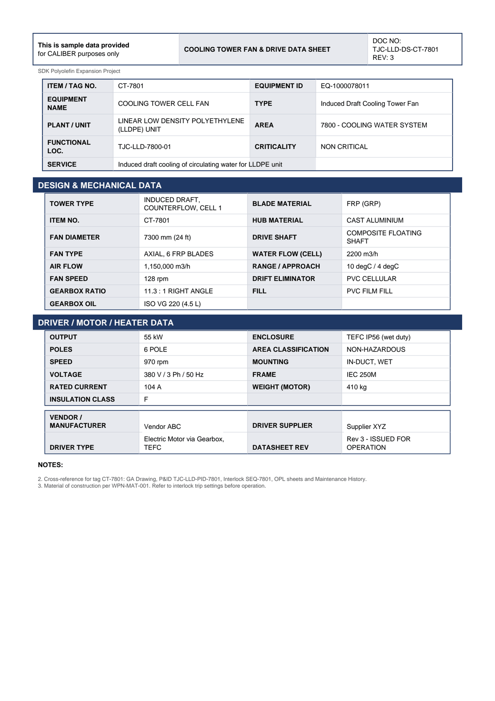

# Equipment Datasheet - CT-7801

Cooling Tower Fan & Drive Data Sheet for **CT-7801 COOLING TOWER CELL FAN**.

## Identification

| Field | Value |
|---|---|
| ITEM / TAG NO. | CT-7801 |
| EQUIPMENT ID | EQ-1000078011 |
| EQUIPMENT NAME | COOLING TOWER CELL FAN |
| TYPE | Induced Draft Cooling Tower Fan |
| PLANT / UNIT | LINEAR LOW DENSITY POLYETHYLENE (LLDPE) UNIT |
| AREA | 7800 - COOLING WATER SYSTEM |
| FUNCTIONAL LOC. | TJC-LLD-7800-01 |
| CRITICALITY | NON CRITICAL |
| SERVICE | Induced draft cooling of circulating water for LLDPE unit |

## Design & Mechanical Data

| Field | Value |
|---|---|
| TOWER TYPE | INDUCED DRAFT, COUNTERFLOW, CELL 1 |
| BLADE MATERIAL | FRP (GRP) |
| ITEM NO. | CT-7801 |
| HUB MATERIAL | CAST ALUMINIUM |
| FAN DIAMETER | 7300 mm (24 ft) |
| DRIVE SHAFT | COMPOSITE FLOATING SHAFT |
| FAN TYPE | AXIAL, 6 FRP BLADES |
| WATER FLOW (CELL) | 2200 m3/h |
| AIR FLOW | 1,150,000 m3/h |
| RANGE / APPROACH | 10 degC / 4 degC |
| FAN SPEED | 128 rpm |
| DRIFT ELIMINATOR | PVC CELLULAR |
| GEARBOX RATIO | 11.3 : 1 RIGHT ANGLE |
| FILL | PVC FILM FILL |
| GEARBOX OIL | ISO VG 220 (4.5 L) |

## Driver / Motor / Heater Data

| Field | Value |
|---|---|
| OUTPUT | 55 kW |
| ENCLOSURE | TEFC IP56 (wet duty) |
| POLES | 6 POLE |
| AREA CLASSIFICATION | NON-HAZARDOUS |
| SPEED | 970 rpm |
| MOUNTING | IN-DUCT, WET |
| VOLTAGE | 380 V / 3 Ph / 50 Hz |
| FRAME | IEC 250M |
| RATED CURRENT | 104 A |
| WEIGHT (MOTOR) | 410 kg |
| INSULATION CLASS | F |

## Vendor & revision

| Field | Value |
|---|---|
| VENDOR / MANUFACTURER | Vendor ABC |
| DRIVER SUPPLIER | Supplier XYZ |
| DRIVER TYPE | Electric Motor via Gearbox, TEFC |
| DATASHEET REV | Rev 3 - ISSUED FOR OPERATION |

## Notes

- Cross-reference for tag CT-7801: GA Drawing, P&ID TJC-LLD-PID-7801, Interlock SEQ-7801, OPL sheets and Maintenance History.
- Material of construction per WPN-MAT-001. Refer to interlock trip settings before operation.

---
Source: `Set_07_CT-7801_COOLING_TOWER_CELL_FAN/Equipment Datasheet - CT-7801.pdf`

## Image

