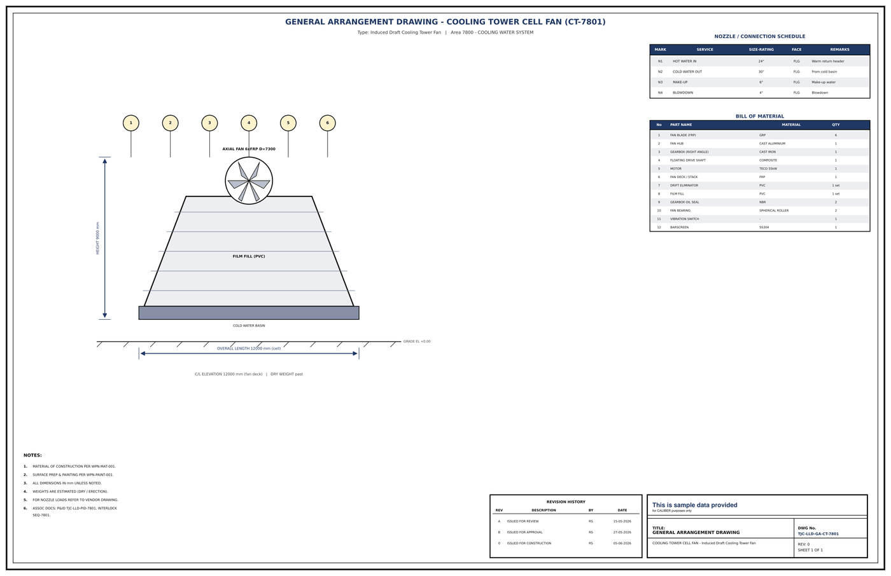

# General Arrangement Drawing - CT-7801

## Key dimensions

- OVERALL LENGTH 12000 mm (cell)
- HEIGHT 9000 mm
- C/L ELEVATION 12000 mm (fan deck)   |   DRY WEIGHT past

## Nozzle / connection schedule

Mark, service, size-rating, face, remarks as printed on the drawing.

- N1 HOT WATER IN 24" FLG Warm return header
- N2 COLD WATER OUT 30" FLG From cold basin
- N3 MAKE-UP 6" FLG Make-up water
- N4 BLOWDOWN 4" FLG Blowdown

## Bill of material

No., part name, material, quantity as printed on the drawing.

- 1 FAN BLADE (FRP) GRP 6
- 2 FAN HUB CAST ALUMINIUM 1
- 3 GEARBOX (RIGHT ANGLE) CAST IRON 1
- 4 FLOATING DRIVE SHAFT COMPOSITE 1
- 5 MOTOR TECO 55kW 1
- 6 FAN DECK / STACK FRP 1
- 9 GEARBOX OIL SEAL NBR 2
- 10 FAN BEARING SPHERICAL ROLLER 2
- 11 VIBRATION SWITCH - 1
- 12 BARSCREEN SS304 1

## Notes

- MATERIAL OF CONSTRUCTION PER WPN-MAT-001.
- SURFACE PREP & PAINTING PER WPN-PAINT-001.
- ALL DIMENSIONS IN mm UNLESS NOTED.
- WEIGHTS ARE ESTIMATED (DRY / ERECTION).
- FOR NOZZLE LOADS REFER TO VENDOR DRAWING.
- ASSOC DOCS: P&ID TJC-LLD-PID-7801, INTERLOCK

## Revision history

| Rev | Description | By | Date |
|---|---|---|---|
| A | ISSUED FOR REVIEW | RS | 15-05-2026 |
| B | ISSUED FOR APPROVAL | RS | 27-05-2026 |
| 0 | ISSUED FOR CONSTRUCTION | RS | 05-06-2026 |

---
Source: `Set_07_CT-7801_COOLING_TOWER_CELL_FAN/Equipment GA Drawing - CT-7801.pdf`

## Image

