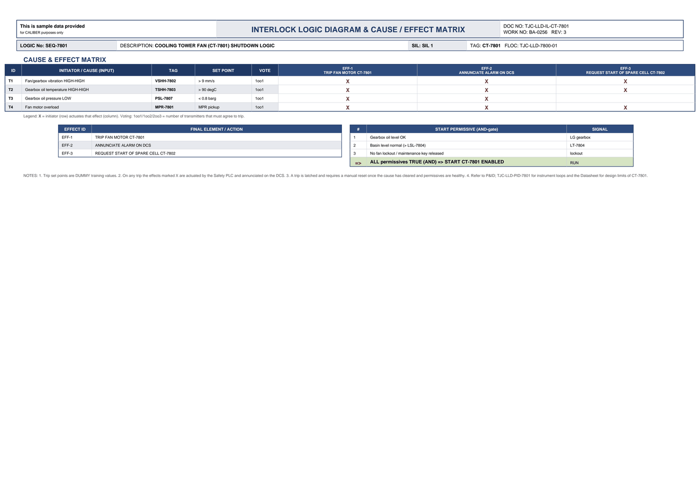

# Interlock Logic & Cause/Effect - CT-7801

| Field | Value |
|---|---|
| Logic no. | SEQ-7801 |
| Description | COOLING TOWER FAN (CT-7801) SHUTDOWN LOGIC |
| SIL | SIL 1 |
| Functional location | TJC-LLD-7800-01 |

## Cause & effect matrix

| ID | INITIATOR / CAUSE (INPUT) | TAG | SET POINT | VOTE | EFF-1 TRIP FAN MOTOR CT-7801 | EFF-2 ANNUNCIATE ALARM ON DCS | EFF-3 REQUEST START OF SPARE CELL CT-7802 |
|---|---|---|---|---|---|---|---|
| T1 | Fan/gearbox vibration HIGH-HIGH | VSHH-7802 | > 9 mm/s | 1oo1 | X | X | X |
| T2 | Gearbox oil temperature HIGH-HIGH | TSHH-7803 | > 90 degC | 1oo1 | X | X | X |
| T3 | Gearbox oil pressure LOW | PSL-7807 | < 0.8 barg | 1oo1 | X | X |  |
| T4 | Fan motor overload | MPR-7801 | MPR pickup | 1oo1 | X | X | X |

### Trips in plain language

- **VSHH-7802** (Fan/gearbox vibration HIGH-HIGH) trips at **> 9 mm/s**, voting 1oo1. Effects: TRIP FAN MOTOR CT-7801; ANNUNCIATE ALARM ON DCS; REQUEST START OF SPARE CELL CT-7802.
- **TSHH-7803** (Gearbox oil temperature HIGH-HIGH) trips at **> 90 degC**, voting 1oo1. Effects: TRIP FAN MOTOR CT-7801; ANNUNCIATE ALARM ON DCS; REQUEST START OF SPARE CELL CT-7802.
- **PSL-7807** (Gearbox oil pressure LOW) trips at **< 0.8 barg**, voting 1oo1. Effects: TRIP FAN MOTOR CT-7801; ANNUNCIATE ALARM ON DCS.
- **MPR-7801** (Fan motor overload) trips at **MPR pickup**, voting 1oo1. Effects: TRIP FAN MOTOR CT-7801; ANNUNCIATE ALARM ON DCS; REQUEST START OF SPARE CELL CT-7802.

## Effects (final elements)

| EFFECT ID | FINAL ELEMENT / ACTION |
|---|---|
| EFF-1 | TRIP FAN MOTOR CT-7801 |
| EFF-2 | ANNUNCIATE ALARM ON DCS |
| EFF-3 | REQUEST START OF SPARE CELL CT-7802 |

## Start permissives (all must be true)

| # | START PERMISSIVE (AND-gate) | SIGNAL |
|---|---|---|
| 1 | Gearbox oil level OK | LG gearbox |
| 2 | Basin level normal (> LSL-7804) | LT-7804 |
| 3 | No fan lockout / maintenance key released | lockout |
| => | ALL permissives TRUE (AND) => START CT-7801 ENABLED | RUN |

## Notes

- Trip set points are DUMMY training values.
- On any trip the effects marked X are actuated by the Safety PLC and annunciated on the DCS.
- A trip is latched and requires a manual reset once the cause has cleared and permissives are healthy.
- Refer to P&ID TJC-LLD-PID-7801 for instrument loops and the Datasheet for design limits of CT-7801. 

---
Source: `Set_07_CT-7801_COOLING_TOWER_CELL_FAN/Interlock Logic Diagram - CT-7801.pdf`

## Image

