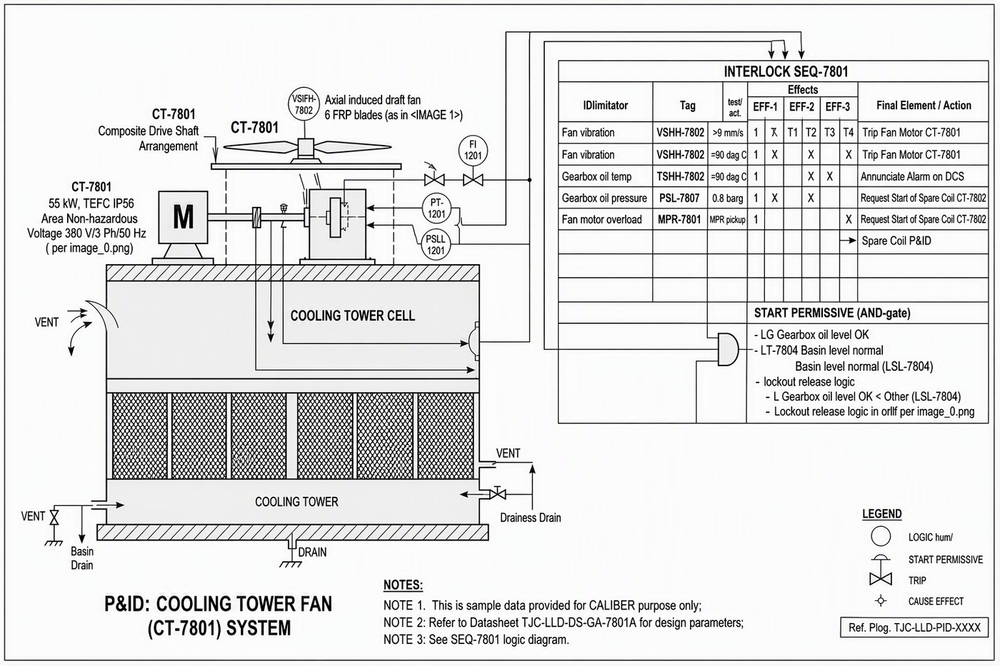

# P&ID - CT-7801

Image-only drawing. The title block prints `TJC-LLD-PID-XXXX`; the number `TJC-LLD-PID-7801` comes from the datasheet and interlock cross-references.

## Tags linked to this drawing

From the interlock matrix and datasheet of CT-7801:

- `AI-7805`
- `AI-7806`
- `CT-7802`
- `LSL-7804`
- `LT-7804`
- `MPR-7801`
- `PSL-7807`
- `TE-7803`
- `TSHH-7803`
- `TT-7801`
- `VS-7802`
- `VSHH-7802`
- `XV-7806`

## Description

To be written by an engineer from the drawing (flow path, valves, instruments, trips). Keep tags in backticks so they link.

---
Source: `Set_07_CT-7801_COOLING_TOWER_CELL_FAN/P&ID_Set 7.png`

## Image

