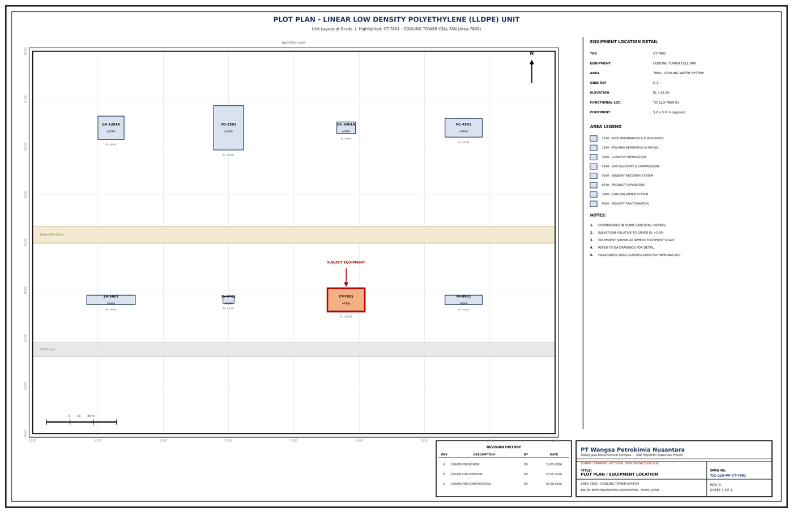

# Plot Plan - CT-7801

## Equipment location

| Field | Value |
|---|---|
| TAG | CT-7801 |
| EQUIPMENT | LOCATION DETAIL |
| AREA | 7800 - COOLING WATER SYSTEM |
| GRID REF | G-2 |
| ELEVATION | EL +12.00 |
| FUNCTIONAL LOC. | TJC-LLD-7800-01 |
| FOOTPRINT | 5.0 x 5.0 m (approx) |

## Area legend (LLDPE unit)

- 1200 - Feed Preparation & Purification
- 2300 - Polymer Separation & Drying
- 3400 - Catalyst Preparation
- 4500 - Gas Recovery & Compression
- 5600 - Solvent Recovery System
- 6700 - Product Separation
- 7800 - Cooling Water System
- 8900 - Solvent Fractionation

## Revision history

| Rev | Description | By | Date |
|---|---|---|---|
| A | ISSUED FOR REVIEW | RS | 15-05-2026 |
| B | ISSUED FOR APPROVAL | RS | 27-05-2026 |
| 0 | ISSUED FOR CONSTRUCTION | RS | 05-06-2026 |

---
Source: `Set_07_CT-7801_COOLING_TOWER_CELL_FAN/Plot Plan - CT-7801.pdf`

## Image

