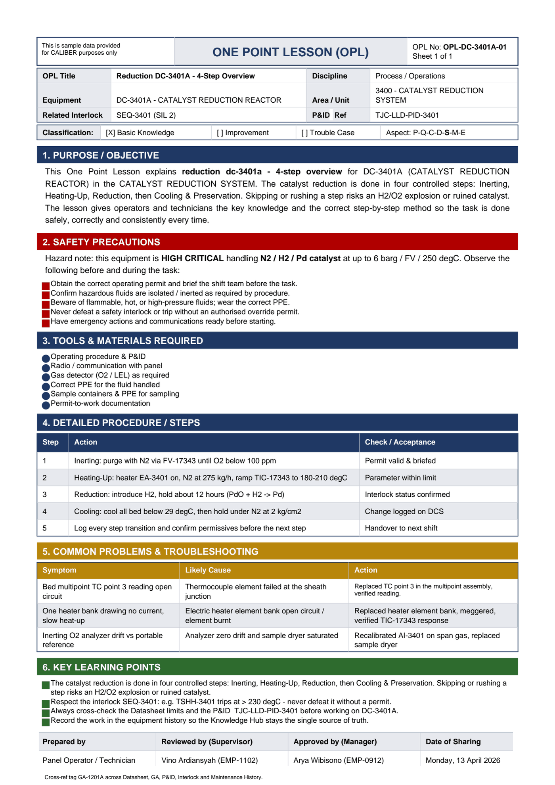

# OPL-DC-3401A-01 - Reduction DC-3401A - 4-Step Overview

| Field | Value |
|---|---|
| Equipment | DC-3401A - CATALYST REDUCTION REACTOR |
| Area / unit | 3400 - CATALYST REDUCTION SYSTEM |
| Discipline | Process / Operations |
| Classification | Basic Knowledge |
| Related interlock | SEQ-3401 (SIL 2) |
| P&ID ref | TJC-LLD-PID-3401 |

## 1. Purpose

This One Point Lesson explains reduction dc-3401a - 4-step overview for DC-3401A (CATALYST REDUCTION REACTOR) in the CATALYST REDUCTION SYSTEM. The catalyst reduction is done in four controlled steps: Inerting, Heating-Up, Reduction, then Cooling & Preservation. Skipping or rushing a step risks an H2/O2 explosion or ruined catalyst. The lesson gives operators and technicians the key knowledge and the correct step-by-step method so the task is done safely, correctly and consistently every time.

## 2. Safety precautions

Hazard note: this equipment is HIGH CRITICAL handling N2 / H2 / Pd catalyst at up to 6 barg / FV / 250 degC.

- Obtain the correct operating permit and brief the shift team before the task.
- Confirm hazardous fluids are isolated / inerted as required by procedure.
- Beware of flammable, hot, or high-pressure fluids; wear the correct PPE.
- Never defeat a safety interlock or trip without an authorised override permit.
- Have emergency actions and communications ready before starting.

## 3. Tools & materials

- Operating procedure & P&ID
- Radio / communication with panel
- Gas detector (O2 / LEL) as required
- Correct PPE for the fluid handled
- Sample containers & PPE for sampling
- Permit-to-work documentation

## 4. Procedure

| Step | Action | Check / acceptance (as printed) |
|---|---|---|
| 1 | Inerting: purge with N2 via FV-17343 until O2 below 100 ppm | Permit valid & briefed |
| 2 | Heating-Up: heater EA-3401 on, N2 at 275 kg/h, ramp TIC-17343 to 180-210 degC | Parameter within limit |
| 3 | Reduction: introduce H2, hold about 12 hours (PdO + H2 -> Pd) | Interlock status confirmed |
| 4 | Cooling: cool all bed below 29 degC, then hold under N2 at 2 kg/cm2 | Change logged on DCS |
| 5 | Log every step transition and confirm permissives before the next step | Handover to next shift |

## 5. Common problems & troubleshooting

Full text restored from the linked work order where the OPL cell was cut off.

| Symptom | Likely cause | Action | Work order |
|---|---|---|---|
| Bed multipoint TC point 3 reading open circuit | Thermocouple element failed at the sheath junction | Replaced TC point 3 in the multipoint assembly, verified reading and TSHH-3401 select | WO-240056 |
| One heater bank drawing no current, slow heat-up | Electric heater element bank open circuit / element burnt | Replaced heater element bank, meggered, verified TIC-17343 response | WO-240057 |
| Inerting O2 analyzer drift vs portable reference | Analyzer zero drift and sample dryer saturated | Recalibrated AI-3401 on span gas, replaced sample dryer | WO-240058 |

## 6. Key learning points

- The catalyst reduction is done in four controlled steps: Inerting, Heating-Up, Reduction, then Cooling & Preservation. Skipping or rushing a step risks an H2/O2 explosion or ruined catalyst.
- Respect the interlock SEQ-3401: e.g. TSHH-3401 trips at > 230 degC - never defeat it without a permit.
- Always cross-check the Datasheet limits and the P&ID TJC-LLD-PID-3401 before working on DC-3401A.
- Record the work in the equipment history so the Knowledge Hub stays the single source of truth. This is sample data provided for CALIBER purposes only Replaced TC point 3 in the multipoint assembly, verified reading.

## Sign-off

| Role | Name |
|---|---|
| Prepared by | Panel Operator / Technician |
| Reviewed by (Supervisor) | Vino Ardiansyah (EMP-1102) |
| Approved by (Manager) | Arya Wibisono (EMP-0912) |
| Date of Sharing | Monday, 13 April 2026 |

---
Source: `Set_03_DC-3401A_CATALYST_REDUCTION_REACTOR/OPL (One Point Lessons)/OPL-DC-3401A-01 Reduction_DC_3401A_4_Step_Overview.pdf`

## Image

