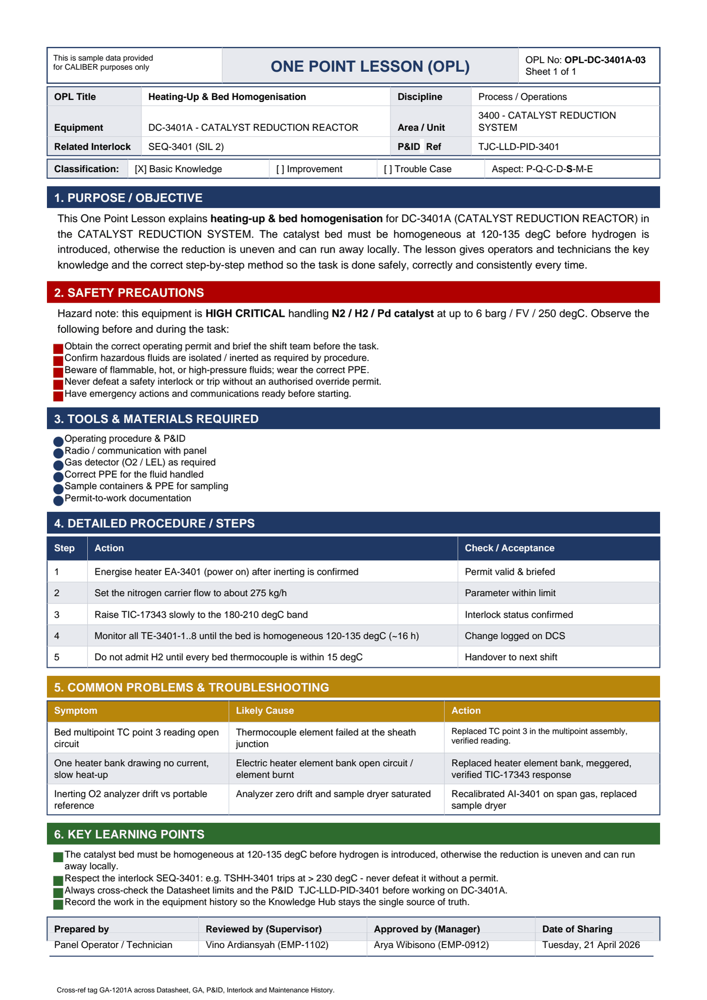

# OPL-DC-3401A-03 - Heating-Up & Bed Homogenisation

| Field | Value |
|---|---|
| Equipment | DC-3401A - CATALYST REDUCTION REACTOR |
| Area / unit | 3400 - CATALYST REDUCTION SYSTEM |
| Discipline | Process / Operations |
| Classification | Basic Knowledge |
| Related interlock | SEQ-3401 (SIL 2) |
| P&ID ref | TJC-LLD-PID-3401 |

## 1. Purpose

This One Point Lesson explains heating-up & bed homogenisation for DC-3401A (CATALYST REDUCTION REACTOR) in the CATALYST REDUCTION SYSTEM. The catalyst bed must be homogeneous at 120-135 degC before hydrogen is introduced, otherwise the reduction is uneven and can run away locally. The lesson gives operators and technicians the key knowledge and the correct step-by-step method so the task is done safely, correctly and consistently every time.

## 2. Safety precautions

Hazard note: this equipment is HIGH CRITICAL handling N2 / H2 / Pd catalyst at up to 6 barg / FV / 250 degC.

- Obtain the correct operating permit and brief the shift team before the task.
- Confirm hazardous fluids are isolated / inerted as required by procedure.
- Beware of flammable, hot, or high-pressure fluids; wear the correct PPE.
- Never defeat a safety interlock or trip without an authorised override permit.
- Have emergency actions and communications ready before starting.

## 3. Tools & materials

- Operating procedure & P&ID
- Radio / communication with panel
- Gas detector (O2 / LEL) as required
- Correct PPE for the fluid handled
- Sample containers & PPE for sampling
- Permit-to-work documentation

## 4. Procedure

| Step | Action | Check / acceptance (as printed) |
|---|---|---|
| 1 | Energise heater EA-3401 (power on) after inerting is confirmed | Permit valid & briefed |
| 2 | Set the nitrogen carrier flow to about 275 kg/h | Parameter within limit |
| 3 | Raise TIC-17343 slowly to the 180-210 degC band | Interlock status confirmed |
| 4 | Monitor all TE-3401-1..8 until the bed is homogeneous 120-135 degC (~16 h) | Change logged on DCS |
| 5 | Do not admit H2 until every bed thermocouple is within 15 degC | Handover to next shift |

## 5. Common problems & troubleshooting

Full text restored from the linked work order where the OPL cell was cut off.

| Symptom | Likely cause | Action | Work order |
|---|---|---|---|
| Bed multipoint TC point 3 reading open circuit | Thermocouple element failed at the sheath junction | Replaced TC point 3 in the multipoint assembly, verified reading and TSHH-3401 select | WO-240056 |
| One heater bank drawing no current, slow heat-up | Electric heater element bank open circuit / element burnt | Replaced heater element bank, meggered, verified TIC-17343 response | WO-240057 |
| Inerting O2 analyzer drift vs portable reference | Analyzer zero drift and sample dryer saturated | Recalibrated AI-3401 on span gas, replaced sample dryer | WO-240058 |

## 6. Key learning points

- The catalyst bed must be homogeneous at 120-135 degC before hydrogen is introduced, otherwise the reduction is uneven and can run away locally.
- Respect the interlock SEQ-3401: e.g. TSHH-3401 trips at > 230 degC - never defeat it without a permit.
- Always cross-check the Datasheet limits and the P&ID TJC-LLD-PID-3401 before working on DC-3401A.
- Record the work in the equipment history so the Knowledge Hub stays the single source of truth.

## Sign-off

| Role | Name |
|---|---|
| Prepared by |  |
| Reviewed by (Supervisor) |  |
| Approved by (Manager) |  |
| Date of Sharing |  |

---
Source: `Set_03_DC-3401A_CATALYST_REDUCTION_REACTOR/OPL (One Point Lessons)/OPL-DC-3401A-03 Heating_Up_Bed_Homogenisation.pdf`

## Image

