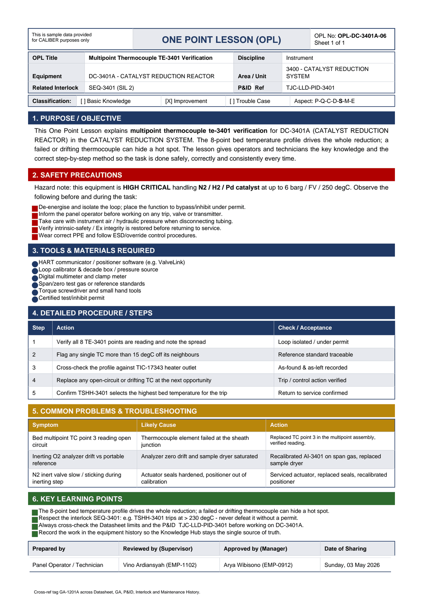

# OPL-DC-3401A-06 - Multipoint Thermocouple TE-3401 Verification

| Field | Value |
|---|---|
| Equipment | DC-3401A - CATALYST REDUCTION REACTOR |
| Area / unit | 3400 - CATALYST REDUCTION SYSTEM |
| Discipline | Instrument |
| Classification | Improvement |
| Related interlock | SEQ-3401 (SIL 2) |
| P&ID ref | TJC-LLD-PID-3401 |

## 1. Purpose

This One Point Lesson explains multipoint thermocouple te-3401 verification for DC-3401A (CATALYST REDUCTION REACTOR) in the CATALYST REDUCTION SYSTEM. The 8-point bed temperature profile drives the whole reduction; a failed or drifting thermocouple can hide a hot spot. The lesson gives operators and technicians the key knowledge and the correct step-by-step method so the task is done safely, correctly and consistently every time.

## 2. Safety precautions

Hazard note: this equipment is HIGH CRITICAL handling N2 / H2 / Pd catalyst at up to 6 barg / FV / 250 degC.

- De-energise and isolate the loop; place the function to bypass/inhibit under permit.
- Inform the panel operator before working on any trip, valve or transmitter.
- Take care with instrument air / hydraulic pressure when disconnecting tubing.
- Verify intrinsic-safety / Ex integrity is restored before returning to service.
- Wear correct PPE and follow ESD/override control procedures.

## 3. Tools & materials

- HART communicator / positioner software (e.g. ValveLink)
- Loop calibrator & decade box / pressure source
- Digital multimeter and clamp meter
- Span/zero test gas or reference standards
- Torque screwdriver and small hand tools
- Certified test/inhibit permit

## 4. Procedure

| Step | Action | Check / acceptance (as printed) |
|---|---|---|
| 1 | Verify all 8 TE-3401 points are reading and note the spread | Loop isolated / under permit |
| 2 | Flag any single TC more than 15 degC off its neighbours | Reference standard traceable |
| 3 | Cross-check the profile against TIC-17343 heater outlet | As-found & as-left recorded |
| 4 | Replace any open-circuit or drifting TC at the next opportunity | Trip / control action verified |
| 5 | Confirm TSHH-3401 selects the highest bed temperature for the trip | Return to service confirmed |

## 5. Common problems & troubleshooting

Full text restored from the linked work order where the OPL cell was cut off.

| Symptom | Likely cause | Action | Work order |
|---|---|---|---|
| Bed multipoint TC point 3 reading open circuit | Thermocouple element failed at the sheath junction | Replaced TC point 3 in the multipoint assembly, verified reading and TSHH-3401 select | WO-240056 |
| Inerting O2 analyzer drift vs portable reference | Analyzer zero drift and sample dryer saturated | Recalibrated AI-3401 on span gas, replaced sample dryer | WO-240058 |
| N2 inert valve slow / sticking during inerting step | Actuator seals hardened, positioner out of calibration | Serviced actuator, replaced seals, recalibrated positioner | WO-240059 |

## 6. Key learning points

- The 8-point bed temperature profile drives the whole reduction; a failed or drifting thermocouple can hide a hot spot.
- Respect the interlock SEQ-3401: e.g. TSHH-3401 trips at > 230 degC - never defeat it without a permit.
- Always cross-check the Datasheet limits and the P&ID TJC-LLD-PID-3401 before working on DC-3401A.
- Record the work in the equipment history so the Knowledge Hub stays the single source of truth.

## Sign-off

| Role | Name |
|---|---|

---
Source: `Set_03_DC-3401A_CATALYST_REDUCTION_REACTOR/OPL (One Point Lessons)/OPL-DC-3401A-06 Multipoint_Thermocouple_TE_3401_Verifica.pdf`

## Image

