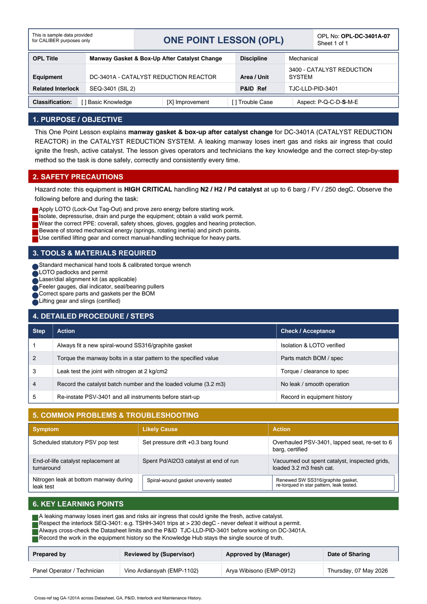

# OPL-DC-3401A-07 - Manway Gasket & Box-Up After Catalyst Change

| Field | Value |
|---|---|
| Equipment | DC-3401A - CATALYST REDUCTION REACTOR |
| Area / unit | 3400 - CATALYST REDUCTION SYSTEM |
| Discipline | Mechanical |
| Classification | Improvement |
| Related interlock | SEQ-3401 (SIL 2) |
| P&ID ref | TJC-LLD-PID-3401 |

## 1. Purpose

This One Point Lesson explains manway gasket & box-up after catalyst change for DC-3401A (CATALYST REDUCTION REACTOR) in the CATALYST REDUCTION SYSTEM. A leaking manway loses inert gas and risks air ingress that could ignite the fresh, active catalyst. The lesson gives operators and technicians the key knowledge and the correct step-by-step method so the task is done safely, correctly and consistently every time.

## 2. Safety precautions

Hazard note: this equipment is HIGH CRITICAL handling N2 / H2 / Pd catalyst at up to 6 barg / FV / 250 degC.

- Apply LOTO (Lock-Out Tag-Out) and prove zero energy before starting work.
- Isolate, depressurise, drain and purge the equipment; obtain a valid work permit.
- Wear the correct PPE: coverall, safety shoes, gloves, goggles and hearing protection.
- Beware of stored mechanical energy (springs, rotating inertia) and pinch points.
- Use certified lifting gear and correct manual-handling technique for heavy parts.

## 3. Tools & materials

- Standard mechanical hand tools & calibrated torque wrench
- LOTO padlocks and permit
- Laser/dial alignment kit (as applicable)
- Feeler gauges, dial indicator, seal/bearing pullers
- Correct spare parts and gaskets per the BOM
- Lifting gear and slings (certified)

## 4. Procedure

| Step | Action | Check / acceptance (as printed) |
|---|---|---|
| 1 | Always fit a new spiral-wound SS316/graphite gasket | Isolation & LOTO verified |
| 2 | Torque the manway bolts in a star pattern to the specified value | Parts match BOM / spec |
| 3 | Leak test the joint with nitrogen at 2 kg/cm2 | Torque / clearance to spec |
| 4 | Record the catalyst batch number and the loaded volume (3.2 m3) | No leak / smooth operation |
| 5 | Re-instate PSV-3401 and all instruments before start-up | Record in equipment history |

## 5. Common problems & troubleshooting

Full text restored from the linked work order where the OPL cell was cut off.

| Symptom | Likely cause | Action | Work order |
|---|---|---|---|
| Scheduled statutory PSV pop test | Set pressure drift +0.3 barg found | Overhauled PSV-3401, lapped seat, re-set to 6 barg, certified | WO-240060 |
| End-of-life catalyst replacement at turnaround | Spent Pd/Al2O3 catalyst at end of run | Vacuumed out spent catalyst, inspected grids, loaded 3.2 m3 fresh catalyst | WO-240061 |
| Nitrogen leak at bottom manway during leak test | Spiral-wound gasket unevenly seated | Renewed SW SS316/graphite gasket, re-torqued in star pattern, leak test passed | WO-240062 |

## 6. Key learning points

- A leaking manway loses inert gas and risks air ingress that could ignite the fresh, active catalyst.
- Respect the interlock SEQ-3401: e.g. TSHH-3401 trips at > 230 degC - never defeat it without a permit.
- Always cross-check the Datasheet limits and the P&ID TJC-LLD-PID-3401 before working on DC-3401A.
- Record the work in the equipment history so the Knowledge Hub stays the single source of truth.

## Sign-off

| Role | Name |
|---|---|

---
Source: `Set_03_DC-3401A_CATALYST_REDUCTION_REACTOR/OPL (One Point Lessons)/OPL-DC-3401A-07 Manway_Gasket_Box_Up_After_Catalyst_Chan.pdf`

## Image

