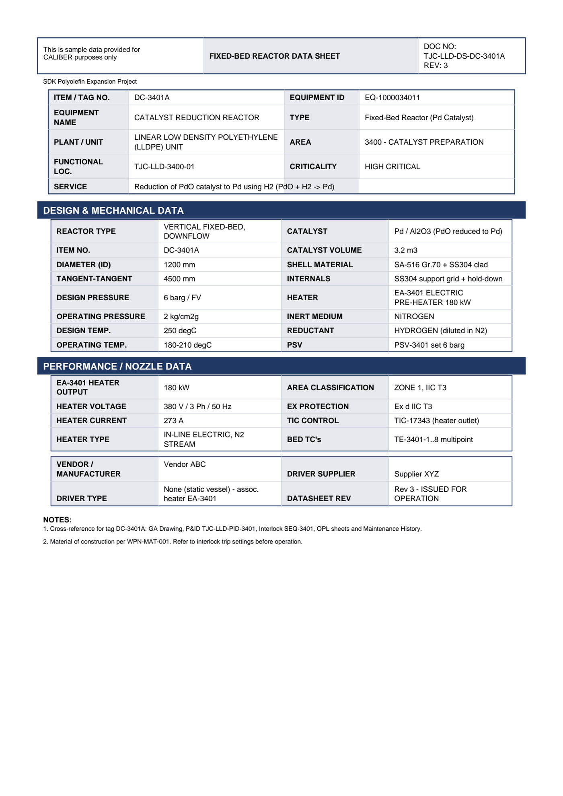

# Equipment Datasheet - DC-3401A

Bed Reactor Data Sheet for **DC-3401A CATALYST REDUCTION REACTOR**.

## Identification

| Field | Value |
|---|---|
| ITEM / TAG NO. | DC-3401A |
| EQUIPMENT ID | EQ-1000034011 |
| EQUIPMENT NAME | CATALYST REDUCTION REACTOR |
| TYPE | Fixed-Bed Reactor (Pd Catalyst) |
| PLANT / UNIT | LINEAR LOW DENSITY POLYETHYLENE (LLDPE) UNIT |
| AREA | 3400 - CATALYST PREPARATION |
| FUNCTIONAL LOC. | TJC-LLD-3400-01 |
| CRITICALITY | HIGH CRITICAL |
| SERVICE | Reduction of PdO catalyst to Pd using H2 (P dO + H2 -> Pd) |

## Design & Mechanical Data

| Field | Value |
|---|---|
| REACTOR TYPE | VERTICAL FIXED-BED, DOWNFLOW |
| CATALYST | Pd / Al2O3 (PdO reduced to Pd) |
| ITEM NO. | DC-3401A |
| CATALYST VOLUME | 3.2 m3 |
| DIAMETER (ID) | 1200 mm |
| SHELL MATERIAL | SA-516 Gr.70 + SS304 clad |
| TANGENT-TANGENT | 4500 mm |
| INTERNALS | SS304 support grid + hold-down |
| DESIGN PRESSURE | 6 barg / FV |
| HEATER | EA-3401 ELECTRIC PRE-HEATER 180 kW |
| OPERATING PRESSURE | 2 kg/cm2g |
| INERT MEDIUM | NITROGEN |
| DESIGN TEMP. | 250 degC |
| REDUCTANT | HYDROGEN (diluted in N2) |
| OPERATING TEMP. | 180-210 degC |
| PSV | PSV-3401 set 6 barg |

## Performance / Nozzle Data

| Field | Value |
|---|---|
| EA-3401 HEATER OUTPUT | 180 kW |
| AREA CLASSIFICATION | ZONE 1, IIC T3 |
| HEATER VOLTAGE | 380 V / 3 Ph / 50 Hz |
| EX PROTECTION | Ex d IIC T3 |
| HEATER CURRENT | 273 A |
| TIC CONTROL | TIC-17343 (heater outlet) |
| HEATER TYPE | IN-LINE ELECTRIC, N2 STREAM |
| BED TC's | TE-3401-1..8 multipoint |

## Notes

- Cross-reference for tag DC-3401A: GA Drawing, P&ID TJC-LLD-PID-3401, Interlock SEQ-3401, OPL sheets and Maintenance History.
- Material of construction per WPN-MAT-001. Refer to interlock trip settings before operation.

---
Source: `Set_03_DC-3401A_CATALYST_REDUCTION_REACTOR/Equipment Datasheet - DC-3401A.pdf`

## Image

