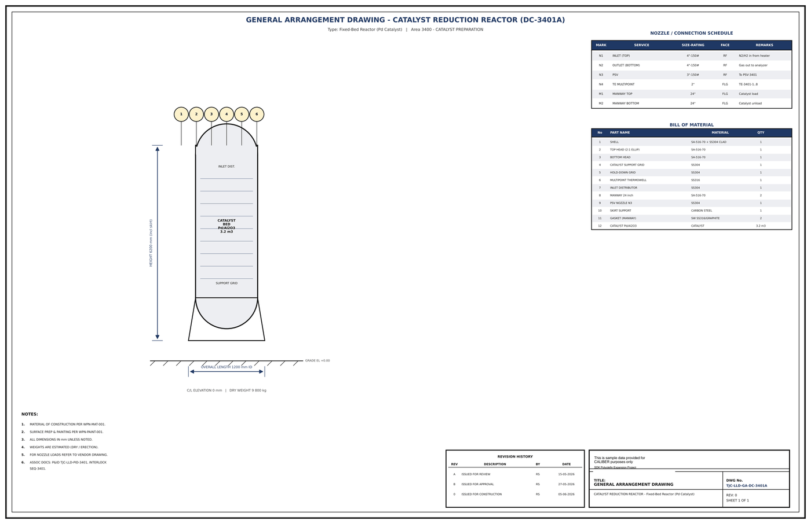

# General Arrangement Drawing - DC-3401A

## Key dimensions

- OVERALL LENGTH 1200 mm ID
- HEIGHT 6200 mm (incl skirt)
- C/L ELEVATION 0 mm   |   DRY WEIGHT 9 800 kg

## Nozzle / connection schedule

Mark, service, size-rating, face, remarks as printed on the drawing.

- N1 INLET (TOP) 4"-150# RF N2/H2 in from heater
- N2 OUTLET (BOTTOM) 4"-150# RF Gas out to analyzer
- N3 PSV 3"-150# RF T o PSV-3401
- N4 TE MULTIPOINT 2" FLG TE-3401-1..8

## Bill of material

No., part name, material, quantity as printed on the drawing.

- 1 SHELL SA-516-70 + SS304 CLAD 1
- 2 TOP HEAD (2:1 ELLIP) SA-516-70 1
- 3 BOTTOM HEAD SA-516-70 1
- 4 CATALYST SUPPORT GRID SS304 1
- 5 HOLD-DOWN GRID SS304 1
- 6 MULTIPOINT THERMOWELL SS316 1
- 7 INLET DISTRIBUTOR SS304 1
- 8 MANWAY 24 inch SA-516-70 2
- 9 PSV NOZZLE N3 SS304 1
- 10 SKIRT SUPPORT CARBON STEEL 1
- 11 GASKET (MANWAY) SW SS316/GRAPHITE 2

## Notes

- MATERIAL OF CONSTRUCTION PER WPN-MAT-001.
- SURFACE PREP & PAINTING PER WPN-PAINT-001.
- ALL DIMENSIONS IN mm UNLESS NOTED.
- WEIGHTS ARE ESTIMATED (DRY / ERECTION).
- FOR NOZZLE LOADS REFER TO VENDOR DRAWING.
- ASSOC DOCS: P&ID TJC-LLD-PID-3401, INTERLOCK

## Revision history

| Rev | Description | By | Date |
|---|---|---|---|
| A | ISSUED FOR REVIEW | RS | 15-05-2026 |
| B | ISSUED FOR APPROVAL | RS | 27-05-2026 |
| 0 | ISSUED FOR CONSTRUCTION | RS | 05-06-2026 |

---
Source: `Set_03_DC-3401A_CATALYST_REDUCTION_REACTOR/Equipment Drawing DC-3401A.pdf`

## Image

