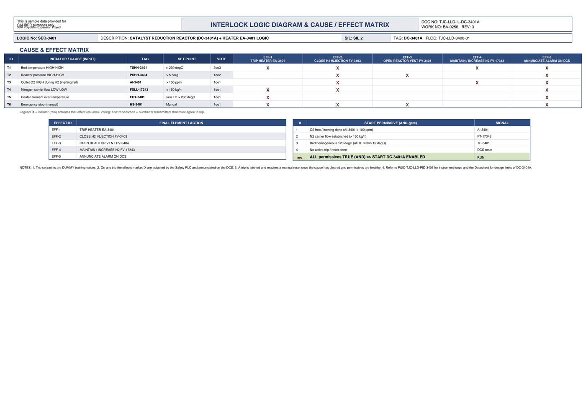

# Interlock Logic & Cause/Effect - DC-3401A

| Field | Value |
|---|---|
| Logic no. | SEQ-3401 |
| Description | CATALYST REDUCTION REACTOR (DC-3401A) + HEATER EA-3401 LOGIC |
| SIL | SIL 2 |
| Functional location | TJC-LLD-3400-01 |

## Cause & effect matrix

| ID | INITIATOR / CAUSE (INPUT) | TAG | SET POINT | VOTE | EFF-1 TRIP HEATER EA-3401 | EFF-2 CLOSE H2 INJECTION FV-3403 | EFF-3 OPEN REACTOR VENT PV-3404 | EFF-4 MAINTAIN / INCREASE N2 FV-17343 | EFF-5 ANNUNCIATE ALARM ON DCS |
|---|---|---|---|---|---|---|---|---|---|
| T1 | Bed temperature HIGH-HIGH | TSHH-3401 | > 230 degC | 2oo3 | X | X |  | X | X |
| T2 | Reactor pressure HIGH-HIGH | PSHH-3404 | > 5 barg | 1oo2 |  | X | X |  | X |
| T3 | Outlet O2 HIGH during H2 (inerting fail) | AI-3401 | > 100 ppm | 1oo1 |  | X |  | X | X |
| T4 | Nitrogen carrier flow LOW-LOW | FSLL-17343 | < 150 kg/h | 1oo1 | X | X |  |  | X |
| T5 | Heater element over-temperature | EHT-3401 | skin TC > 260 degC | 1oo1 | X |  |  |  | X |
| T6 | Emergency stop (manual) | HS-3401 | Manual | 1oo1 | X | X | X |  | X |

### Trips in plain language

- **TSHH-3401** (Bed temperature HIGH-HIGH) trips at **> 230 degC**, voting 2oo3. Effects: TRIP HEATER EA-3401; CLOSE H2 INJECTION FV-3403; MAINTAIN / INCREASE N2 FV-17343; ANNUNCIATE ALARM ON DCS.
- **PSHH-3404** (Reactor pressure HIGH-HIGH) trips at **> 5 barg**, voting 1oo2. Effects: CLOSE H2 INJECTION FV-3403; OPEN REACTOR VENT PV-3404; ANNUNCIATE ALARM ON DCS.
- **AI-3401** (Outlet O2 HIGH during H2 (inerting fail)) trips at **> 100 ppm**, voting 1oo1. Effects: CLOSE H2 INJECTION FV-3403; MAINTAIN / INCREASE N2 FV-17343; ANNUNCIATE ALARM ON DCS.
- **FSLL-17343** (Nitrogen carrier flow LOW-LOW) trips at **< 150 kg/h**, voting 1oo1. Effects: TRIP HEATER EA-3401; CLOSE H2 INJECTION FV-3403; ANNUNCIATE ALARM ON DCS.
- **EHT-3401** (Heater element over-temperature) trips at **skin TC > 260 degC**, voting 1oo1. Effects: TRIP HEATER EA-3401; ANNUNCIATE ALARM ON DCS.
- **HS-3401** (Emergency stop (manual)) trips at **Manual**, voting 1oo1. Effects: TRIP HEATER EA-3401; CLOSE H2 INJECTION FV-3403; OPEN REACTOR VENT PV-3404; ANNUNCIATE ALARM ON DCS.

## Effects (final elements)

| EFFECT ID | FINAL ELEMENT / ACTION |
|---|---|
| EFF-1 | TRIP HEATER EA-3401 |
| EFF-2 | CLOSE H2 INJECTION FV-3403 |
| EFF-3 | OPEN REACTOR VENT PV-3404 |
| EFF-4 | MAINTAIN / INCREASE N2 FV-17343 |
| EFF-5 | ANNUNCIATE ALARM ON DCS |

## Start permissives (all must be true)

| # | START PERMISSIVE (AND-gate) | SIGNAL |
|---|---|---|
| 1 | O2 free / inerting done (AI-3401 < 100 ppm) | AI-3401 |
| 2 | N2 carrier flow established (> 150 kg/h) | FT-17343 |
| 3 | Bed homogeneous 120 degC (all TE within 15 degC) | TE-3401 |
| 4 | No active trip / reset done | DCS reset |
| => | ALL permissives TRUE (AND) => START DC-3401A ENABLED | RUN |

## Notes

- Trip set points are DUMMY training values.
- On any trip the effects marked X are actuated by the Safety PLC and annunciated on the DCS.
- A trip is latched and requires a manual reset once the cause has cleared and permissives are healthy.
- Refer to P&ID TJC-LLD-PID-3401 for instrument loops and the Datasheet for design limits of DC-3401A.

---
Source: `Set_03_DC-3401A_CATALYST_REDUCTION_REACTOR/Interlock Logic Diagram DC-3401A.pdf`

## Image

