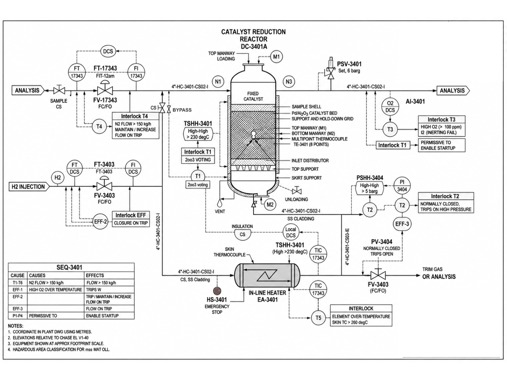

# P&ID - DC-3401A

Image-only drawing. The title block prints `TJC-LLD-PID-XXXX`; the number `TJC-LLD-PID-3401` comes from the datasheet and interlock cross-references.

## Tags linked to this drawing

From the interlock matrix and datasheet of DC-3401A:

- `AI-3401`
- `EA-3401`
- `EHT-3401`
- `FV-3403`
- `HS-3401`
- `PSHH-3404`
- `PSV-3401`
- `PV-3404`
- `TE-3401`
- `TSHH-3401`

## Description

To be written by an engineer from the drawing (flow path, valves, instruments, trips). Keep tags in backticks so they link.

---
Source: `Set_03_DC-3401A_CATALYST_REDUCTION_REACTOR/P&ID Set 3.png`

## Image

