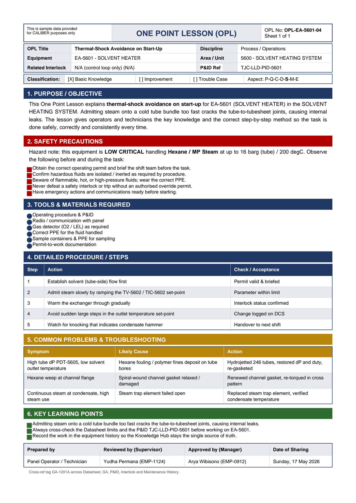

# OPL-EA-5601-04 - Thermal-Shock Avoidance on Start-Up

| Field | Value |
|---|---|
| Equipment | EA-5601 - SOLVENT HEATER |
| Area / unit | 5600 - SOLVENT HEATING SYSTEM |
| Discipline | Process / Operations |
| Classification | Basic Knowledge |
| Related interlock | N/A (control loop only) (N/A) |
| P&ID ref | TJC-LLD-PID-5601 |

## 1. Purpose

This One Point Lesson explains thermal-shock avoidance on start-up for EA-5601 (SOLVENT HEATER) in the SOLVENT HEATING SYSTEM. Admitting steam onto a cold tube bundle too fast cracks the tube-to-tubesheet joints, causing internal leaks. The lesson gives operators and technicians the key knowledge and the correct step-by-step method so the task is done safely, correctly and consistently every time.

## 2. Safety precautions

Hazard note: this equipment is LOW CRITICAL handling Hexane / MP Steam at up to 16 barg (tube) / 200 degC.

- Obtain the correct operating permit and brief the shift team before the task.
- Confirm hazardous fluids are isolated / inerted as required by procedure.
- Beware of flammable, hot, or high-pressure fluids; wear the correct PPE.
- Never defeat a safety interlock or trip without an authorised override permit.
- Have emergency actions and communications ready before starting.

## 3. Tools & materials

- Radio / communication with panel
- Gas detector (O2 / LEL) as required
- Correct PPE for the fluid handled
- Sample containers & PPE for sampling
- Permit-to-work documentation

## 4. Procedure

| Step | Action | Check / acceptance (as printed) |
|---|---|---|
| 1 | Establish solvent (tube-side) flow first | Permit valid & briefed |
| 2 | Admit steam slowly by ramping the TV-5602 / TIC-5602 set-point | Parameter within limit |
| 3 | Warm the exchanger through gradually | Interlock status confirmed |
| 4 | Avoid sudden large steps in the outlet temperature set-point | Change logged on DCS |
| 5 | Watch for knocking that indicates condensate hammer | Handover to next shift |

## 5. Common problems & troubleshooting

Full text restored from the linked work order where the OPL cell was cut off.

| Symptom | Likely cause | Action | Work order |
|---|---|---|---|
| High tube dP PDT-5605, low solvent outlet temperature | Hexane fouling / polymer fines deposit on tube bores | Hydrojetted 246 tubes, restored dP and duty, re-gasketed | WO-240110 |
| Hexane weep at channel flange | Spiral-wound channel gasket relaxed / damaged | Renewed channel gasket, re-torqued in cross pattern | WO-240111 |
| Continuous steam at condensate, high steam use | Steam trap element failed open | Replaced steam trap element, verified condensate temperature | WO-240112 |

## 6. Key learning points

- Admitting steam onto a cold tube bundle too fast cracks the tube-to-tubesheet joints, causing internal leaks.
- Record the work in the equipment history so the Knowledge Hub stays the single source of truth.

## Sign-off

| Role | Name |
|---|---|
| Prepared by | Panel Operator / Technician |
| Reviewed by (Supervisor) | Yudha Permana (EMP-1124) |
| Approved by (Manager) | Arya Wibisono (EMP-0912) |
| Date of Sharing | Sunday, 17 May 2026 |

---
Source: `Set_05_EA-5601_SOLVENT_HEATER/OPL (One Point Lessons)/OPL-EA-5601-04 - Thermal_Shock_Avoidance_on_Start_Up.pdf`

## Image

