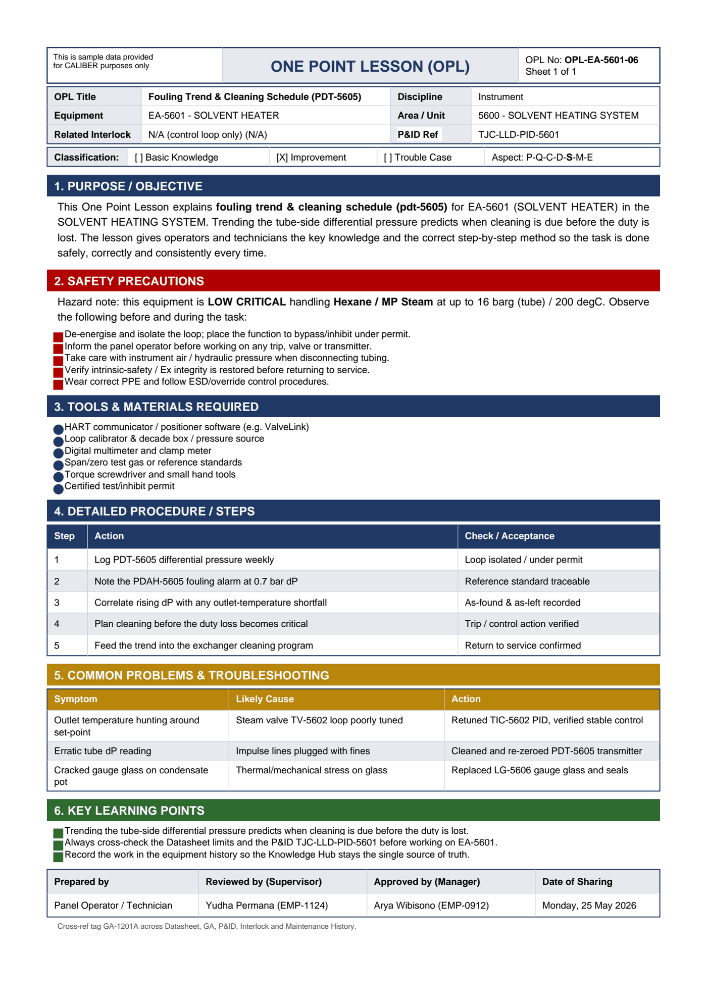

# OPL-EA-5601-06 - Fouling Trend & Cleaning Schedule (PDT-5605)

| Field | Value |
|---|---|
| Equipment | EA-5601 - SOLVENT HEATER |
| Area / unit | 5600 - SOLVENT HEATING SYSTEM |
| Discipline | Instrument |
| Classification | Improvement |
| Related interlock | N/A (control loop only) (N/A) |
| P&ID ref | TJC-LLD-PID-5601 |

## 1. Purpose

This One Point Lesson explains fouling trend & cleaning schedule (pdt-5605) for EA-5601 (SOLVENT HEATER) in the SOLVENT HEATING SYSTEM. Trending the tube-side differential pressure predicts when cleaning is due before the duty is lost. The lesson gives operators and technicians the key knowledge and the correct step-by-step method so the task is done safely, correctly and consistently every time.

## 2. Safety precautions

Hazard note: this equipment is LOW CRITICAL handling Hexane / MP Steam at up to 16 barg (tube) / 200 degC.

- De-energise and isolate the loop; place the function to bypass/inhibit under permit.
- Inform the panel operator before working on any trip, valve or transmitter.
- Take care with instrument air / hydraulic pressure when disconnecting tubing.
- Verify intrinsic-safety / Ex integrity is restored before returning to service.
- Wear correct PPE and follow ESD/override control procedures.

## 3. Tools & materials

- HART communicator / positioner software (e.g. ValveLink)
- Loop calibrator & decade box / pressure source
- Digital multimeter and clamp meter
- Span/zero test gas or reference standards
- Torque screwdriver and small hand tools
- Certified test/inhibit permit

## 4. Procedure

| Step | Action | Check / acceptance (as printed) |
|---|---|---|
| 1 | Log PDT-5605 differential pressure weekly | Loop isolated / under permit |
| 2 | Note the PDAH-5605 fouling alarm at 0.7 bar dP | Reference standard traceable |
| 3 | Correlate rising dP with any outlet-temperature shortfall | As-found & as-left recorded |
| 4 | Plan cleaning before the duty loss becomes critical | Trip / control action verified |
| 5 | Feed the trend into the exchanger cleaning program | Return to service confirmed |

## 5. Common problems & troubleshooting

Full text restored from the linked work order where the OPL cell was cut off.

| Symptom | Likely cause | Action | Work order |
|---|---|---|---|
| Outlet temperature hunting around set-point | Steam valve TV-5602 loop poorly tuned | Retuned TIC-5602 PID, verified stable control | WO-240114 |
| Erratic tube dP reading | Impulse lines plugged with fines | Cleaned and re-zeroed PDT-5605 transmitter | WO-240115 |
| Cracked gauge glass on condensate pot | Thermal/mechanical stress on glass | Replaced LG-5606 gauge glass and seals | WO-240118 |

## 6. Key learning points

- Trending the tube-side differential pressure predicts when cleaning is due before the duty is lost.
- Record the work in the equipment history so the Knowledge Hub stays the single source of truth.

## Sign-off

| Role | Name |
|---|---|
| Prepared by | Panel Operator / Technician |
| Reviewed by (Supervisor) | Yudha Permana (EMP-1124) |
| Approved by (Manager) | Arya Wibisono (EMP-0912) |
| Date of Sharing | Monday, 25 May 2026 |

---
Source: `Set_05_EA-5601_SOLVENT_HEATER/OPL (One Point Lessons)/OPL-EA-5601-06 - Fouling_Trend_Cleaning_Schedule_PDT_5605.pdf`

## Image

