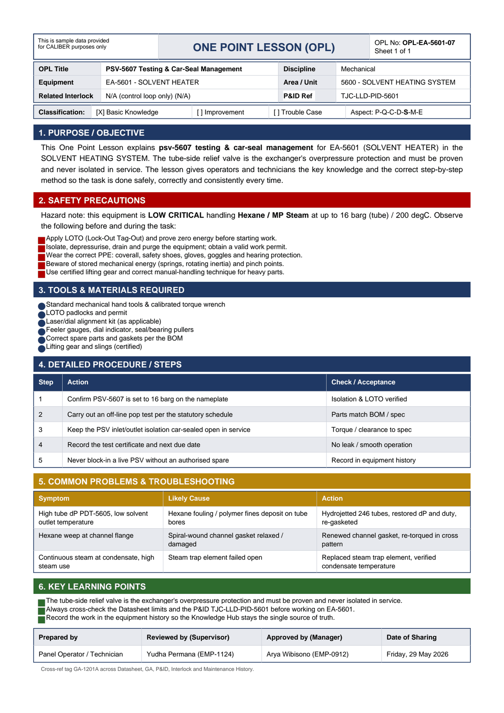

# OPL-EA-5601-07 - PSV-5607 Testing & Car-Seal Management

| Field | Value |
|---|---|
| Equipment | EA-5601 - SOLVENT HEATER |
| Area / unit | 5600 - SOLVENT HEATING SYSTEM |
| Discipline | Mechanical |
| Classification | Basic Knowledge |
| Related interlock | N/A (control loop only) (N/A) |
| P&ID ref | TJC-LLD-PID-5601 |

## 1. Purpose

This One Point Lesson explains psv-5607 testing & car-seal management for EA-5601 (SOLVENT HEATER) in the SOLVENT HEATING SYSTEM. The tube-side relief valve is the exchanger's overpressure protection and must be proven and never isolated in service. The lesson gives operators and technicians the key knowledge and the correct step-by-step method so the task is done safely, correctly and consistently every time.

## 2. Safety precautions

Hazard note: this equipment is LOW CRITICAL handling Hexane / MP Steam at up to 16 barg (tube) / 200 degC.

- Apply LOTO (Lock-Out Tag-Out) and prove zero energy before starting work.
- Isolate, depressurise, drain and purge the equipment; obtain a valid work permit.
- Wear the correct PPE: coverall, safety shoes, gloves, goggles and hearing protection.
- Beware of stored mechanical energy (springs, rotating inertia) and pinch points.
- Use certified lifting gear and correct manual-handling technique for heavy parts.

## 3. Tools & materials

- Standard mechanical hand tools & calibrated torque wrench
- LOTO padlocks and permit
- Laser/dial alignment kit (as applicable)
- Feeler gauges, dial indicator, seal/bearing pullers
- Correct spare parts and gaskets per the BOM
- Lifting gear and slings (certified)

## 4. Procedure

| Step | Action | Check / acceptance (as printed) |
|---|---|---|
| 1 | Confirm PSV-5607 is set to 16 barg on the nameplate | Isolation & LOTO verified |
| 2 | Carry out an off-line pop test per the statutory schedule | Parts match BOM / spec |
| 3 | Keep the PSV inlet/outlet isolation car-sealed open in service | Torque / clearance to spec |
| 4 | Record the test certificate and next due date | No leak / smooth operation |
| 5 | Never block-in a live PSV without an authorised spare | Record in equipment history |

## 5. Common problems & troubleshooting

Full text restored from the linked work order where the OPL cell was cut off.

| Symptom | Likely cause | Action | Work order |
|---|---|---|---|
| High tube dP PDT-5605, low solvent outlet temperature | Hexane fouling / polymer fines deposit on tube bores | Hydrojetted 246 tubes, restored dP and duty, re-gasketed | WO-240110 |
| Hexane weep at channel flange | Spiral-wound channel gasket relaxed / damaged | Renewed channel gasket, re-torqued in cross pattern | WO-240111 |
| Continuous steam at condensate, high steam use | Steam trap element failed open | Replaced steam trap element, verified condensate temperature | WO-240112 |

## 6. Key learning points

- The tube-side relief valve is the exchanger's overpressure protection and must be proven and never isolated in service.
- Record the work in the equipment history so the Knowledge Hub stays the single source of truth.

## Sign-off

| Role | Name |
|---|---|
| Prepared by | Panel Operator / Technician |
| Reviewed by (Supervisor) | Yudha Permana (EMP-1124) |
| Approved by (Manager) | Arya Wibisono (EMP-0912) |
| Date of Sharing | Friday, 29 May 2026 |

---
Source: `Set_05_EA-5601_SOLVENT_HEATER/OPL (One Point Lessons)/OPL-EA-5601-07 - PSV_5607_Testing_Car_Seal_Management.pdf`

## Image

