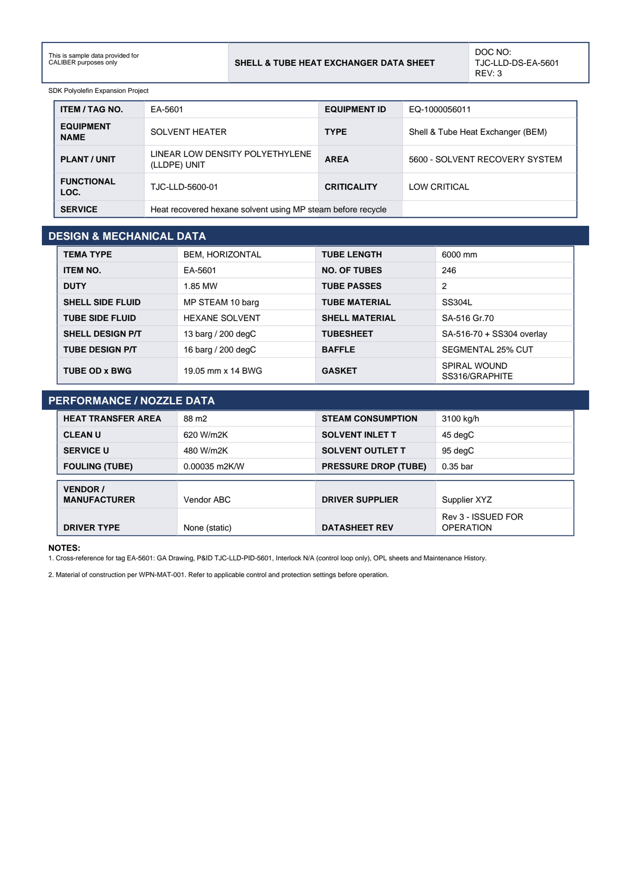

# Equipment Datasheet - EA-5601

Shell & Tube Heat Exchanger Data Sheet for **EA-5601 SOLVENT HEATER**.

## Identification

| Field | Value |
|---|---|
| ITEM / TAG NO. | EA-5601 |
| EQUIPMENT ID | EQ-1000056011 |
| EQUIPMENT NAME | SOLVENT HEATER |
| TYPE | Shell & Tube Heat Exchanger (BEM) |
| PLANT / UNIT | LINEAR LOW DENSITY POLYETHYLENE (LLDPE) UNIT |
| AREA | 5600 - SOLVENT RECOVERY SYSTEM |
| FUNCTIONAL LOC. | TJC-LLD-5600-01 |
| CRITICALITY | LOW CRITICAL |
| SERVICE | Heat recovered hexane solvent using MP steam before recycle |

## Design & Mechanical Data

| Field | Value |
|---|---|
| TEMA TYPE | BEM, HORIZONTAL |
| TUBE LENGTH | 6000 mm |
| ITEM NO. | EA-5601 |
| NO. OF TUBES | 246 |
| DUTY | 1.85 MW |
| TUBE PASSES | 2 |
| SHELL SIDE FLUID | MP STEAM 10 barg |
| TUBE MATERIAL | SS304L |
| TUBE SIDE FLUID | HEXANE SOLVENT |
| SHELL MATERIAL | SA-516 Gr.70 |
| SHELL DESIGN P/T | 13 barg / 200 degC |
| TUBESHEET | SA-516-70 + SS304 overlay |
| TUBE DESIGN P/T | 16 barg / 200 degC |
| BAFFLE | SEGMENTAL 25% CUT |
| TUBE OD x BWG | 19.05 mm x 14 BWG |
| GASKET | SPIRAL WOUND SS316/GRAPHITE |

## Performance / Nozzle Data

| Field | Value |
|---|---|
| HEAT TRANSFER AREA | 88 m2 |
| STEAM CONSUMPTION | 3100 kg/h |
| CLEAN U | 620 W/m2K |
| SOLVENT INLET T | 45 degC |
| SERVICE U | 480 W/m2K |
| SOLVENT OUTLET T | 95 degC |
| FOULING (TUBE) | 0.00035 m2K/W |
| PRESSURE DROP (TUBE) | 0.35 bar |

## Vendor & revision

| Field | Value |
|---|---|
| VENDOR / MANUFACTURER | Vendor ABC |
| DRIVER SUPPLIER | Supplier XYZ |
| DRIVER TYPE | None (static) |
| DATASHEET REV | Rev 3 - ISSUED FOR OPERATION |

## Notes

- Cross-reference for tag EA-5601: GA Drawing, P&ID TJC-LLD-PID-5601, Interlock N/A (control loop only), OPL sheets and Maintenance History.
- Material of construction per WPN-MAT-001. Refer to applicable control and protection settings before operation.

---
Source: `Set_05_EA-5601_SOLVENT_HEATER/Equipment Datasheet - EA-5601.pdf`

## Image

