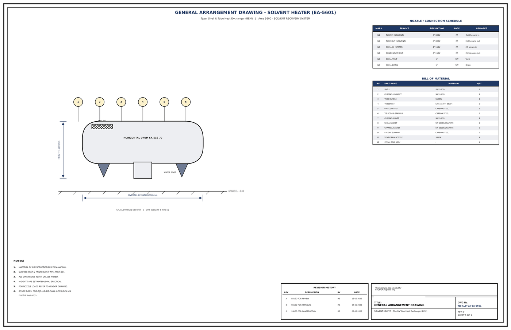

# General Arrangement Drawing - EA-5601

## Key dimensions

- OVERALL LENGTH 6800 mm
- HEIGHT 1100 mm
- C/L ELEVATION 550 mm   |   DRY WEIGHT 6 400 kg

## Nozzle / connection schedule

Mark, service, size-rating, face, remarks as printed on the drawing.

- N1 TUBE IN (SOLVENT) 6"-300# RF Cold hexane in
- N2 TUBE OUT (SOLVENT) 6"-300# RF Hot hexane out
- N3 SHELL IN (STEAM) 4"-150# RF MP steam in
- N4 CONDENSATE OUT 3"-150# RF Condensate out
- N5 SHELL VENT 1" SW Vent
- N6 SHELL DRAIN 1" SW Drain

## Bill of material

No., part name, material, quantity as printed on the drawing.

- 1 SHELL SA-516-70 1
- 2 CHANNEL / BONNET SA-516-70 1
- 3 TUBE BUNDLE SS304L 1
- 4 TUBESHEET SA-516-70 + SS304 2
- 5 BAFFLE PLATES CARBON STEEL 9
- 6 TIE RODS & SPACERS CARBON STEEL 6
- 7 CHANNEL COVER SA-516-70 1
- 8 SHELL GASKET SW SS316/GRAPHITE 2
- 9 CHANNEL GASKET SW SS316/GRAPHITE 2
- 10 SADDLE SUPPORT CARBON STEEL 2
- 11 VENT/DRAIN NOZZLE SS304 4
- 12 STEAM TRAP ASSY - 1

## Notes

- MATERIAL OF CONSTRUCTION PER WPN-MAT-001.
- SURFACE PREP & PAINTING PER WPN-PAINT-001.
- ALL DIMENSIONS IN mm UNLESS NOTED.
- WEIGHTS ARE ESTIMATED (DRY / ERECTION).
- FOR NOZZLE LOADS REFER TO VENDOR DRAWING.
- ASSOC DOCS: P&ID TJC-LLD-PID-5601, INTERLOCK N/A

## Revision history

| Rev | Description | By | Date |
|---|---|---|---|
| A | ISSUED FOR REVIEW | RS | 15-05-2026 |
| B | ISSUED FOR APPROVAL | RS | 27-05-2026 |
| 0 | ISSUED FOR CONSTRUCTION | RS | 05-06-2026 |

---
Source: `Set_05_EA-5601_SOLVENT_HEATER/Equipment GA Drawing EA-5601.pdf`

## Image

