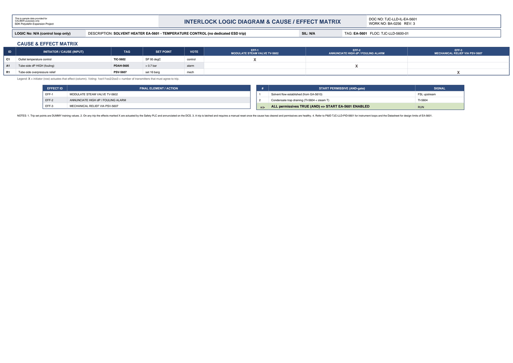

# Interlock Logic & Cause/Effect - EA-5601

| Field | Value |
|---|---|
| Logic no. | N/A (control loop only) |
| Description | SOLVENT HEATER EA-5601 - TEMPERATURE CONTROL (no dedicated ESD trip) |
| SIL | N/A |
| Functional location | TJC-LLD-5600-01 |

## Cause & effect matrix

| ID | INITIATOR / CAUSE (INPUT) | TAG | SET POINT | VOTE | EFF-1 MODULATE STEAM VALVE TV-5602 | EFF-2 ANNUNCIATE HIGH dP / FOULING ALARM | EFF-3 MECHANICAL RELIEF VIA PSV-5607 |
|---|---|---|---|---|---|---|---|
| C1 | Outlet temperature control | TIC-5602 | SP 95 degC | control | X |  |  |
| A1 | Tube-side dP HIGH (fouling) | PDAH-5605 | > 0.7 bar | alarm |  | X |  |
| R1 | Tube-side overpressure relief | PSV-5607 | set 16 barg | mech |  |  | X |

### Trips in plain language

- **TIC-5602** (Outlet temperature control) trips at **SP 95 degC**, voting control. Effects: MODULATE STEAM VALVE TV-5602.
- **PDAH-5605** (Tube-side dP HIGH (fouling)) trips at **> 0.7 bar**, voting alarm. Effects: ANNUNCIATE HIGH dP / FOULING ALARM.
- **PSV-5607** (Tube-side overpressure relief) trips at **set 16 barg**, voting mech. Effects: MECHANICAL RELIEF VIA PSV-5607.

## Effects (final elements)

| EFFECT ID | FINAL ELEMENT / ACTION |
|---|---|
| EFF-1 | MODULATE STEAM VALVE TV-5602 |
| EFF-2 | ANNUNCIATE HIGH dP / FOULING ALARM |
| EFF-3 | MECHANICAL RELIEF VIA PSV-5607 |

## Start permissives (all must be true)

| # | START PERMISSIVE (AND-gate) | SIGNAL |
|---|---|---|
| 1 | Solvent flow established (from GA-5610) | FSL upstream |
| 2 | Condensate trap draining (TI-5604 < steam T) | TI-5604 |
| => | ALL permissives TRUE (AND) => START EA-5601 ENABLED | RUN |

## Notes

- Trip set points are DUMMY training values.
- On any trip the effects marked X are actuated by the Safety PLC and annunciated on the DCS.
- A trip is latched and requires a manual reset once the cause has cleared and permissives are healthy.
- Refer to P&ID TJC-LLD-PID-5601 for instrument loops and the Datasheet for design limits of EA-5601.

---
Source: `Set_05_EA-5601_SOLVENT_HEATER/Interlock Logic Diagram EA-5601.pdf`

## Image

