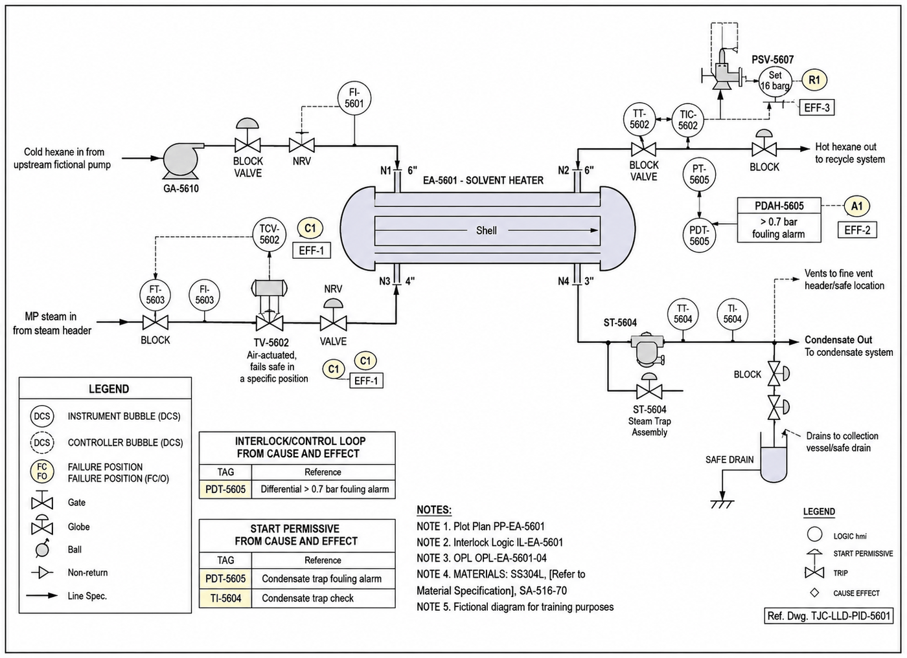

# P&ID - EA-5601

Image-only drawing. The title block prints `TJC-LLD-PID-XXXX`; the number `TJC-LLD-PID-5601` comes from the datasheet and interlock cross-references.

## Tags linked to this drawing

From the interlock matrix and datasheet of EA-5601:

- `GA-5610`
- `LG-5606`
- `PDAH-5605`
- `PDT-5605`
- `PSV-5607`
- `TI-5604`
- `TIC-5602`
- `TV-5602`

## Description

To be written by an engineer from the drawing (flow path, valves, instruments, trips). Keep tags in backticks so they link.

---
Source: `Set_05_EA-5601_SOLVENT_HEATER/P&ID SET 5.png`

## Image

