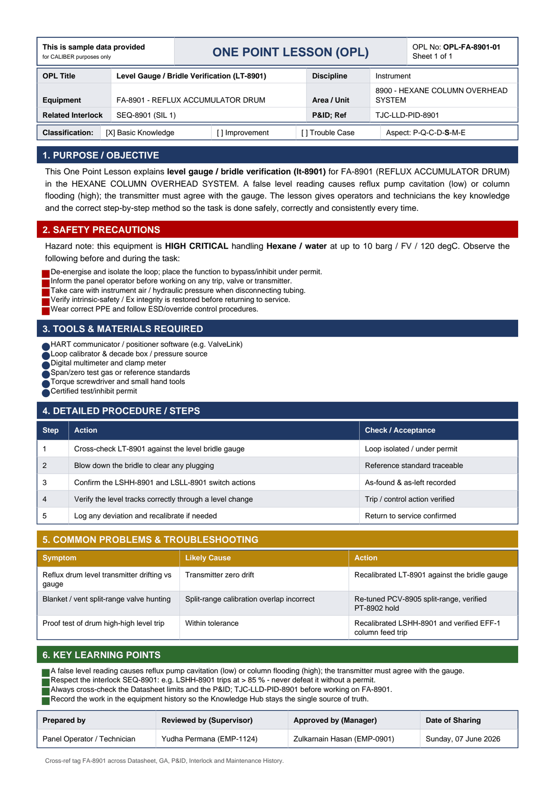

# OPL-FA-8901-01 - Level Gauge / Bridle Verification (LT-8901)

| Field | Value |
|---|---|
| Equipment | FA-8901 - REFLUX ACCUMULATOR DRUM |
| Area / unit | 8900 - HEXANE COLUMN OVERHEAD SYSTEM |
| Discipline | Instrument |
| Classification | Basic Knowledge |
| Related interlock | SEQ-8901 (SIL 1) |
| P&ID ref | TJC-LLD-PID-8901 |

## 1. Purpose

This One Point Lesson explains level gauge / bridle verification (lt-8901) for FA-8901 (REFLUX ACCUMULATOR DRUM) in the HEXANE COLUMN OVERHEAD SYSTEM. A false level reading causes reflux pump cavitation (low) or column flooding (high); the transmitter must agree with the gauge. The lesson gives operators and technicians the key knowledge and the correct step-by-step method so the task is done safely, correctly and consistently every time.

## 2. Safety precautions

Hazard note: this equipment is HIGH CRITICAL handling Hexane / water at up to 10 barg / FV / 120 degC.

- De-energise and isolate the loop; place the function to bypass/inhibit under permit.
- Inform the panel operator before working on any trip, valve or transmitter.
- Take care with instrument air / hydraulic pressure when disconnecting tubing.
- Verify intrinsic-safety / Ex integrity is restored before returning to service.
- Wear correct PPE and follow ESD/override control procedures.

## 3. Tools & materials

- HART communicator / positioner software (e.g. ValveLink)
- Loop calibrator & decade box / pressure source
- Digital multimeter and clamp meter
- Span/zero test gas or reference standards
- Torque screwdriver and small hand tools
- Certified test/inhibit permit

## 4. Procedure

| Step | Action | Check / acceptance (as printed) |
|---|---|---|
| 1 | Cross-check LT-8901 against the level bridle gauge | Loop isolated / under permit |
| 2 | Blow down the bridle to clear any plugging | Reference standard traceable |
| 3 | Confirm the LSHH-8901 and LSLL-8901 switch actions | As-found & as-left recorded |
| 4 | Verify the level tracks correctly through a level change | Trip / control action verified |
| 5 | Log any deviation and recalibrate if needed | Return to service confirmed |

## 5. Common problems & troubleshooting

Full text restored from the linked work order where the OPL cell was cut off.

| Symptom | Likely cause | Action | Work order |
|---|---|---|---|
| Reflux drum level transmitter drifting vs gauge | Transmitter zero drift | Recalibrated LT-8901 against the bridle gauge | WO-240188 |
| Blanket / vent split-range valve hunting | Split-range calibration overlap incorrect | Re-tuned PCV-8905 split-range, verified PT-8902 hold | WO-240191 |
| Proof test of drum high-high level trip | Within tolerance | Recalibrated LSHH-8901 and verified EFF-1 column feed trip | WO-240192 |

## 6. Key learning points

- A false level reading causes reflux pump cavitation (low) or column flooding (high); the transmitter must agree with the gauge.
- Respect the interlock SEQ-8901: e.g. LSHH-8901 trips at > 85 % - never defeat it without a permit.
- Always cross-check the Datasheet limits and the P&ID TJC-LLD-PID-8901 before working on FA-8901.
- Record the work in the equipment history so the Knowledge Hub stays the single source of truth.

## Sign-off

| Role | Name |
|---|---|
| Prepared by | Panel Operator / Technician |
| Reviewed by (Supervisor) | Yudha Permana (EMP-1124) |
| Approved by (Manager) | Zulkarnain Hasan (EMP-0901) |
| Date of Sharing | Sunday, 07 June 2026 |

---
Source: `Set_08_FA-8901_REFLUX_ACCUMULATOR_DRUM/One Point Lesson (OPL)/OPL-FA-8901-01 - Level_Gauge_Bridle_Verification_LT_8901.pdf`

## Image

