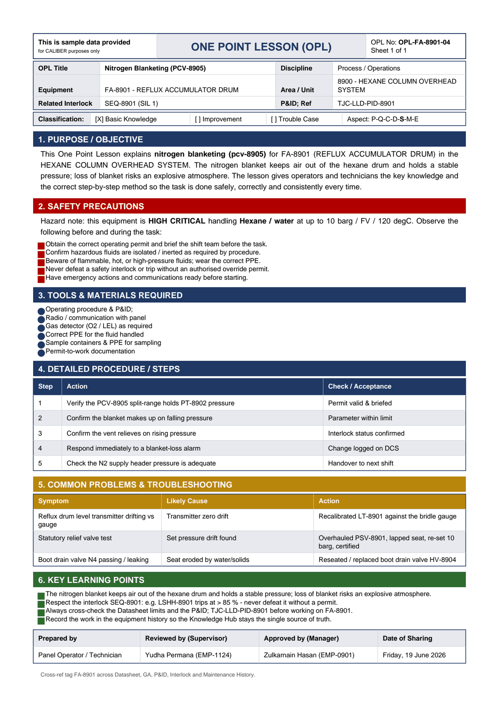

# OPL-FA-8901-04 - Nitrogen Blanketing (PCV-8905)

| Field | Value |
|---|---|
| Equipment | FA-8901 - REFLUX ACCUMULATOR DRUM |
| Area / unit | 8900 - HEXANE COLUMN OVERHEAD SYSTEM |
| Discipline | Process / Operations |
| Classification | Basic Knowledge |
| Related interlock | SEQ-8901 (SIL 1) |
| P&ID ref | TJC-LLD-PID-8901 |

## 1. Purpose

This One Point Lesson explains nitrogen blanketing (pcv-8905) for FA-8901 (REFLUX ACCUMULATOR DRUM) in the HEXANE COLUMN OVERHEAD SYSTEM. The nitrogen blanket keeps air out of the hexane drum and holds a stable pressure; loss of blanket risks an explosive atmosphere. The lesson gives operators and technicians the key knowledge and the correct step-by-step method so the task is done safely, correctly and consistently every time.

## 2. Safety precautions

Hazard note: this equipment is HIGH CRITICAL handling Hexane / water at up to 10 barg / FV / 120 degC.

- Obtain the correct operating permit and brief the shift team before the task.
- Confirm hazardous fluids are isolated / inerted as required by procedure.
- Beware of flammable, hot, or high-pressure fluids; wear the correct PPE.
- Never defeat a safety interlock or trip without an authorised override permit.
- Have emergency actions and communications ready before starting.

## 3. Tools & materials

- Operating procedure & P&ID
- Radio / communication with panel
- Gas detector (O2 / LEL) as required
- Correct PPE for the fluid handled
- Sample containers & PPE for sampling
- Permit-to-work documentation

## 4. Procedure

| Step | Action | Check / acceptance (as printed) |
|---|---|---|
| 1 | Verify the PCV-8905 split-range holds PT-8902 pressure | Permit valid & briefed |
| 2 | Confirm the blanket makes up on falling pressure | Parameter within limit |
| 3 | Confirm the vent relieves on rising pressure | Interlock status confirmed |
| 4 | Respond immediately to a blanket-loss alarm | Change logged on DCS |
| 5 | Check the N2 supply header pressure is adequate | Handover to next shift |

## 5. Common problems & troubleshooting

Full text restored from the linked work order where the OPL cell was cut off.

| Symptom | Likely cause | Action | Work order |
|---|---|---|---|
| Reflux drum level transmitter drifting vs gauge | Transmitter zero drift | Recalibrated LT-8901 against the bridle gauge | WO-240188 |
| Statutory relief valve test | Set pressure drift found | Overhauled PSV-8901, lapped seat, re-set 10 barg, certified | WO-240189 |
| Boot drain valve N4 passing / leaking | Seat eroded by water/solids | Reseated / replaced boot drain valve HV-8904 | WO-240190 |

## 6. Key learning points

- The nitrogen blanket keeps air out of the hexane drum and holds a stable pressure; loss of blanket risks an explosive atmosphere.
- Respect the interlock SEQ-8901: e.g. LSHH-8901 trips at > 85 % - never defeat it without a permit.
- Always cross-check the Datasheet limits and the P&ID TJC-LLD-PID-8901 before working on FA-8901.
- Record the work in the equipment history so the Knowledge Hub stays the single source of truth.

## Sign-off

| Role | Name |
|---|---|
| Prepared by | Panel Operator / Technician |
| Reviewed by (Supervisor) | Yudha Permana (EMP-1124) |
| Approved by (Manager) | Zulkarnain Hasan (EMP-0901) |
| Date of Sharing | Friday, 19 June 2026 |

---
Source: `Set_08_FA-8901_REFLUX_ACCUMULATOR_DRUM/One Point Lesson (OPL)/OPL-FA-8901-04 - Nitrogen_Blanketing_PCV_8905.pdf`

## Image

