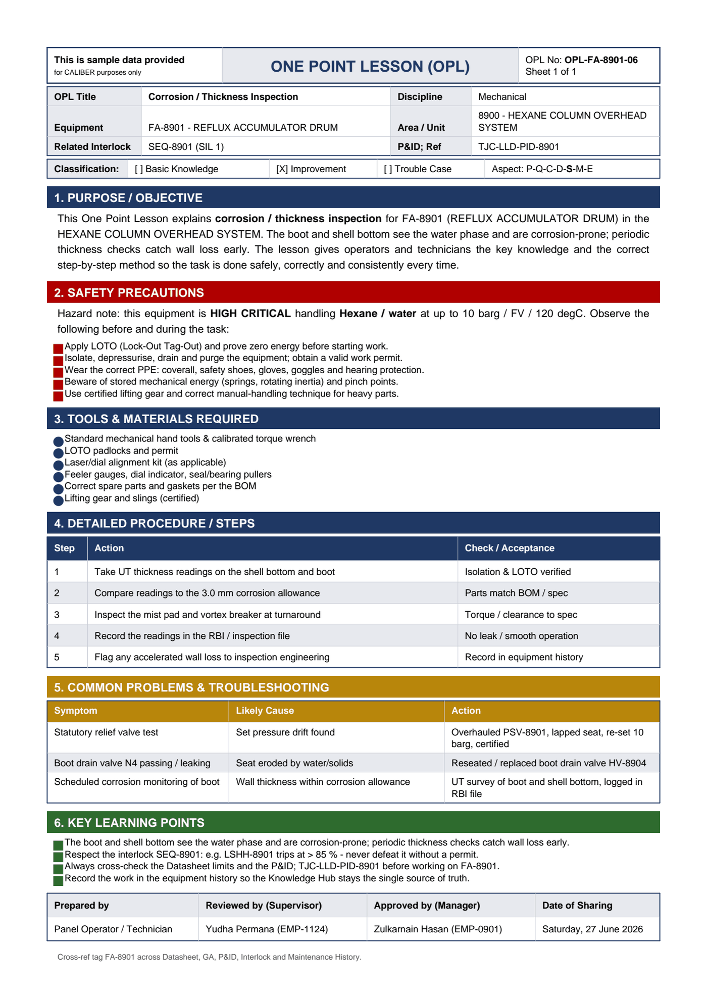

# OPL-FA-8901-06 - Corrosion / Thickness Inspection

| Field | Value |
|---|---|
| Equipment | FA-8901 - REFLUX ACCUMULATOR DRUM |
| Area / unit | 8900 - HEXANE COLUMN OVERHEAD SYSTEM |
| Discipline | Mechanical |
| Classification | Improvement |
| Related interlock | SEQ-8901 (SIL 1) |
| P&ID ref | TJC-LLD-PID-8901 |

## 1. Purpose

This One Point Lesson explains corrosion / thickness inspection for FA-8901 (REFLUX ACCUMULATOR DRUM) in the HEXANE COLUMN OVERHEAD SYSTEM. The boot and shell bottom see the water phase and are corrosion-prone; periodic thickness checks catch wall loss early. The lesson gives operators and technicians the key knowledge and the correct step-by-step method so the task is done safely, correctly and consistently every time.

## 2. Safety precautions

Hazard note: this equipment is HIGH CRITICAL handling Hexane / water at up to 10 barg / FV / 120 degC.

- Apply LOTO (Lock-Out Tag-Out) and prove zero energy before starting work.
- Isolate, depressurise, drain and purge the equipment; obtain a valid work permit.
- Wear the correct PPE: coverall, safety shoes, gloves, goggles and hearing protection.
- Beware of stored mechanical energy (springs, rotating inertia) and pinch points.
- Use certified lifting gear and correct manual-handling technique for heavy parts.

## 3. Tools & materials

- Standard mechanical hand tools & calibrated torque wrench
- LOTO padlocks and permit
- Laser/dial alignment kit (as applicable)
- Feeler gauges, dial indicator, seal/bearing pullers
- Correct spare parts and gaskets per the BOM
- Lifting gear and slings (certified)

## 4. Procedure

| Step | Action | Check / acceptance (as printed) |
|---|---|---|
| 1 | Take UT thickness readings on the shell bottom and boot | Isolation & LOTO verified |
| 2 | Compare readings to the 3.0 mm corrosion allowance | Parts match BOM / spec |
| 3 | Inspect the mist pad and vortex breaker at turnaround | Torque / clearance to spec |
| 4 | Record the readings in the RBI / inspection file | No leak / smooth operation |
| 5 | Flag any accelerated wall loss to inspection engineering | Record in equipment history |

## 5. Common problems & troubleshooting

Full text restored from the linked work order where the OPL cell was cut off.

| Symptom | Likely cause | Action | Work order |
|---|---|---|---|
| Statutory relief valve test | Set pressure drift found | Overhauled PSV-8901, lapped seat, re-set 10 barg, certified | WO-240189 |
| Boot drain valve N4 passing / leaking | Seat eroded by water/solids | Reseated / replaced boot drain valve HV-8904 | WO-240190 |
| Scheduled corrosion monitoring of boot | Wall thickness within corrosion allowance | UT survey of boot and shell bottom, logged in RBI file | WO-240194 |

## 6. Key learning points

- The boot and shell bottom see the water phase and are corrosion-prone; periodic thickness checks catch wall loss early.
- Respect the interlock SEQ-8901: e.g. LSHH-8901 trips at > 85 % - never defeat it without a permit.
- Always cross-check the Datasheet limits and the P&ID TJC-LLD-PID-8901 before working on FA-8901.
- Record the work in the equipment history so the Knowledge Hub stays the single source of truth.

## Sign-off

| Role | Name |
|---|---|
| Prepared by | Panel Operator / Technician |
| Reviewed by (Supervisor) | Yudha Permana (EMP-1124) |
| Approved by (Manager) | Zulkarnain Hasan (EMP-0901) |
| Date of Sharing | Saturday, 27 June 2026 |

---
Source: `Set_08_FA-8901_REFLUX_ACCUMULATOR_DRUM/One Point Lesson (OPL)/OPL-FA-8901-06 - Corrosion_Thickness_Inspection.pdf`

## Image

