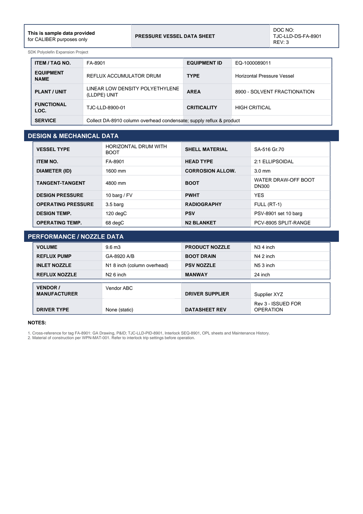

# Equipment Datasheet - FA-8901

Pressure Vessel Data Sheet for **FA-8901 REFLUX ACCUMULATOR DRUM**.

## Identification

| Field | Value |
|---|---|
| ITEM / TAG NO. | FA-8901 |
| EQUIPMENT ID | EQ-1000089011 |
| EQUIPMENT NAME | REFLUX ACCUMULATOR DRUM |
| TYPE | Horizontal Pressure Vessel |
| PLANT / UNIT | LINEAR LOW DENSITY POLYETHYLENE (LLDPE) UNIT |
| AREA | 8900 - SOLVENT FRACTIONATION |
| FUNCTIONAL LOC. | TJC-LLD-8900-01 |
| CRITICALITY | HIGH CRITICAL |
| SERVICE | Collect DA-8910 column overhead condens ate; supply reflux & pro duct |

## Design & Mechanical Data

| Field | Value |
|---|---|
| VESSEL TYPE | HORIZONTAL DRUM WITH BOOT |
| SHELL MATERIAL | SA-516 Gr.70 |
| ITEM NO. | FA-8901 |
| HEAD TYPE | 2:1 ELLIPSOIDAL |
| DIAMETER (ID) | 1600 mm |
| CORROSION ALLOW. | 3.0 mm |
| TANGENT-TANGENT | 4800 mm |
| BOOT | WATER DRAW-OFF BOOT DN300 |
| DESIGN PRESSURE | 10 barg / FV |
| PWHT | YES |
| OPERATING PRESSURE | 3.5 barg |
| RADIOGRAPHY | FULL (RT-1) |
| DESIGN TEMP. | 120 degC |
| PSV | PSV-8901 set 10 barg |
| OPERATING TEMP. | 68 degC |
| N2 BLANKET | PCV-8905 SPLIT-RANGE |

## Performance / Nozzle Data

| Field | Value |
|---|---|
| VOLUME | 9.6 m3 |
| PRODUCT NOZZLE | N3 4 inch |
| REFLUX PUMP | GA-8920 A/B |
| BOOT DRAIN | N4 2 inch |
| INLET NOZZLE | N1 8 inch (column overhead) |
| PSV NOZZLE | N5 3 inch |
| REFLUX NOZZLE | N2 6 inch |
| MANWAY | 24 inch |

## Notes

- Cross-reference for tag FA-8901: GA Drawing, P&ID TJC-LLD-PID-8901, Interlock SEQ-8901, OPL sheets and Maintenance History.
- Material of construction per WPN-MAT-001. Refer to interlock trip settings before operation.

---
Source: `Set_08_FA-8901_REFLUX_ACCUMULATOR_DRUM/Equipment Datasheet - FA-8901.pdf`

## Image

