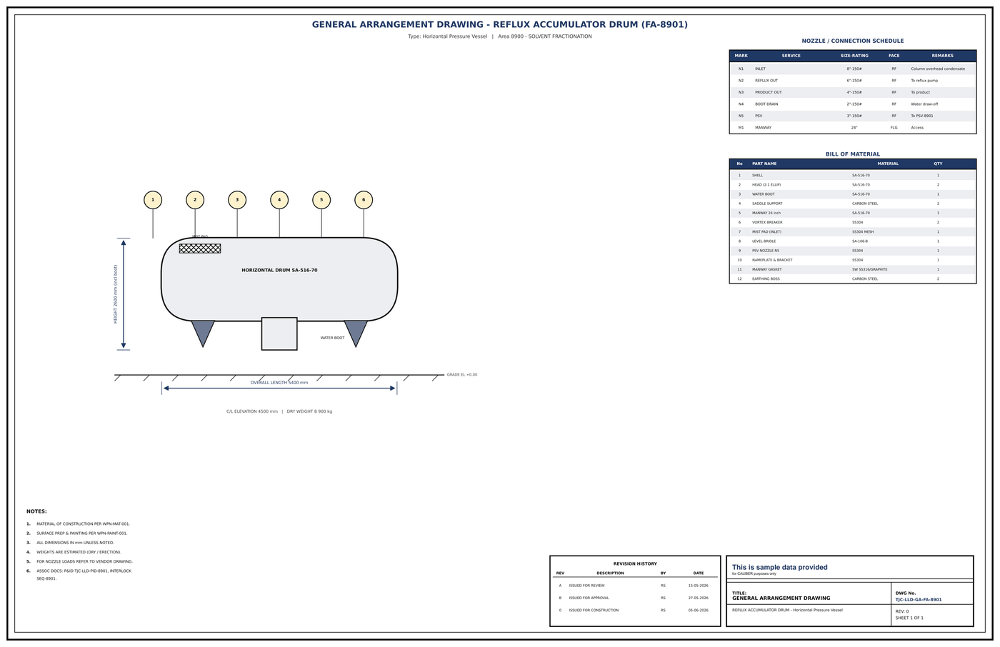

# General Arrangement Drawing - FA-8901

## Key dimensions

- OVERALL LENGTH 5400 mm
- HEIGHT 2600 mm (incl boot)
- C/L ELEVATION 4500 mm   |   DRY WEIGHT 8 900 kg

## Nozzle / connection schedule

Mark, service, size-rating, face, remarks as printed on the drawing.

- N1 INLET 8"-150# RF Column overhead condensate
- N2 REFLUX OUT 6"-150# RF T o reflux pump
- N3 PRODUCT OUT 4"-150# RF T o product
- N4 BOOT DRAIN 2"-150# RF Water draw-off
- N5 PSV 3"-150# RF T o PSV-8901

## Bill of material

No., part name, material, quantity as printed on the drawing.

- 1 SHELL SA-516-70 1
- 2 HEAD (2:1 ELLIP) SA-516-70 2
- 3 WATER BOOT SA-516-70 1
- 4 SADDLE SUPPORT CARBON STEEL 2
- 5 MANWAY 24 inch SA-516-70 1
- 6 VORTEX BREAKER SS304 2
- 7 MIST PAD (INLET) SS304 MESH 1
- 8 LEVEL BRIDLE SA-106-B 1
- 9 PSV NOZZLE N5 SS304 1
- 10 NAMEPLATE & BRACKET SS304 1
- 11 MANWAY GASKET SW SS316/GRAPHITE 1
- 12 EARTHING BOSS CARBON STEEL 2

## Notes

- MATERIAL OF CONSTRUCTION PER WPN-MAT-001.
- SURFACE PREP & PAINTING PER WPN-PAINT-001.
- ALL DIMENSIONS IN mm UNLESS NOTED.
- WEIGHTS ARE ESTIMATED (DRY / ERECTION).
- FOR NOZZLE LOADS REFER TO VENDOR DRAWING.
- ASSOC DOCS: P&ID TJC-LLD-PID-8901, INTERLOCK

## Revision history

| Rev | Description | By | Date |
|---|---|---|---|
| A | ISSUED FOR REVIEW | RS | 15-05-2026 |
| B | ISSUED FOR APPROVAL | RS | 27-05-2026 |
| 0 | ISSUED FOR CONSTRUCTION | RS | 05-06-2026 |

---
Source: `Set_08_FA-8901_REFLUX_ACCUMULATOR_DRUM/Equipment GA Drawing - FA-8901.pdf`

## Image

