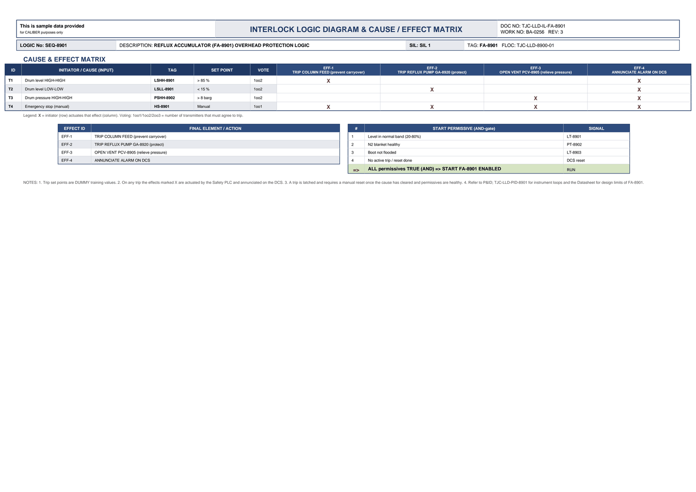

# Interlock Logic & Cause/Effect - FA-8901

| Field | Value |
|---|---|
| Logic no. | SEQ-8901 |
| Description | REFLUX ACCUMULATOR (FA-8901) OVERHEAD PROTECTION LOGIC |
| SIL | SIL 1 |
| Functional location | TJC-LLD-8900-01 |

## Cause & effect matrix

| ID | INITIATOR / CAUSE (INPUT) | TAG | SET POINT | VOTE | EFF-1 TRIP COLUMN FEED (prevent carryover) | EFF-2 TRIP REFLUX PUMP GA-8920 (protect) | EFF-3 OPEN VENT PCV-8905 (relieve pressure) | EFF-4 ANNUNCIATE ALARM ON DCS |
|---|---|---|---|---|---|---|---|---|
| T1 | Drum level HIGH-HIGH | LSHH-8901 | > 85 % | 1oo2 | X |  |  | X |
| T2 | Drum level LOW-LOW | LSLL-8901 | < 15 % | 1oo2 |  | X |  | X |
| T3 | Drum pressure HIGH-HIGH | PSHH-8902 | > 8 barg | 1oo2 |  |  | X | X |
| T4 | Emergency stop (manual) | HS-8901 | Manual | 1oo1 | X | X | X | X |

### Trips in plain language

- **LSHH-8901** (Drum level HIGH-HIGH) trips at **> 85 %**, voting 1oo2. Effects: TRIP COLUMN FEED (prevent carryover); ANNUNCIATE ALARM ON DCS.
- **LSLL-8901** (Drum level LOW-LOW) trips at **< 15 %**, voting 1oo2. Effects: TRIP REFLUX PUMP GA-8920 (protect); ANNUNCIATE ALARM ON DCS.
- **PSHH-8902** (Drum pressure HIGH-HIGH) trips at **> 8 barg**, voting 1oo2. Effects: OPEN VENT PCV-8905 (relieve pressure); ANNUNCIATE ALARM ON DCS.
- **HS-8901** (Emergency stop (manual)) trips at **Manual**, voting 1oo1. Effects: TRIP COLUMN FEED (prevent carryover); TRIP REFLUX PUMP GA-8920 (protect); OPEN VENT PCV-8905 (relieve pressure); ANNUNCIATE ALARM ON DCS.

## Effects (final elements)

| EFFECT ID | FINAL ELEMENT / ACTION |
|---|---|
| EFF-1 | TRIP COLUMN FEED (prevent carryover) |
| EFF-2 | TRIP REFLUX PUMP GA-8920 (protect) |
| EFF-3 | OPEN VENT PCV-8905 (relieve pressure) |
| EFF-4 | ANNUNCIATE ALARM ON DCS |

## Start permissives (all must be true)

| # | START PERMISSIVE (AND-gate) | SIGNAL |
|---|---|---|
| 1 | Level in normal band (20-80%) | LT-8901 |
| 2 | N2 blanket healthy | PT-8902 |
| 3 | Boot not flooded | LT-8903 |
| 4 | No active trip / reset done | DCS reset |
| => | ALL permissives TRUE (AND) => START FA-8901 ENABLED | RUN |

## Notes

- Trip set points are DUMMY training values.
- On any trip the effects marked X are actuated by the Safety PLC and annunciated on the DCS.
- A trip is latched and requires a manual reset once the cause has cleared and permissives are healthy.
- Refer to P&ID TJC-LLD-PID-8901 for instrument loops and the Datasheet for design limits of FA-8901. 

---
Source: `Set_08_FA-8901_REFLUX_ACCUMULATOR_DRUM/Interlock Logic Diagram - FA-8901.pdf`

## Image

