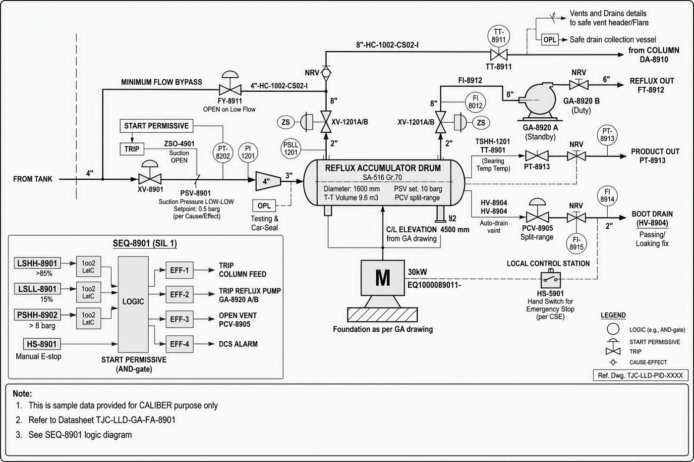

# P&ID - FA-8901

Image-only drawing. The title block prints `TJC-LLD-PID-XXXX`; the number `TJC-LLD-PID-8901` comes from the datasheet and interlock cross-references.

## Tags linked to this drawing

From the interlock matrix and datasheet of FA-8901:

- `DA-8910`
- `GA-8920`
- `HS-8901`
- `HV-8904`
- `LSHH-8901`
- `LSLL-8901`
- `LT-8901`
- `LT-8903`
- `PCV-8905`
- `PSHH-8902`
- `PSV-8901`
- `PT-8902`

## Description

To be written by an engineer from the drawing (flow path, valves, instruments, trips). Keep tags in backticks so they link.

---
Source: `Set_08_FA-8901_REFLUX_ACCUMULATOR_DRUM/P&ID_Set 8.png`

## Image

