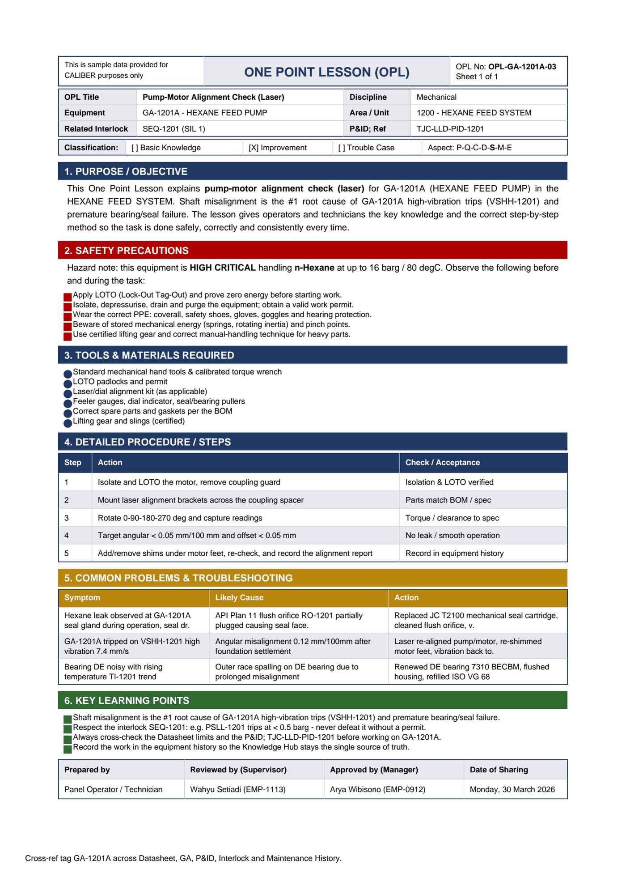

# OPL-GA-1201A-03 - Pump-Motor Alignment Check (Laser)

| Field | Value |
|---|---|
| Equipment | GA-1201A - HEXANE FEED PUMP |
| Area / unit | 1200 - HEXANE FEED SYSTEM |
| Discipline | Mechanical |
| Classification | Improvement |
| Related interlock | SEQ-1201 (SIL 1) |
| P&ID ref | TJC-LLD-PID-1201 |

## 1. Purpose

This One Point Lesson explains pump-motor alignment check (laser) for GA-1201A (HEXANE FEED PUMP) in the HEXANE FEED SYSTEM. Shaft misalignment is the #1 root cause of GA-1201A high-vibration trips (VSHH-1201) and premature bearing/seal failure. The lesson gives operators and technicians the key knowledge and the correct step-by-step method so the task is done safely, correctly and consistently every time.

## 2. Safety precautions

Hazard note: this equipment is HIGH CRITICAL handling n-Hexane at up to 16 barg / 80 degC.

- Apply LOTO (Lock-Out Tag-Out) and prove zero energy before starting work.
- Isolate, depressurise, drain and purge the equipment; obtain a valid work permit.
- Wear the correct PPE: coverall, safety shoes, gloves, goggles and hearing protection.
- Beware of stored mechanical energy (springs, rotating inertia) and pinch points.
- Use certified lifting gear and correct manual-handling technique for heavy parts.

## 3. Tools & materials

- Standard mechanical hand tools & calibrated torque wrench
- LOTO padlocks and permit
- Laser/dial alignment kit (as applicable)
- Feeler gauges, dial indicator, seal/bearing pullers
- Correct spare parts and gaskets per the BOM
- Lifting gear and slings (certified)

## 4. Procedure

| Step | Action | Check / acceptance (as printed) |
|---|---|---|
| 1 | Isolate and LOTO the motor, remove coupling guard | Isolation & LOTO verified |
| 2 | Mount laser alignment brackets across the coupling spacer | Parts match BOM / spec |
| 3 | Rotate 0-90-180-270 deg and capture readings | Torque / clearance to spec |
| 4 | Target angular < 0.05 mm/100 mm and offset < 0.05 mm | No leak / smooth operation |
| 5 | Add/remove shims under motor feet, re-check, and record the alignment report | Record in equipment history |

## 5. Common problems & troubleshooting

Full text restored from the linked work order where the OPL cell was cut off.

| Symptom | Likely cause | Action | Work order |
|---|---|---|---|
| Hexane leak observed at GA-1201A seal gland during operation, seal drain flowing | API Plan 11 flush orifice RO-1201 partially plugged causing seal face to run dry and score | Replaced JC T2100 mechanical seal cartridge, cleaned flush orifice, verified PDI-1201 dP | WO-240002 |
| GA-1201A tripped on VSHH-1201 high vibration 7.4 mm/s | Angular misalignment 0.12 mm/100mm after foundation settlement | Laser re-aligned pump/motor, re-shimmed motor feet, vibration back to 1.9 mm/s | WO-240003 |
| Bearing DE noisy with rising temperature TI-1201 trend | Outer race spalling on DE bearing due to prolonged misalignment | Renewed DE bearing 7310 BECBM, flushed housing, refilled ISO VG 68 | WO-240004 |

## 6. Key learning points

- Shaft misalignment is the #1 root cause of GA-1201A high-vibration trips (VSHH-1201) and premature bearing/seal failure.
- Respect the interlock SEQ-1201: e.g. PSLL-1201 trips at < 0.5 barg - never defeat it without a permit.
- Always cross-check the Datasheet limits and the P&ID TJC-LLD-PID-1201 before working on GA-1201A.
- Record the work in the equipment history so the Knowledge Hub stays the single source of truth.

## Sign-off

| Role | Name |
|---|---|
| Prepared by | Panel Operator / Technician |
| Reviewed by (Supervisor) | Wahyu Setiadi (EMP-1113) |
| Approved by (Manager) | Arya Wibisono (EMP-0912) |
| Date of Sharing | Monday, 30 March 2026 |

---
Source: `Set_01_GA-1201A_HEXANE_FEED_PUMP/One Point Lesson/OPL-GA-1201A-03 - Pump_Motor_Alignment_Check_Laser_edited.pdf`

## Image

