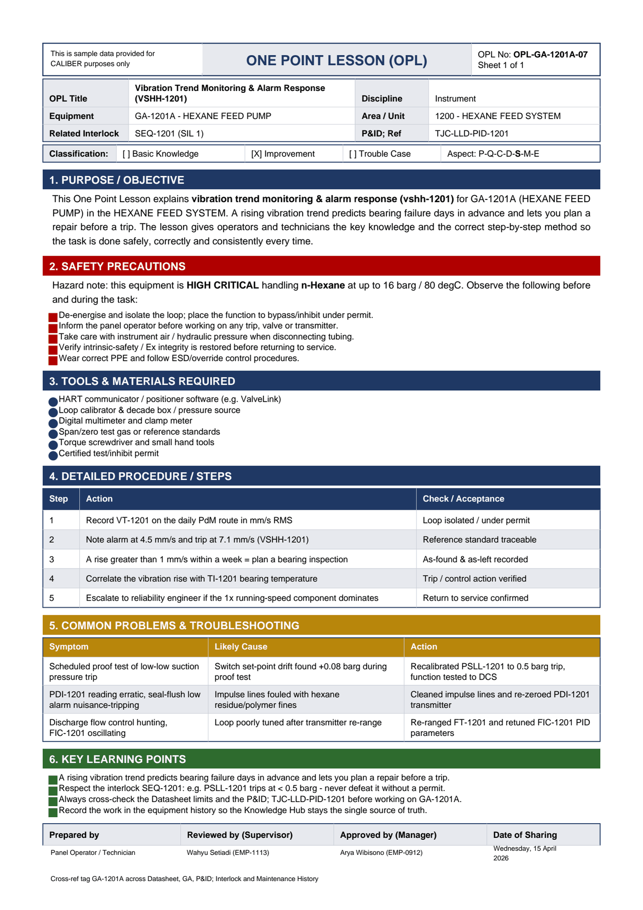

# OPL-GA-1201A-07 - Vibration Trend Monitoring & Alarm Response (VSHH-1201)

| Field | Value |
|---|---|
| Equipment | GA-1201A - HEXANE FEED PUMP |
| Area / unit | 1200 - HEXANE FEED SYSTEM |
| Discipline | Instrument |
| Classification | Improvement |
| Related interlock | SEQ-1201 (SIL 1) |
| P&ID ref | TJC-LLD-PID-1201 |

## 1. Purpose

This One Point Lesson explains vibration trend monitoring & alarm response (vshh-1201) for GA-1201A (HEXANE FEED PUMP) in the HEXANE FEED SYSTEM. A rising vibration trend predicts bearing failure days in advance and lets you plan a repair before a trip. The lesson gives operators and technicians the key knowledge and the correct step-by-step method so the task is done safely, correctly and consistently every time.

## 2. Safety precautions

Hazard note: this equipment is HIGH CRITICAL handling n-Hexane at up to 16 barg / 80 degC.

- De-energise and isolate the loop; place the function to bypass/inhibit under permit.
- Inform the panel operator before working on any trip, valve or transmitter.
- Take care with instrument air / hydraulic pressure when disconnecting tubing.
- Verify intrinsic-safety / Ex integrity is restored before returning to service.
- Wear correct PPE and follow ESD/override control procedures.

## 3. Tools & materials

- HART communicator / positioner software (e.g. ValveLink)
- Loop calibrator & decade box / pressure source
- Digital multimeter and clamp meter
- Span/zero test gas or reference standards
- Torque screwdriver and small hand tools
- Certified test/inhibit permit

## 4. Procedure

| Step | Action | Check / acceptance (as printed) |
|---|---|---|
| 1 | Record VT-1201 on the daily PdM route in mm/s RMS | Loop isolated / under permit |
| 2 | Note alarm at 4.5 mm/s and trip at 7.1 mm/s (VSHH-1201) | Reference standard traceable |
| 3 | A rise greater than 1 mm/s within a week = plan a bearing inspection | As-found & as-left recorded |
| 4 | Correlate the vibration rise with TI-1201 bearing temperature | Trip / control action verified |
| 5 | Escalate to reliability engineer if the 1x running-speed component dominates | Return to service confirmed |

## 5. Common problems & troubleshooting

Full text restored from the linked work order where the OPL cell was cut off.

| Symptom | Likely cause | Action | Work order |
|---|---|---|---|
| Scheduled proof test of low-low suction pressure trip | Switch set-point drift found +0.08 barg during proof test | Recalibrated PSLL-1201 to 0.5 barg trip, function tested to DCS | WO-240006 |
| PDI-1201 reading erratic, seal-flush low alarm nuisance-tripping | Impulse lines fouled with hexane residue/polymer fines | Cleaned impulse lines and re-zeroed PDI-1201 transmitter | WO-240008 |
| Discharge flow control hunting, FIC-1201 oscillating | Loop poorly tuned after transmitter re-range | Re-ranged FT-1201 and retuned FIC-1201 PID parameters | WO-240009 |

## 6. Key learning points

- A rising vibration trend predicts bearing failure days in advance and lets you plan a repair before a trip.
- Respect the interlock SEQ-1201: e.g. PSLL-1201 trips at < 0.5 barg - never defeat it without a permit.
- Always cross-check the Datasheet limits and the P&ID TJC-LLD-PID-1201 before working on GA-1201A.
- Record the work in the equipment history so the Knowledge Hub stays the single source of truth.

## Sign-off

| Role | Name |
|---|---|

---
Source: `Set_01_GA-1201A_HEXANE_FEED_PUMP/One Point Lesson/OPL-GA-1201A-07 - Vibration_Trend_Monitoring_Alarm_Respons_EDITED.pdf`

## Image

