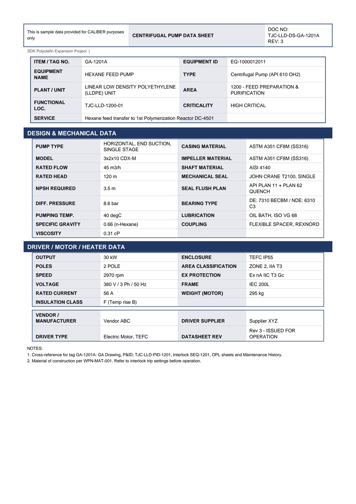

# Equipment Datasheet - GA-1201A

Centrifugal Pump Data Sheet for **GA-1201A HEXANE FEED PUMP**.

## Identification

| Field | Value |
|---|---|
| ITEM / TAG NO. | GA-1201A |
| EQUIPMENT ID | EQ-1000012011 |
| EQUIPMENT NAME | HEXANE FEED PUMP |
| TYPE | Centrifugal Pump (API 610 OH2) |
| PLANT / UNIT | LINEAR LOW DENSITY POLYETHYLENE (LLDPE) UNIT |
| AREA | 1200 - FEED PREPARATION & PURIFICATION |
| FUNCTIONAL LOC. | TJC-LLD-1200-01 |
| CRITICALITY | HIGH CRITICAL |
| SERVICE | Hexane feed transfer to 1st Polymerization Reactor DC-4501 |

## Design & Mechanical Data

| Field | Value |
|---|---|
| PUMP TYPE | HORIZONTAL, END SUCTION, SINGLE STAGE |
| CASING MATERIAL | ASTM A351 CF8M (SS316) |
| MODEL | 3x2x10 CDX-M |
| IMPELLER MATERIAL | ASTM A351 CF8M (SS316) |
| RATED FLOW | 45 m3/h |
| SHAFT MATERIAL | AISI 4140 |
| RATED HEAD | 120 m |
| MECHANICAL SEAL | JOHN CRANE T2100, SINGLE |
| NPSH REQUIRED | 3.5 m |
| SEAL FLUSH PLAN | API PLAN 11 + PLAN 62 QUENCH |
| DIFF. PRESSURE | 8.6 bar |
| BEARING TYPE | DE: 7310 BECBM / NDE: 6310 C3 |
| PUMPING TEMP. | 40 degC |
| LUBRICATION | OIL BATH, ISO VG 68 |
| SPECIFIC GRAVITY | 0.66 (n-Hexane) |
| COUPLING | FLEXIBLE SPACER, REXNORD |
| VISCOSITY | 0.31 cP |

## Driver / Motor / Heater Data

| Field | Value |
|---|---|
| OUTPUT | 30 kW |
| ENCLOSURE | TEFC IP55 |
| POLES | 2 POLE |
| AREA CLASSIFICATION | ZONE 2, IIA T3 |
| SPEED | 2970 rpm |
| EX PROTECTION | Ex nA IIC T3 Gc |
| VOLTAGE | 380 V / 3 Ph / 50 Hz |
| FRAME | IEC 200L |
| RATED CURRENT | 56 A |
| WEIGHT (MOTOR) | 295 kg |
| INSULATION CLASS | F (Temp rise B) |

## Vendor & revision

| Field | Value |
|---|---|
| VENDOR / MANUFACTURER | Vendor ABC |
| DRIVER SUPPLIER | Supplier XYZ |
| DRIVER TYPE | Electric Motor, TEFC |
| DATASHEET REV | Rev 3 - ISSUED FOR OPERATION |

## Notes

- Cross-reference for tag GA-1201A: GA Drawing, P&ID TJC-LLD-PID-1201, Interlock SEQ-1201, OPL sheets and Maintenance History.
- Material of construction per WPN-MAT-001. Refer to interlock trip settings before operation.

---
Source: `Set_01_GA-1201A_HEXANE_FEED_PUMP/Equipment Datasheet - GA-1201A.pdf`

## Image

