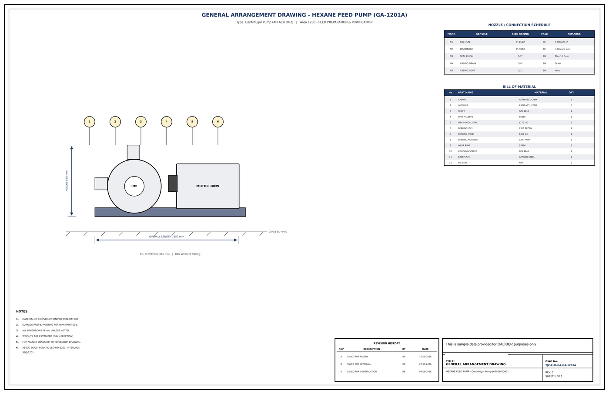

# General Arrangement Drawing - GA-1201A

## Key dimensions

- OVERALL LENGTH 1850 mm
- HEIGHT 820 mm
- C/L ELEVATION 375 mm   |   DRY WEIGHT 690 kg

## Nozzle / connection schedule

Mark, service, size-rating, face, remarks as printed on the drawing.

- N1 SUCTION 3"-150# RF n-Hexane in
- N2 DISCHARGE 2"-300# RF n-Hexane out
- N3 SEAL FLUSH 1/2" SW Plan 11 flush
- N4 CASING DRAIN 3/4" SW Drain
- N5 CASING VENT 1/2" SW Vent

## Bill of material

No., part name, material, quantity as printed on the drawing.

- 1 CASING ASTM A351 CF8M 1
- 2 IMPELLER ASTM A351 CF8M 1
- 3 SHAFT AISI 4140 1
- 4 SHAFT SLEEVE SS316 1
- 5 MECHANICAL SEAL JC T2100 1
- 6 BEARING (DE) 7310 BECBM 1
- 7 BEARING (NDE) 6310 C3 1
- 8 BEARING HOUSING CAST IRON 1
- 9 WEAR RING SS316 2
- 10 COUPLING SPACER AISI 4140 1
- 11 BASEPLATE CARBON STEEL 1
- 12 OIL SEAL NBR 2

## Notes

- MATERIAL OF CONSTRUCTION PER WPN-MAT-001.
- SURFACE PREP & PAINTING PER WPN-PAINT-001.
- ALL DIMENSIONS IN mm UNLESS NOTED.
- WEIGHTS ARE ESTIMATED (DRY / ERECTION).
- FOR NOZZLE LOADS REFER TO VENDOR DRAWING.
- ASSOC DOCS: P&ID TJC-LLD-PID-1201, INTERLOCK

## Revision history

| Rev | Description | By | Date |
|---|---|---|---|
| A | ISSUED FOR REVIEW | RS | 15-05-2026 |
| B | ISSUED FOR APPROVAL | RS | 27-05-2026 |
| 0 | ISSUED FOR CONSTRUCTION | RS | 05-06-2026 |

---
Source: `Set_01_GA-1201A_HEXANE_FEED_PUMP/Equipment GA Drawing - GA-1201A.pdf`

## Image

