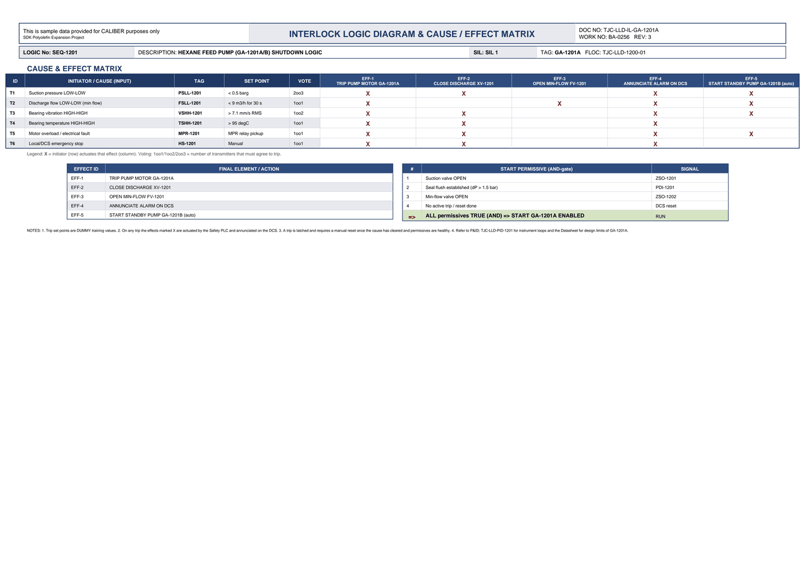

# Interlock Logic & Cause/Effect - GA-1201A

| Field | Value |
|---|---|
| Logic no. | SEQ-1201 |
| Description | HEXANE FEED PUMP (GA-1201A/B) SHUTDOWN LOGIC |
| SIL | SIL 1 |
| Functional location | TJC-LLD-1200-01 |

## Cause & effect matrix

| ID | INITIATOR / CAUSE (INPUT) | TAG | SET POINT | VOTE | EFF-1 TRIP PUMP MOTOR GA-1201A | EFF-2 CLOSE DISCHARGE XV-1201 | EFF-3 OPEN MIN-FLOW FV-1201 | EFF-4 ANNUNCIATE ALARM ON DCS | EFF-5 START STANDBY PUMP GA-1201B (auto) |
|---|---|---|---|---|---|---|---|---|---|
| T1 | Suction pressure LOW-LOW | PSLL-1201 | < 0.5 barg | 2oo3 | X | X |  | X | X |
| T2 | Discharge flow LOW-LOW (min flow) | FSLL-1201 | < 9 m3/h for 30 s | 1oo1 | X |  | X | X | X |
| T3 | Bearing vibration HIGH-HIGH | VSHH-1201 | > 7.1 mm/s RMS | 1oo2 | X | X |  | X | X |
| T4 | Bearing temperature HIGH-HIGH | TSHH-1201 | > 95 degC | 1oo1 | X | X |  | X |  |
| T5 | Motor overload / electrical fault | MPR-1201 | MPR relay pickup | 1oo1 | X | X |  | X | X |
| T6 | Local/DCS emergency stop | HS-1201 | Manual | 1oo1 | X | X |  | X |  |

### Trips in plain language

- **PSLL-1201** (Suction pressure LOW-LOW) trips at **< 0.5 barg**, voting 2oo3. Effects: TRIP PUMP MOTOR GA-1201A; CLOSE DISCHARGE XV-1201; ANNUNCIATE ALARM ON DCS; START STANDBY PUMP GA-1201B (auto).
- **FSLL-1201** (Discharge flow LOW-LOW (min flow)) trips at **< 9 m3/h for 30 s**, voting 1oo1. Effects: TRIP PUMP MOTOR GA-1201A; OPEN MIN-FLOW FV-1201; ANNUNCIATE ALARM ON DCS; START STANDBY PUMP GA-1201B (auto).
- **VSHH-1201** (Bearing vibration HIGH-HIGH) trips at **> 7.1 mm/s RMS**, voting 1oo2. Effects: TRIP PUMP MOTOR GA-1201A; CLOSE DISCHARGE XV-1201; ANNUNCIATE ALARM ON DCS; START STANDBY PUMP GA-1201B (auto).
- **TSHH-1201** (Bearing temperature HIGH-HIGH) trips at **> 95 degC**, voting 1oo1. Effects: TRIP PUMP MOTOR GA-1201A; CLOSE DISCHARGE XV-1201; ANNUNCIATE ALARM ON DCS.
- **MPR-1201** (Motor overload / electrical fault) trips at **MPR relay pickup**, voting 1oo1. Effects: TRIP PUMP MOTOR GA-1201A; CLOSE DISCHARGE XV-1201; ANNUNCIATE ALARM ON DCS; START STANDBY PUMP GA-1201B (auto).
- **HS-1201** (Local/DCS emergency stop) trips at **Manual**, voting 1oo1. Effects: TRIP PUMP MOTOR GA-1201A; CLOSE DISCHARGE XV-1201; ANNUNCIATE ALARM ON DCS.

## Effects (final elements)

| EFFECT ID | FINAL ELEMENT / ACTION |
|---|---|
| EFF-1 | TRIP PUMP MOTOR GA-1201A |
| EFF-2 | CLOSE DISCHARGE XV-1201 |
| EFF-3 | OPEN MIN-FLOW FV-1201 |
| EFF-4 | ANNUNCIATE ALARM ON DCS |
| EFF-5 | START STANDBY PUMP GA-1201B (auto) |

## Start permissives (all must be true)

| # | START PERMISSIVE (AND-gate) | SIGNAL |
|---|---|---|
| 1 | Suction valve OPEN | ZSO-1201 |
| 2 | Seal flush established (dP > 1.5 bar) | PDI-1201 |
| 3 | Min-flow valve OPEN | ZSO-1202 |
| 4 | No active trip / reset done | DCS reset |
| => | ALL permissives TRUE (AND) => START GA-1201A ENABLED | RUN |

## Notes

- Trip set points are DUMMY training values.
- On any trip the effects marked X are actuated by the Safety PLC and annunciated on the DCS.
- A trip is latched and requires a manual reset once the cause has cleared and permissives are healthy.
- Refer to P&ID TJC-LLD-PID-1201 for instrument loops and the Datasheet for design limits of GA-1201A.

---
Source: `Set_01_GA-1201A_HEXANE_FEED_PUMP/Interlock Logic Diagram - GA-1201A.pdf`

## Image

