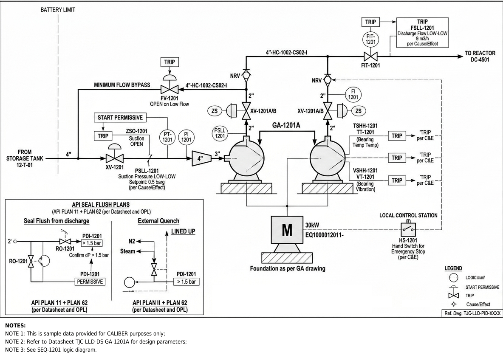

# P&ID - GA-1201A

Image-only drawing. The title block prints `TJC-LLD-PID-XXXX`; the number `TJC-LLD-PID-1201` comes from the datasheet and interlock cross-references.

## Tags linked to this drawing

From the interlock matrix and datasheet of GA-1201A:

- `FIC-1201`
- `FSLL-1201`
- `FT-1201`
- `FV-1201`
- `GA-1201B`
- `HS-1201`
- `MPR-1201`
- `PDI-1201`
- `PSLL-1201`
- `RO-1201`
- `TI-1201`
- `TSHH-1201`
- `VSHH-1201`
- `VT-1201`
- `XV-1201`
- `ZSO-1201`
- `ZSO-1202`

## Description

To be written by an engineer from the drawing (flow path, valves, instruments, trips). Keep tags in backticks so they link.

---
Source: `Set_01_GA-1201A_HEXANE_FEED_PUMP/PID_Set_01.png`

## Image

