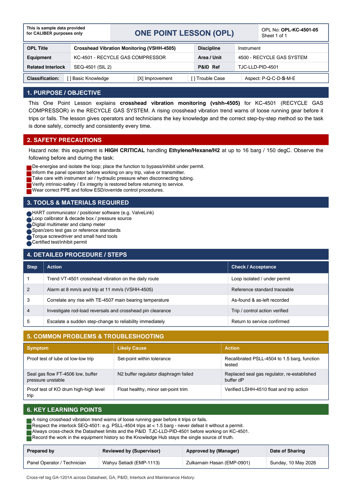

# OPL-KC-4501-05 - Crosshead Vibration Monitoring (VSHH-4505)

| Field | Value |
|---|---|
| Equipment | KC-4501 - RECYCLE GAS COMPRESSOR |
| Area / unit | 4500 - RECYCLE GAS SYSTEM |
| Discipline | Instrument |
| Classification | Improvement |
| Related interlock | SEQ-4501 (SIL 2) |
| P&ID ref | TJC-LLD-PID-4501 |

## 1. Purpose

This One Point Lesson explains crosshead vibration monitoring (vshh-4505) for KC-4501 (RECYCLE GAS COMPRESSOR) in the RECYCLE GAS SYSTEM. A rising crosshead vibration trend warns of loose running gear before it trips or fails. The lesson gives operators and technicians the key knowledge and the correct step-by-step method so the task is done safely, correctly and consistently every time.

## 2. Safety precautions

Hazard note: this equipment is HIGH CRITICAL handling Ethylene/Hexane/H2 at up to 16 barg / 150 degC.

- De-energise and isolate the loop; place the function to bypass/inhibit under permit.
- Inform the panel operator before working on any trip, valve or transmitter.
- Take care with instrument air / hydraulic pressure when disconnecting tubing.
- Verify intrinsic-safety / Ex integrity is restored before returning to service.
- Wear correct PPE and follow ESD/override control procedures.

## 3. Tools & materials

- HART communicator / positioner software (e.g. ValveLink)
- Loop calibrator & decade box / pressure source
- Digital multimeter and clamp meter
- Span/zero test gas or reference standards
- Torque screwdriver and small hand tools
- Certified test/inhibit permit

## 4. Procedure

| Step | Action | Check / acceptance (as printed) |
|---|---|---|
| 1 | Trend VT-4501 crosshead vibration on the daily route | Loop isolated / under permit |
| 2 | Alarm at 8 mm/s and trip at 11 mm/s (VSHH-4505) | Reference standard traceable |
| 3 | Correlate any rise with TE-4507 main bearing temperature | As-found & as-left recorded |
| 4 | Investigate rod-load reversals and crosshead pin clearance | Trip / control action verified |
| 5 | Escalate a sudden step-change to reliability immediately | Return to service confirmed |

## 5. Common problems & troubleshooting

Full text restored from the linked work order where the OPL cell was cut off.

| Symptom | Likely cause | Action | Work order |
|---|---|---|---|
| Proof test of lube oil low-low trip | Set-point within tolerance | Recalibrated PSLL-4504 to 1.5 barg, function tested | WO-240086 |
| Seal gas flow FT-4506 low, buffer pressure unstable | N2 buffer regulator diaphragm failed | Replaced seal gas regulator, re-established buffer dP | WO-240087 |
| Proof test of KO drum high-high level trip | Float healthy, minor set-point trim | Verified LSHH-4510 float and trip action | WO-240090 |

## 6. Key learning points

- A rising crosshead vibration trend warns of loose running gear before it trips or fails.
- Respect the interlock SEQ-4501: e.g. PSLL-4504 trips at < 1.5 barg - never defeat it without a permit.
- Always cross-check the Datasheet limits and the P&ID TJC-LLD-PID-4501 before working on KC-4501.
- Record the work in the equipment history so the Knowledge Hub stays the single source of truth.

## Sign-off

| Role | Name |
|---|---|
| Prepared by | Panel Operator / Technician |
| Reviewed by (Supervisor) | Wahyu Setiadi (EMP-1113) |
| Approved by (Manager) | Zulkarnain Hasan (EMP-0901) |
| Date of Sharing | Sunday, 10 May 2026 |

---
Source: `Set_04_KC-4501_RECYCLE_GAS_COMPRESSOR/OPL (One Point Lessons)/OPL-KC-4501-05 Crosshead_Vibration_Monitoring_VSHH_4505.pdf`

## Image

