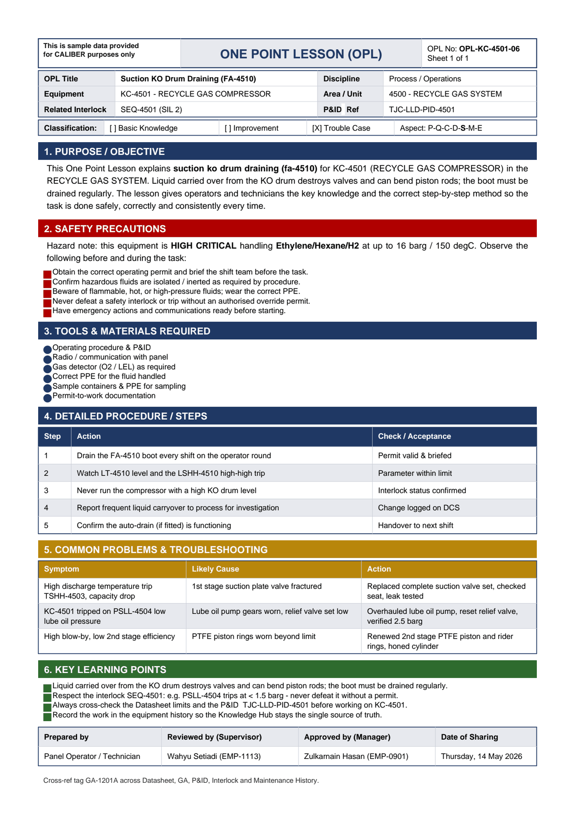

# OPL-KC-4501-06 - Suction KO Drum Draining (FA-4510)

| Field | Value |
|---|---|
| Equipment | KC-4501 - RECYCLE GAS COMPRESSOR |
| Area / unit | 4500 - RECYCLE GAS SYSTEM |
| Discipline | Process / Operations |
| Classification | Trouble Case |
| Related interlock | SEQ-4501 (SIL 2) |
| P&ID ref | TJC-LLD-PID-4501 |

## 1. Purpose

This One Point Lesson explains suction ko drum draining (fa-4510) for KC-4501 (RECYCLE GAS COMPRESSOR) in the RECYCLE GAS SYSTEM. Liquid carried over from the KO drum destroys valves and can bend piston rods; the boot must be drained regularly. The lesson gives operators and technicians the key knowledge and the correct step-by-step method so the task is done safely, correctly and consistently every time.

## 2. Safety precautions

Hazard note: this equipment is HIGH CRITICAL handling Ethylene/Hexane/H2 at up to 16 barg / 150 degC.

- Obtain the correct operating permit and brief the shift team before the task.
- Confirm hazardous fluids are isolated / inerted as required by procedure.
- Beware of flammable, hot, or high-pressure fluids; wear the correct PPE.
- Never defeat a safety interlock or trip without an authorised override permit.
- Have emergency actions and communications ready before starting.

## 3. Tools & materials

- Operating procedure & P&ID
- Radio / communication with panel
- Gas detector (O2 / LEL) as required
- Correct PPE for the fluid handled
- Sample containers & PPE for sampling
- Permit-to-work documentation

## 4. Procedure

| Step | Action | Check / acceptance (as printed) |
|---|---|---|
| 1 | Drain the FA-4510 boot every shift on the operator round | Permit valid & briefed |
| 2 | Watch LT-4510 level and the LSHH-4510 high-high trip | Parameter within limit |
| 3 | Never run the compressor with a high KO drum level | Interlock status confirmed |
| 4 | Report frequent liquid carryover to process for investigation | Change logged on DCS |
| 5 | Confirm the auto-drain (if fitted) is functioning | Handover to next shift |

## 5. Common problems & troubleshooting

Full text restored from the linked work order where the OPL cell was cut off.

| Symptom | Likely cause | Action | Work order |
|---|---|---|---|
| High discharge temperature trip TSHH-4503, capacity drop | 1st stage suction plate valve fractured | Replaced complete suction valve set, checked seat, leak tested | WO-240083 |
| KC-4501 tripped on PSLL-4504 low lube oil pressure | Lube oil pump gears worn, relief valve set low | Overhauled lube oil pump, reset relief valve, verified 2.5 barg | WO-240084 |
| High blow-by, low 2nd stage efficiency | PTFE piston rings worn beyond limit | Renewed 2nd stage PTFE piston and rider rings, honed cylinder | WO-240085 |

## 6. Key learning points

- Liquid carried over from the KO drum destroys valves and can bend piston rods; the boot must be drained regularly.
- Respect the interlock SEQ-4501: e.g. PSLL-4504 trips at < 1.5 barg - never defeat it without a permit.
- Always cross-check the Datasheet limits and the P&ID TJC-LLD-PID-4501 before working on KC-4501.
- Record the work in the equipment history so the Knowledge Hub stays the single source of truth.

## Sign-off

| Role | Name |
|---|---|
| Prepared by | Panel Operator / Technician |
| Reviewed by (Supervisor) | Wahyu Setiadi (EMP-1113) |
| Approved by (Manager) | Zulkarnain Hasan (EMP-0901) |
| Date of Sharing | Thursday, 14 May 2026 |

---
Source: `Set_04_KC-4501_RECYCLE_GAS_COMPRESSOR/OPL (One Point Lessons)/OPL-KC-4501-06 Suction_KO_Drum_Draining_FA_4510.pdf`

## Image

