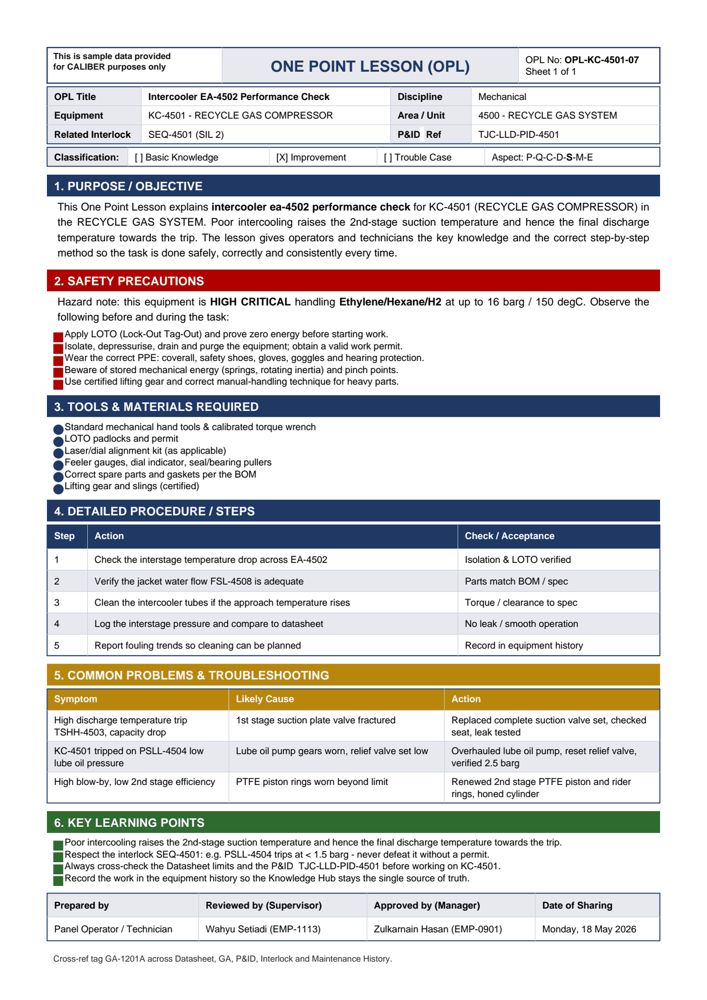

# OPL-KC-4501-07 - Intercooler EA-4502 Performance Check

| Field | Value |
|---|---|
| Equipment | KC-4501 - RECYCLE GAS COMPRESSOR |
| Area / unit | 4500 - RECYCLE GAS SYSTEM |
| Discipline | Mechanical |
| Classification | Improvement |
| Related interlock | SEQ-4501 (SIL 2) |
| P&ID ref | TJC-LLD-PID-4501 |

## 1. Purpose

This One Point Lesson explains intercooler ea-4502 performance check for KC-4501 (RECYCLE GAS COMPRESSOR) in the RECYCLE GAS SYSTEM. Poor intercooling raises the 2nd-stage suction temperature and hence the final discharge temperature towards the trip. The lesson gives operators and technicians the key knowledge and the correct step-by-step method so the task is done safely, correctly and consistently every time.

## 2. Safety precautions

Hazard note: this equipment is HIGH CRITICAL handling Ethylene/Hexane/H2 at up to 16 barg / 150 degC.

- Apply LOTO (Lock-Out Tag-Out) and prove zero energy before starting work.
- Isolate, depressurise, drain and purge the equipment; obtain a valid work permit.
- Wear the correct PPE: coverall, safety shoes, gloves, goggles and hearing protection.
- Beware of stored mechanical energy (springs, rotating inertia) and pinch points.
- Use certified lifting gear and correct manual-handling technique for heavy parts.

## 3. Tools & materials

- Standard mechanical hand tools & calibrated torque wrench
- LOTO padlocks and permit
- Laser/dial alignment kit (as applicable)
- Feeler gauges, dial indicator, seal/bearing pullers
- Correct spare parts and gaskets per the BOM
- Lifting gear and slings (certified)

## 4. Procedure

| Step | Action | Check / acceptance (as printed) |
|---|---|---|
| 1 | Check the interstage temperature drop across EA-4502 | Isolation & LOTO verified |
| 2 | Verify the jacket water flow FSL-4508 is adequate | Parts match BOM / spec |
| 3 | Clean the intercooler tubes if the approach temperature rises | Torque / clearance to spec |
| 4 | Log the interstage pressure and compare to datasheet | No leak / smooth operation |
| 5 | Report fouling trends so cleaning can be planned | Record in equipment history |

## 5. Common problems & troubleshooting

Full text restored from the linked work order where the OPL cell was cut off.

| Symptom | Likely cause | Action | Work order |
|---|---|---|---|
| High discharge temperature trip TSHH-4503, capacity drop | 1st stage suction plate valve fractured | Replaced complete suction valve set, checked seat, leak tested | WO-240083 |
| KC-4501 tripped on PSLL-4504 low lube oil pressure | Lube oil pump gears worn, relief valve set low | Overhauled lube oil pump, reset relief valve, verified 2.5 barg | WO-240084 |
| High blow-by, low 2nd stage efficiency | PTFE piston rings worn beyond limit | Renewed 2nd stage PTFE piston and rider rings, honed cylinder | WO-240085 |

## 6. Key learning points

- Poor intercooling raises the 2nd-stage suction temperature and hence the final discharge temperature towards the trip.
- Respect the interlock SEQ-4501: e.g. PSLL-4504 trips at < 1.5 barg - never defeat it without a permit.
- Always cross-check the Datasheet limits and the P&ID TJC-LLD-PID-4501 before working on KC-4501.
- Record the work in the equipment history so the Knowledge Hub stays the single source of truth.

## Sign-off

| Role | Name |
|---|---|
| Prepared by | Panel Operator / Technician |
| Reviewed by (Supervisor) | Wahyu Setiadi (EMP-1113) |
| Approved by (Manager) | Zulkarnain Hasan (EMP-0901) |
| Date of Sharing | Monday, 18 May 2026 |

---
Source: `Set_04_KC-4501_RECYCLE_GAS_COMPRESSOR/OPL (One Point Lessons)/OPL-KC-4501-07 Intercooler_EA_4502_Performance_Check.pdf`

## Image

