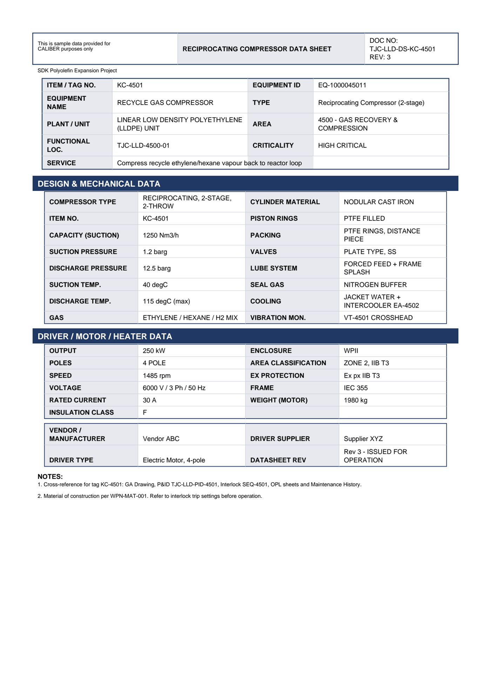

# Equipment Datasheet - KC-4501

Reciprocating Compressor Data Sheet for **KC-4501 RECYCLE GAS COMPRESSOR**.

## Identification

| Field | Value |
|---|---|
| ITEM / TAG NO. | KC-4501 |
| EQUIPMENT ID | EQ-1000045011 |
| EQUIPMENT NAME | RECYCLE GAS COMPRESSOR |
| TYPE | Reciprocating Compressor (2-stage) |
| PLANT / UNIT | LINEAR LOW DENSITY POLYETHYLENE (LLDPE) UNIT |
| AREA | 4500 - GAS RECOVERY & COMPRESSION |
| FUNCTIONAL LOC. | TJC-LLD-4500-01 |
| CRITICALITY | HIGH CRITICAL |
| SERVICE | Compress recycle ethylene/hexane vapour b ack to reactor loop |

## Design & Mechanical Data

| Field | Value |
|---|---|
| COMPRESSOR TYPE | RECIPROCATING, 2-STAGE, 2-THROW |
| CYLINDER MATERIAL | NODULAR CAST IRON |
| ITEM NO. | KC-4501 |
| PISTON RINGS | PTFE FILLED |
| CAPACITY (SUCTION) | 1250 Nm3/h |
| PACKING | PTFE RINGS, DISTANCE PIECE |
| SUCTION PRESSURE | 1.2 barg |
| VALVES | PLATE TYPE, SS |
| DISCHARGE PRESSURE | 12.5 barg |
| LUBE SYSTEM | FORCED FEED + FRAME SPLASH |
| SUCTION TEMP. | 40 degC |
| SEAL GAS | NITROGEN BUFFER |
| DISCHARGE TEMP. | 115 degC (max) |
| COOLING | JACKET WATER + INTERCOOLER EA-4502 |
| GAS | ETHYLENE / HEXANE / H2 MIX |
| VIBRATION MON. | VT-4501 CROSSHEAD |

## Driver / Motor / Heater Data

| Field | Value |
|---|---|
| OUTPUT | 250 kW |
| ENCLOSURE | WPII |
| POLES | 4 POLE |
| AREA CLASSIFICATION | ZONE 2, IIB T3 |
| SPEED | 1485 rpm |
| EX PROTECTION | Ex px IIB T3 |
| VOLTAGE | 6000 V / 3 Ph / 50 Hz |
| FRAME | IEC 355 |
| RATED CURRENT | 30 A |
| WEIGHT (MOTOR) | 1980 kg |
| INSULATION CLASS | F |

## Vendor & revision

| Field | Value |
|---|---|
| VENDOR / MANUFACTURER | Vendor ABC |
| DRIVER SUPPLIER | Supplier XYZ |
| DRIVER TYPE | Electric Motor, 4-pole |
| DATASHEET REV | Rev 3 - ISSUED FOR OPERATION |

## Notes

- Cross-reference for tag KC-4501: GA Drawing, P&ID TJC-LLD-PID-4501, Interlock SEQ-4501, OPL sheets and Maintenance History.
- Material of construction per WPN-MAT-001. Refer to interlock trip settings before operation.

---
Source: `Set_04_KC-4501_RECYCLE_GAS_COMPRESSOR/Equipment Datasheet - KC-4501.pdf`

## Image

