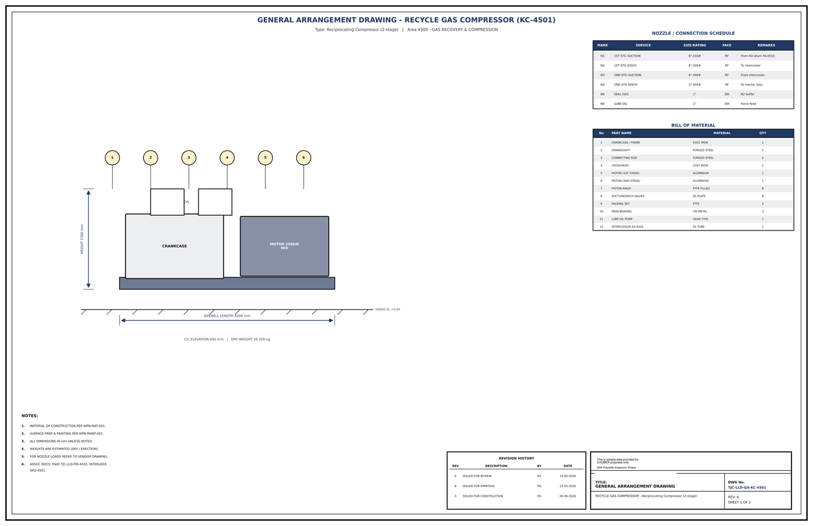

# General Arrangement Drawing - KC-4501

## Key dimensions

- OVERALL LENGTH 4200 mm
- HEIGHT 2300 mm
- C/L ELEVATION 600 mm   |   DRY WEIGHT 16 200 kg

## Nozzle / connection schedule

Mark, service, size-rating, face, remarks as printed on the drawing.

- N1 1ST STG SUCTION 6"-150# RF From KO drum FA-4510
- N2 1ST STG DISCH 4"-300# RF T o intercooler
- N3 2ND STG SUCTION 4"-300# RF From intercooler
- N4 2ND STG DISCH 3"-300# RF T o reactor loop
- N5 SEAL GAS 1" SW N2 buffer
- N6 LUBE OIL 1" SW Force feed

## Bill of material

No., part name, material, quantity as printed on the drawing.

- 1 CRANKCASE / FRAME CAST IRON 1
- 2 CRANKSHAFT FORGED STEEL 1
- 3 CONNECTING ROD FORGED STEEL 2
- 4 CROSSHEAD CAST IRON 2
- 5 PISTON (1ST STAGE) ALUMINIUM 1
- 6 PISTON (2ND STAGE) ALUMINIUM 1
- 7 PISTON RINGS PTFE FILLED 8
- 8 SUCTION/DISCH VALVES SS PLATE 8
- 9 PACKING SET PTFE 2
- 10 MAIN BEARING TRI-METAL 3
- 11 LUBE OIL PUMP GEAR TYPE 1
- 12 INTERCOOLER EA-4502 SS TUBE 1

## Notes

- MATERIAL OF CONSTRUCTION PER WPN-MAT-001.
- SURFACE PREP & PAINTING PER WPN-PAINT-001.
- ALL DIMENSIONS IN mm UNLESS NOTED.
- WEIGHTS ARE ESTIMATED (DRY / ERECTION).
- FOR NOZZLE LOADS REFER TO VENDOR DRAWING.
- ASSOC DOCS: P&ID TJC-LLD-PID-4501, INTERLOCK

## Revision history

| Rev | Description | By | Date |
|---|---|---|---|
| A | ISSUED FOR REVIEW | RS | 15-05-2026 |
| B | ISSUED FOR APPROVAL | RS | 27-05-2026 |
| 0 | ISSUED FOR CONSTRUCTION | RS | 05-06-2026 |

---
Source: `Set_04_KC-4501_RECYCLE_GAS_COMPRESSOR/Equipment GA Drawing KC-4501.pdf`

## Image

