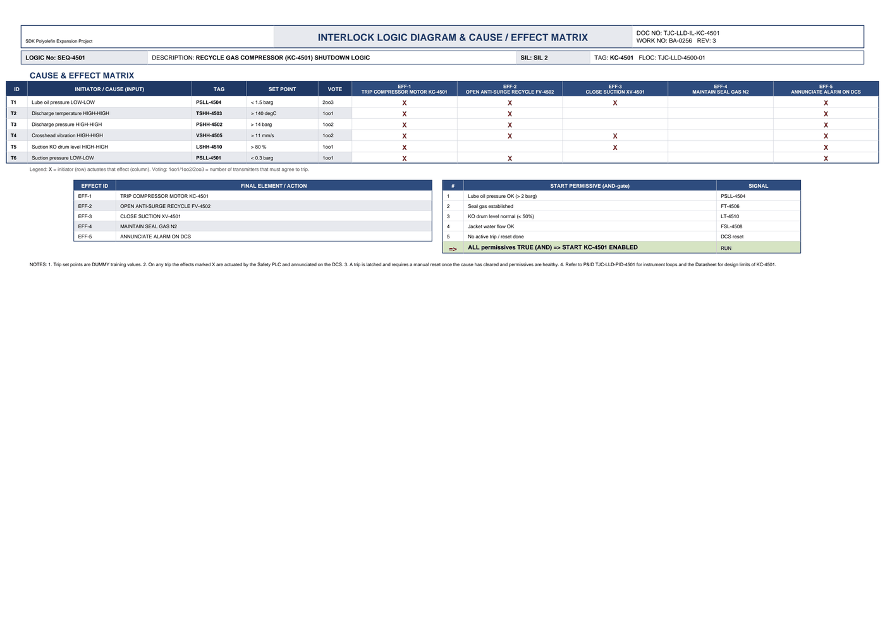

# Interlock Logic & Cause/Effect - KC-4501

| Field | Value |
|---|---|
| Logic no. | SEQ-4501 |
| Description | RECYCLE GAS COMPRESSOR (KC-4501) SHUTDOWN LOGIC |
| SIL | SIL 2 |
| Functional location | TJC-LLD-4500-01 |

## Cause & effect matrix

| ID | INITIATOR / CAUSE (INPUT) | TAG | SET POINT | VOTE | EFF-1 TRIP COMPRESSOR MOTOR KC-4501 | EFF-2 OPEN ANTI-SURGE RECYCLE FV-4502 | EFF-3 CLOSE SUCTION XV-4501 | EFF-4 MAINTAIN SEAL GAS N2 | EFF-5 ANNUNCIATE ALARM ON DCS |
|---|---|---|---|---|---|---|---|---|---|
| T1 | Lube oil pressure LOW-LOW | PSLL-4504 | < 1.5 barg | 2oo3 | X | X | X |  | X |
| T2 | Discharge temperature HIGH-HIGH | TSHH-4503 | > 140 degC | 1oo1 | X | X |  |  | X |
| T3 | Discharge pressure HIGH-HIGH | PSHH-4502 | > 14 barg | 1oo2 | X | X |  |  | X |
| T4 | Crosshead vibration HIGH-HIGH | VSHH-4505 | > 11 mm/s | 1oo2 | X | X | X |  | X |
| T5 | Suction KO drum level HIGH-HIGH | LSHH-4510 | > 80 % | 1oo1 | X |  | X |  | X |
| T6 | Suction pressure LOW-LOW | PSLL-4501 | < 0.3 barg | 1oo1 | X | X |  |  | X |

### Trips in plain language

- **PSLL-4504** (Lube oil pressure LOW-LOW) trips at **< 1.5 barg**, voting 2oo3. Effects: TRIP COMPRESSOR MOTOR KC-4501; OPEN ANTI-SURGE RECYCLE FV-4502; CLOSE SUCTION XV-4501; ANNUNCIATE ALARM ON DCS.
- **TSHH-4503** (Discharge temperature HIGH-HIGH) trips at **> 140 degC**, voting 1oo1. Effects: TRIP COMPRESSOR MOTOR KC-4501; OPEN ANTI-SURGE RECYCLE FV-4502; ANNUNCIATE ALARM ON DCS.
- **PSHH-4502** (Discharge pressure HIGH-HIGH) trips at **> 14 barg**, voting 1oo2. Effects: TRIP COMPRESSOR MOTOR KC-4501; OPEN ANTI-SURGE RECYCLE FV-4502; ANNUNCIATE ALARM ON DCS.
- **VSHH-4505** (Crosshead vibration HIGH-HIGH) trips at **> 11 mm/s**, voting 1oo2. Effects: TRIP COMPRESSOR MOTOR KC-4501; OPEN ANTI-SURGE RECYCLE FV-4502; CLOSE SUCTION XV-4501; ANNUNCIATE ALARM ON DCS.
- **LSHH-4510** (Suction KO drum level HIGH-HIGH) trips at **> 80 %**, voting 1oo1. Effects: TRIP COMPRESSOR MOTOR KC-4501; CLOSE SUCTION XV-4501; ANNUNCIATE ALARM ON DCS.
- **PSLL-4501** (Suction pressure LOW-LOW) trips at **< 0.3 barg**, voting 1oo1. Effects: TRIP COMPRESSOR MOTOR KC-4501; OPEN ANTI-SURGE RECYCLE FV-4502; ANNUNCIATE ALARM ON DCS.

## Effects (final elements)

| EFFECT ID | FINAL ELEMENT / ACTION |
|---|---|
| EFF-1 | TRIP COMPRESSOR MOTOR KC-4501 |
| EFF-2 | OPEN ANTI-SURGE RECYCLE FV-4502 |
| EFF-3 | CLOSE SUCTION XV-4501 |
| EFF-4 | MAINTAIN SEAL GAS N2 |
| EFF-5 | ANNUNCIATE ALARM ON DCS |

## Start permissives (all must be true)

| # | START PERMISSIVE (AND-gate) | SIGNAL |
|---|---|---|
| 1 | Lube oil pressure OK (> 2 barg) | PSLL-4504 |
| 2 | Seal gas established | FT-4506 |
| 3 | KO drum level normal (< 50%) | LT-4510 |
| 4 | Jacket water flow OK | FSL-4508 |
| 5 | No active trip / reset done | DCS reset |
| => | ALL permissives TRUE (AND) => START KC-4501 ENABLED | RUN |

## Notes

- Trip set points are DUMMY training values.
- On any trip the effects marked X are actuated by the Safety PLC and annunciated on the DCS.
- A trip is latched and requires a manual reset once the cause has cleared and permissives are healthy.
- Refer to P&ID TJC-LLD-PID-4501 for instrument loops and the Datasheet for design limits of KC-4501.

---
Source: `Set_04_KC-4501_RECYCLE_GAS_COMPRESSOR/Interlock Logic Diagram KC-4501.pdf`

## Image

