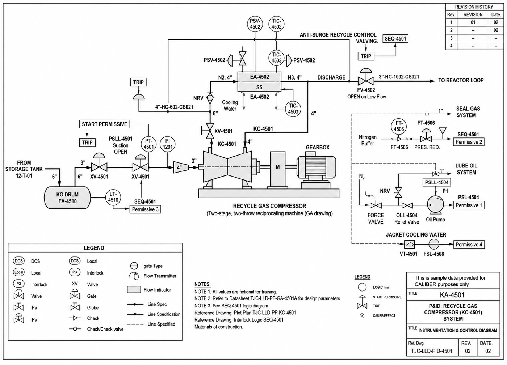

# P&ID - KC-4501

Image-only drawing. The title block prints `TJC-LLD-PID-XXXX`; the number `TJC-LLD-PID-4501` comes from the datasheet and interlock cross-references.

## Tags linked to this drawing

From the interlock matrix and datasheet of KC-4501:

- `EA-4502`
- `FA-4510`
- `FSL-4508`
- `FT-4506`
- `FV-4502`
- `LSHH-4510`
- `LT-4510`
- `PSHH-4502`
- `PSLL-4501`
- `PSLL-4504`
- `TE-4507`
- `TSHH-4503`
- `VSHH-4505`
- `VT-4501`
- `XV-4501`

## Description

To be written by an engineer from the drawing (flow path, valves, instruments, trips). Keep tags in backticks so they link.

---
Source: `Set_04_KC-4501_RECYCLE_GAS_COMPRESSOR/P&ID SET 4.png`

## Image

