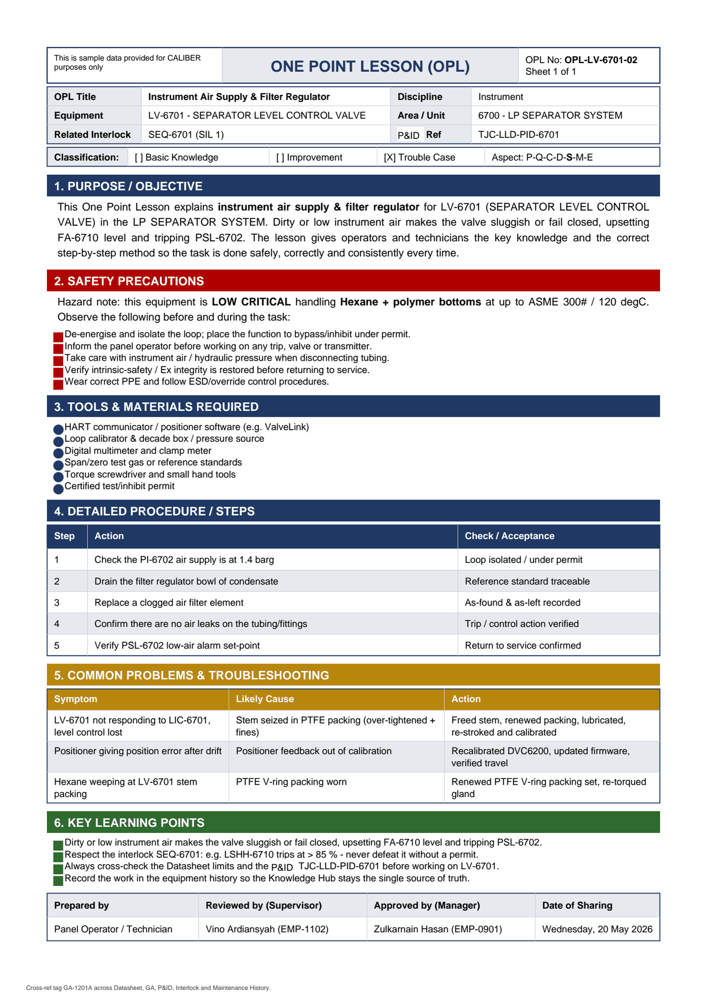

# OPL-LV-6701-02 - Instrument Air Supply & Filter Regulator

| Field | Value |
|---|---|
| Equipment | LV-6701 - SEPARATOR LEVEL CONTROL VALVE |
| Area / unit | 6700 - LP SEPARATOR SYSTEM |
| Discipline | Instrument |
| Classification | Trouble Case |
| Related interlock | SEQ-6701 (SIL 1) |
| P&ID ref | TJC-LLD-PID-6701 |

## 1. Purpose

This One Point Lesson explains instrument air supply & filter regulator for LV-6701 (SEPARATOR LEVEL CONTROL VALVE) in the LP SEPARATOR SYSTEM. Dirty or low instrument air makes the valve sluggish or fail closed, upsetting FA-6710 level and tripping PSL-6702. The lesson gives operators and technicians the key knowledge and the correct step-by-step method so the task is done safely, correctly and consistently every time.

## 2. Safety precautions

Hazard note: this equipment is LOW CRITICAL handling Hexane + polymer bottoms at up to ASME 300# / 120 degC.

- De-energise and isolate the loop; place the function to bypass/inhibit under permit.
- Inform the panel operator before working on any trip, valve or transmitter.
- Take care with instrument air / hydraulic pressure when disconnecting tubing.
- Verify intrinsic-safety / Ex integrity is restored before returning to service.
- Wear correct PPE and follow ESD/override control procedures.

## 3. Tools & materials

- HART communicator / positioner software (e.g. ValveLink)
- Loop calibrator & decade box / pressure source
- Digital multimeter and clamp meter
- Span/zero test gas or reference standards
- Torque screwdriver and small hand tools
- Certified test/inhibit permit

## 4. Procedure

| Step | Action | Check / acceptance (as printed) |
|---|---|---|
| 1 | Check the PI-6702 air supply is at 1.4 barg | Loop isolated / under permit |
| 2 | Drain the filter regulator bowl of condensate | Reference standard traceable |
| 3 | Replace a clogged air filter element | As-found & as-left recorded |
| 4 | Confirm there are no air leaks on the tubing/fittings | Trip / control action verified |
| 5 | Verify PSL-6702 low-air alarm set-point | Return to service confirmed |

## 5. Common problems & troubleshooting

Full text restored from the linked work order where the OPL cell was cut off.

| Symptom | Likely cause | Action | Work order |
|---|---|---|---|
| LV-6701 not responding to LIC-6701, level control lost | Stem seized in PTFE packing (over-tightened + fines) | Freed stem, renewed packing, lubricated, re-stroked and calibrated | WO-240135 |
| Positioner giving position error after drift | Positioner feedback out of calibration | Recalibrated DVC6200, updated firmware, verified travel | WO-240137 |
| Hexane weeping at LV-6701 stem packing | PTFE V-ring packing worn | Renewed PTFE V-ring packing set, re-torqued gland | WO-240138 |

## 6. Key learning points

- Dirty or low instrument air makes the valve sluggish or fail closed, upsetting FA-6710 level and tripping PSL-6702.
- Respect the interlock SEQ-6701: e.g. LSHH-6710 trips at > 85 % - never defeat it without a permit.
- Always cross-check the Datasheet limits and the TJC-LLD-PID-6701 before working on LV-6701.
- Record the work in the equipment history so the Knowledge Hub stays the single source of truth.

## Sign-off

| Role | Name |
|---|---|
| Prepared by | Panel Operator / Technician |
| Reviewed by (Supervisor) | Vino Ardiansyah (EMP-1102) |
| Approved by (Manager) | Zulkarnain Hasan (EMP-0901) |
| Date of Sharing | Wednesday, 20 May 2026 |

---
Source: `Set_06_LV-6701_SEPARATOR_LEVEL_CONTROL_VALVE/OPL (One Point Lessons)/OPL-LV-6701-02 - Instrument_Air_Supply_Filter_Regulator.pdf`

## Image

