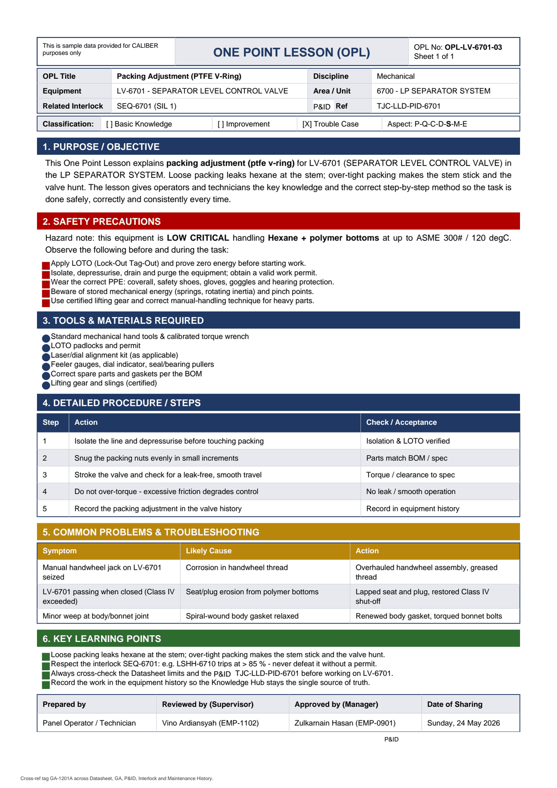

# OPL-LV-6701-03 - Packing Adjustment (PTFE V-Ring)

| Field | Value |
|---|---|
| Equipment | LV-6701 - SEPARATOR LEVEL CONTROL VALVE |
| Area / unit | 6700 - LP SEPARATOR SYSTEM |
| Discipline | Mechanical |
| Classification | Trouble Case |
| Related interlock | SEQ-6701 (SIL 1) |
| P&ID ref | TJC-LLD-PID-6701 |

## 1. Purpose

This One Point Lesson explains packing adjustment (ptfe v-ring) for LV-6701 (SEPARATOR LEVEL CONTROL VALVE) in the LP SEPARATOR SYSTEM. Loose packing leaks hexane at the stem; over-tight packing makes the stem stick and the valve hunt. The lesson gives operators and technicians the key knowledge and the correct step-by-step method so the task is done safely, correctly and consistently every time.

## 2. Safety precautions

Hazard note: this equipment is LOW CRITICAL handling Hexane + polymer bottoms at up to ASME 300# / 120 degC.

- Apply LOTO (Lock-Out Tag-Out) and prove zero energy before starting work.
- Isolate, depressurise, drain and purge the equipment; obtain a valid work permit.
- Wear the correct PPE: coverall, safety shoes, gloves, goggles and hearing protection.
- Beware of stored mechanical energy (springs, rotating inertia) and pinch points.
- Use certified lifting gear and correct manual-handling technique for heavy parts.

## 3. Tools & materials

- Standard mechanical hand tools & calibrated torque wrench
- LOTO padlocks and permit
- Laser/dial alignment kit (as applicable)
- Feeler gauges, dial indicator, seal/bearing pullers
- Correct spare parts and gaskets per the BOM
- Lifting gear and slings (certified)

## 4. Procedure

| Step | Action | Check / acceptance (as printed) |
|---|---|---|
| 1 | Isolate the line and depressurise before touching packing | Isolation & LOTO verified |
| 2 | Snug the packing nuts evenly in small increments | Parts match BOM / spec |
| 3 | Stroke the valve and check for a leak-free, smooth travel | Torque / clearance to spec |
| 4 | Do not over-torque - excessive friction degrades control | No leak / smooth operation |
| 5 | Record the packing adjustment in the valve history | Record in equipment history |

## 5. Common problems & troubleshooting

Full text restored from the linked work order where the OPL cell was cut off.

| Symptom | Likely cause | Action | Work order |
|---|---|---|---|
| Manual handwheel jack on LV-6701 seized | Corrosion in handwheel thread | Overhauled handwheel assembly, greased thread | WO-240136 |
| LV-6701 passing when closed (Class IV exceeded) | Seat/plug erosion from polymer bottoms | Lapped seat and plug, restored Class IV shut-off | WO-240143 |
| Minor weep at body/bonnet joint | Spiral-wound body gasket relaxed | Renewed body gasket, torqued bonnet bolts | WO-240145 |

## 6. Key learning points

- Loose packing leaks hexane at the stem; over-tight packing makes the stem stick and the valve hunt.
- Respect the interlock SEQ-6701: e.g. LSHH-6710 trips at > 85 % - never defeat it without a permit.
- Always cross-check the Datasheet limits and the TJC-LLD-PID-6701 before working on LV-6701.
- Record the work in the equipment history so the Knowledge Hub stays the single source of truth.

## Sign-off

| Role | Name |
|---|---|
| Prepared by | Panel Operator / Technician |
| Reviewed by (Supervisor) | Vino Ardiansyah (EMP-1102) |
| Approved by (Manager) | Zulkarnain Hasan (EMP-0901) |
| Date of Sharing | Sunday, 24 May 2026 |

---
Source: `Set_06_LV-6701_SEPARATOR_LEVEL_CONTROL_VALVE/OPL (One Point Lessons)/OPL-LV-6701-03 - Packing_Adjustment_PTFE_V_Ring.pdf`

## Image

