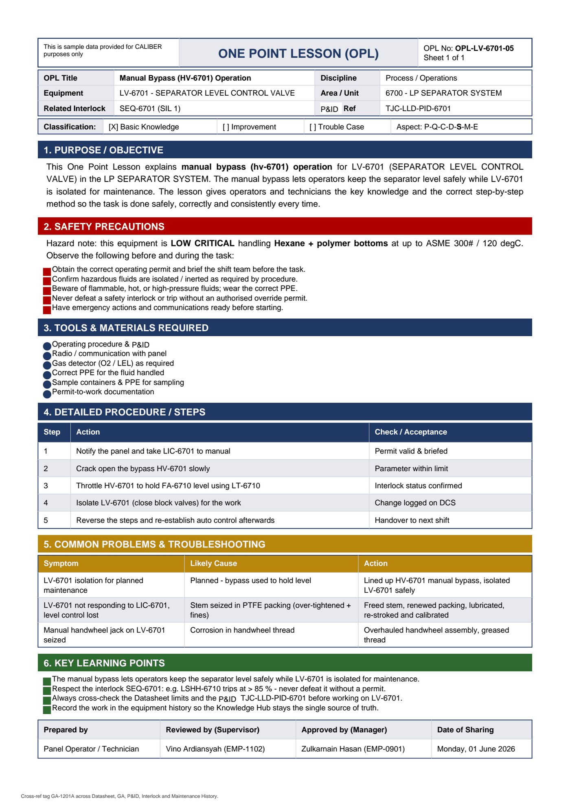

# OPL-LV-6701-05 - Manual Bypass (HV-6701) Operation

| Field | Value |
|---|---|
| Equipment | LV-6701 - SEPARATOR LEVEL CONTROL VALVE |
| Area / unit | 6700 - LP SEPARATOR SYSTEM |
| Discipline | Process / Operations |
| Classification | Basic Knowledge |
| Related interlock | SEQ-6701 (SIL 1) |
| P&ID ref | TJC-LLD-PID-6701 |

## 1. Purpose

This One Point Lesson explains manual bypass (hv-6701) operation for LV-6701 (SEPARATOR LEVEL CONTROL VALVE) in the LP SEPARATOR SYSTEM. The manual bypass lets operators keep the separator level safely while LV-6701 is isolated for maintenance. The lesson gives operators and technicians the key knowledge and the correct step-by-step method so the task is done safely, correctly and consistently every time.

## 2. Safety precautions

Hazard note: this equipment is LOW CRITICAL handling Hexane + polymer bottoms at up to ASME 300# / 120 degC.

- Obtain the correct operating permit and brief the shift team before the task.
- Confirm hazardous fluids are isolated / inerted as required by procedure.
- Beware of flammable, hot, or high-pressure fluids; wear the correct PPE.
- Never defeat a safety interlock or trip without an authorised override permit.
- Have emergency actions and communications ready before starting.

## 3. Tools & materials

- Operating procedure &
- Radio / communication with panel
- Gas detector (O2 / LEL) as required
- Correct PPE for the fluid handled
- Sample containers & PPE for sampling
- Permit-to-work documentation

## 4. Procedure

| Step | Action | Check / acceptance (as printed) |
|---|---|---|
| 1 | Notify the panel and take LIC-6701 to manual | Permit valid & briefed |
| 2 | Crack open the bypass HV-6701 slowly | Parameter within limit |
| 3 | Throttle HV-6701 to hold FA-6710 level using LT-6710 | Interlock status confirmed |
| 4 | Isolate LV-6701 (close block valves) for the work | Change logged on DCS |
| 5 | Reverse the steps and re-establish auto control afterwards | Handover to next shift |

## 5. Common problems & troubleshooting

Full text restored from the linked work order where the OPL cell was cut off.

| Symptom | Likely cause | Action | Work order |
|---|---|---|---|
| LV-6701 isolation for planned maintenance | Planned - bypass used to hold level | Lined up HV-6701 manual bypass, isolated LV-6701 safely | WO-240142 |
| LV-6701 not responding to LIC-6701, level control lost | Stem seized in PTFE packing (over-tightened + fines) | Freed stem, renewed packing, lubricated, re-stroked and calibrated | WO-240135 |
| Manual handwheel jack on LV-6701 seized | Corrosion in handwheel thread | Overhauled handwheel assembly, greased thread | WO-240136 |

## 6. Key learning points

- The manual bypass lets operators keep the separator level safely while LV-6701 is isolated for maintenance.
- Respect the interlock SEQ-6701: e.g. LSHH-6710 trips at > 85 % - never defeat it without a permit.
- Always cross-check the Datasheet limits and the TJC-LLD-PID-6701 before working on LV-6701.
- Record the work in the equipment history so the Knowledge Hub stays the single source of truth.

## Sign-off

| Role | Name |
|---|---|
| Prepared by | Panel Operator / Technician |
| Reviewed by (Supervisor) | Vino Ardiansyah (EMP-1102) |
| Approved by (Manager) | Zulkarnain Hasan (EMP-0901) |
| Date of Sharing | Monday, 01 June 2026 |

---
Source: `Set_06_LV-6701_SEPARATOR_LEVEL_CONTROL_VALVE/OPL (One Point Lessons)/OPL-LV-6701-05 - Manual_Bypass_HV_6701_Operation.pdf`

## Image

