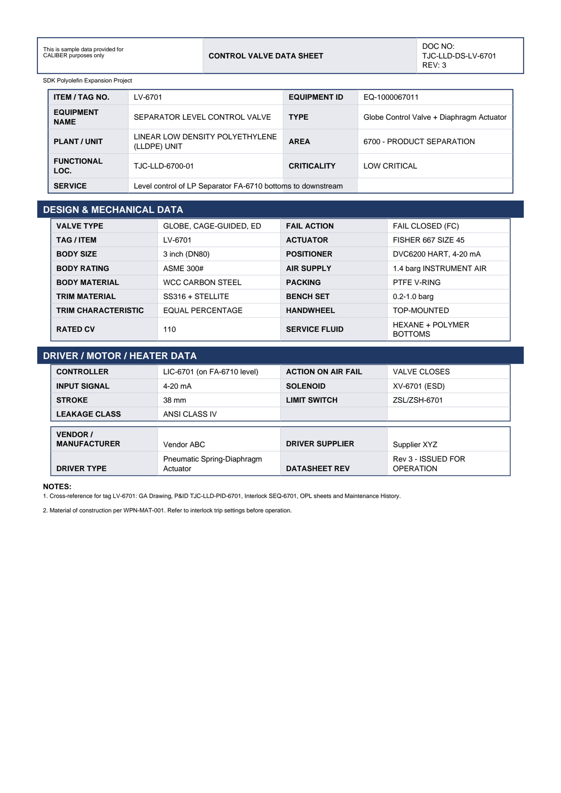

# Equipment Datasheet - LV-6701

Control Valve Data Sheet for **LV-6701 SEPARATOR LEVEL CONTROL VALVE**.

## Identification

| Field | Value |
|---|---|
| ITEM / TAG NO. | LV-6701 |
| EQUIPMENT ID | EQ-1000067011 |
| EQUIPMENT NAME | SEPARATOR LEVEL CONTROL VALVE |
| TYPE | Globe Control Valve + Diaphragm Actuator |
| PLANT / UNIT | LINEAR LOW DENSITY POLYETHYLENE (LLDPE) UNIT |
| AREA | 6700 - PRODUCT SEPARATION |
| FUNCTIONAL LOC. | TJC-LLD-6700-01 |
| CRITICALITY | LOW CRITICAL |
| SERVICE | Level control of LP Separator FA-6710 botto ms to downstream |

## Design & Mechanical Data

| Field | Value |
|---|---|
| VALVE TYPE | GLOBE, CAGE-GUIDED, ED |
| FAIL ACTION | FAIL CLOSED (FC) |
| TAG / ITEM | LV-6701 |
| ACTUATOR | FISHER 667 SIZE 45 |
| BODY SIZE | 3 inch (DN80) |
| POSITIONER | DVC6200 HART, 4-20 mA |
| BODY RATING | ASME 300# |
| AIR SUPPLY | 1.4 barg INSTRUMENT AIR |
| BODY MATERIAL | WCC CARBON STEEL |
| PACKING | PTFE V-RING |
| TRIM MATERIAL | SS316 + STELLITE |
| BENCH SET | 0.2-1.0 barg |
| TRIM CHARACTERISTIC | EQUAL PERCENTAGE |
| HANDWHEEL | TOP-MOUNTED |
| RATED CV | 110 |
| SERVICE FLUID | HEXANE + POLYMER BOTTOMS |

## Driver / Motor / Heater Data

| Field | Value |
|---|---|
| CONTROLLER | LIC-6701 (on FA-6710 level) |
| ACTION ON AIR FAIL | VALVE CLOSES |
| INPUT SIGNAL | 4-20 mA |
| SOLENOID | XV-6701 (ESD) |
| STROKE | 38 mm |
| LIMIT SWITCH | ZSL/ZSH-6701 |
| LEAKAGE CLASS | ANSI CLASS IV |

## Vendor & revision

| Field | Value |
|---|---|
| VENDOR / MANUFACTURER | Vendor ABC |
| DRIVER SUPPLIER | Supplier XYZ |
| DRIVER TYPE | Pneumatic Spring-Diaphragm Actuator |
| DATASHEET REV | Rev 3 - ISSUED FOR OPERATION |

## Notes

- Cross-reference for tag LV-6701: GA Drawing, P&ID TJC-LLD-PID-6701, Interlock SEQ-6701, OPL sheets and Maintenance History.
- Material of construction per WPN-MAT-001. Refer to interlock trip settings before operation.

---
Source: `Set_06_LV-6701_SEPARATOR_LEVEL_CONTROL_VALVE/Equipment Datasheet - LV-6701.pdf`

## Image

