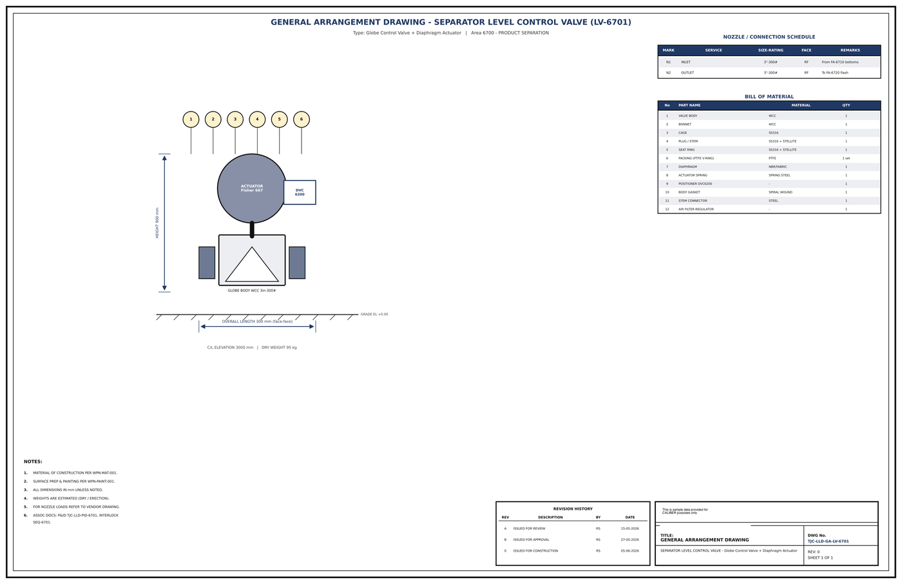

# General Arrangement Drawing - LV-6701

## Key dimensions

- OVERALL LENGTH 300 mm (face-face)
- HEIGHT 900 mm
- C/L ELEVATION 3000 mm   |   DRY WEIGHT 95 kg

## Nozzle / connection schedule

Mark, service, size-rating, face, remarks as printed on the drawing.

- N1 INLET 3"-300# RF From FA-6710 bottoms
- N2 OUTLET 3"-300# RF T o FA-6720 flash

## Bill of material

No., part name, material, quantity as printed on the drawing.

- 1 VALVE BODY WCC 1
- 2 BONNET WCC 1
- 3 CAGE SS316 1
- 4 PLUG / STEM SS316 + STELLITE 1
- 5 SEAT RING SS316 + STELLITE 1
- 7 DIAPHRAGM NBR/FABRIC 1
- 8 ACTUATOR SPRING SPRING STEEL 1
- 9 POSITIONER DVC6200 - 1
- 10 BODY GASKET SPIRAL WOUND 1
- 11 STEM CONNECTOR STEEL 1
- 12 AIR FILTER REGULATOR - 1

## Notes

- MATERIAL OF CONSTRUCTION PER WPN-MAT-001.
- SURFACE PREP & PAINTING PER WPN-PAINT-001.
- ALL DIMENSIONS IN mm UNLESS NOTED.
- WEIGHTS ARE ESTIMATED (DRY / ERECTION).
- FOR NOZZLE LOADS REFER TO VENDOR DRAWING.
- ASSOC DOCS: P&ID TJC-LLD-PID-6701, INTERLOCK

## Revision history

| Rev | Description | By | Date |
|---|---|---|---|
| A | ISSUED FOR REVIEW | RS | 15-05-2026 |
| B | ISSUED FOR APPROVAL | RS | 27-05-2026 |
| 0 | ISSUED FOR CONSTRUCTION | RS | 05-06-2026 |

---
Source: `Set_06_LV-6701_SEPARATOR_LEVEL_CONTROL_VALVE/Equipment GA Drawing - LV-6701.pdf`

## Image

