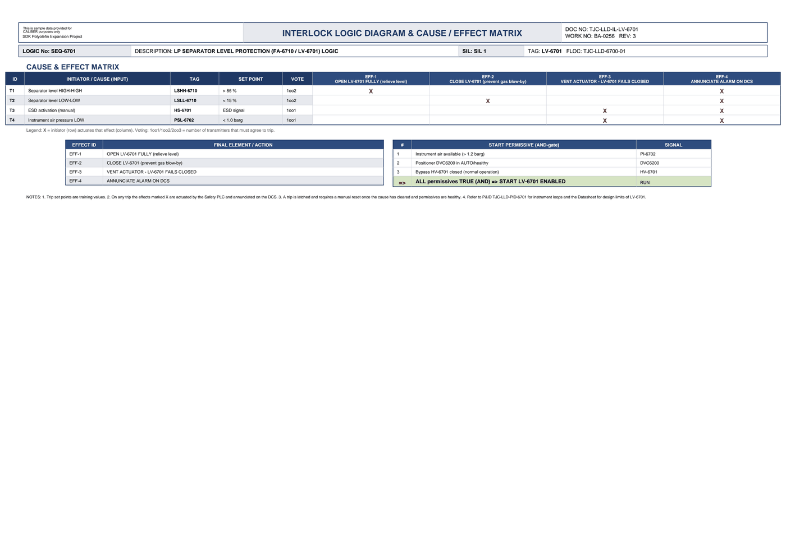

# Interlock Logic & Cause/Effect - LV-6701

| Field | Value |
|---|---|
| Logic no. | SEQ-6701 |
| Description | LP SEPARATOR LEVEL PROTECTION (FA-6710 / LV-6701) LOGIC |
| SIL | SIL 1 |
| Functional location | TJC-LLD-6700-01 |

## Cause & effect matrix

| ID | INITIATOR / CAUSE (INPUT) | TAG | SET POINT | VOTE | EFF-1 OPEN LV-6701 FULLY (relieve level) | EFF-2 CLOSE LV-6701 (prevent gas blow-by) | EFF-3 VENT ACTUATOR - LV-6701 FAILS CLOSED | EFF-4 ANNUNCIATE ALARM ON DCS |
|---|---|---|---|---|---|---|---|---|
| T1 | Separator level HIGH-HIGH | LSHH-6710 | > 85 % | 1oo2 | X |  |  | X |
| T2 | Separator level LOW-LOW | LSLL-6710 | < 15 % | 1oo2 |  | X |  | X |
| T3 | ESD activation (manual) | HS-6701 | ESD signal | 1oo1 |  |  | X | X |
| T4 | Instrument air pressure LOW | PSL-6702 | < 1.0 barg | 1oo1 |  |  | X | X |

### Trips in plain language

- **LSHH-6710** (Separator level HIGH-HIGH) trips at **> 85 %**, voting 1oo2. Effects: OPEN LV-6701 FULLY (relieve level); ANNUNCIATE ALARM ON DCS.
- **LSLL-6710** (Separator level LOW-LOW) trips at **< 15 %**, voting 1oo2. Effects: CLOSE LV-6701 (prevent gas blow-by); ANNUNCIATE ALARM ON DCS.
- **HS-6701** (ESD activation (manual)) trips at **ESD signal**, voting 1oo1. Effects: VENT ACTUATOR - LV-6701 FAILS CLOSED; ANNUNCIATE ALARM ON DCS.
- **PSL-6702** (Instrument air pressure LOW) trips at **< 1.0 barg**, voting 1oo1. Effects: VENT ACTUATOR - LV-6701 FAILS CLOSED; ANNUNCIATE ALARM ON DCS.

## Effects (final elements)

| EFFECT ID | FINAL ELEMENT / ACTION |
|---|---|
| EFF-1 | OPEN LV-6701 FULLY (relieve level) |
| EFF-2 | CLOSE LV-6701 (prevent gas blow-by) |
| EFF-3 | VENT ACTUATOR - LV-6701 FAILS CLOSED |
| EFF-4 | ANNUNCIATE ALARM ON DCS |

## Start permissives (all must be true)

| # | START PERMISSIVE (AND-gate) | SIGNAL |
|---|---|---|
| 1 | Instrument air available (> 1.2 barg) | PI-6702 |
| 2 | Positioner DVC6200 in AUTO/healthy | DVC6200 |
| 3 | Bypass HV-6701 closed (normal operation) | HV-6701 |
| => | ALL permissives TRUE (AND) => START LV-6701 ENABLED | RUN |

## Notes

- Trip set points are training values.
- On any trip the effects marked X are actuated by the Safety PLC and annunciated on the DCS.
- A trip is latched and requires a manual reset once the cause has cleared and permissives are healthy.
- Refer to P&ID TJC-LLD-PID-6701 for instrument loops and the Datasheet for design limits of LV-6701.

---
Source: `Set_06_LV-6701_SEPARATOR_LEVEL_CONTROL_VALVE/Interlock Logic Diagram - LV-6701.pdf`

## Image

