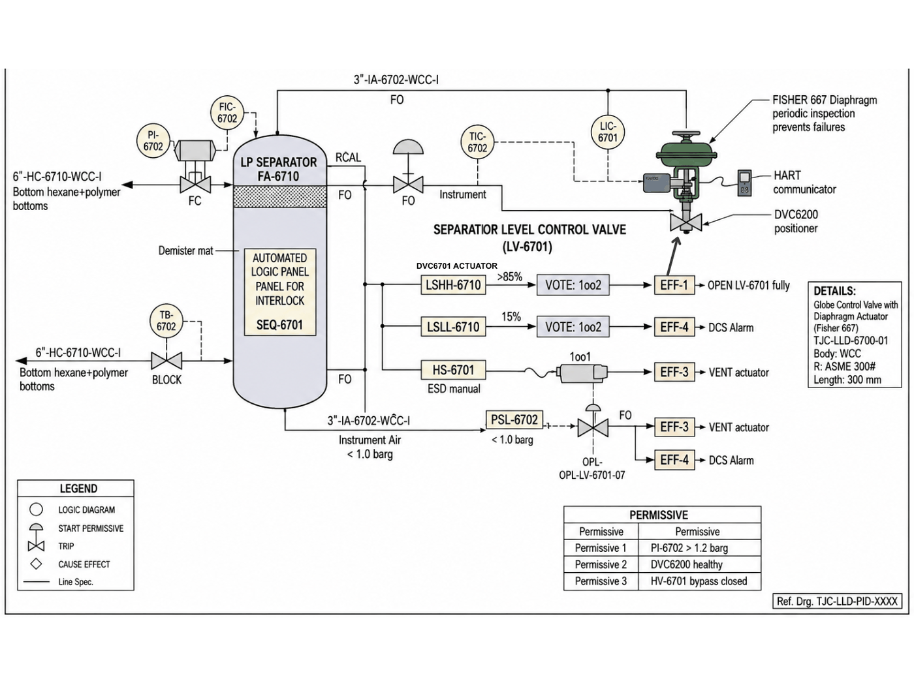

# P&ID - LV-6701

Image-only drawing. The title block prints `TJC-LLD-PID-XXXX`; the number `TJC-LLD-PID-6701` comes from the datasheet and interlock cross-references.

## Tags linked to this drawing

From the interlock matrix and datasheet of LV-6701:

- `FA-6710`
- `FA-6720`
- `HS-6701`
- `HV-6701`
- `LIC-6701`
- `LSHH-6710`
- `LSLL-6710`
- `LT-6710`
- `PI-6702`
- `PSL-6702`
- `XV-6701`
- `ZSH-6701`
- `ZSL-6701`

## Description

To be written by an engineer from the drawing (flow path, valves, instruments, trips). Keep tags in backticks so they link.

---
Source: `Set_06_LV-6701_SEPARATOR_LEVEL_CONTROL_VALVE/P&ID SET 6.png`

## Image

